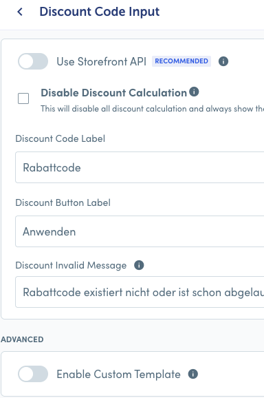
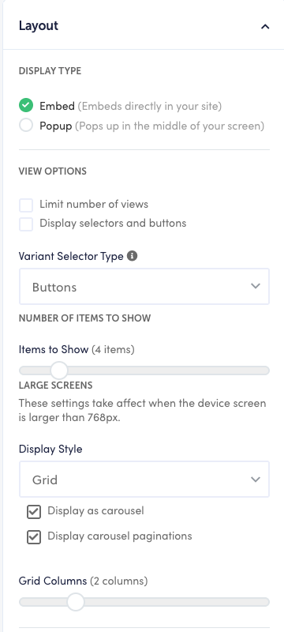
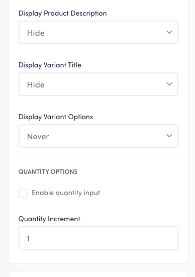

For each new site country -> new Smart Cart instance, copy of the live one, make sure it is NOT set to Live.

## Cart Title :

This needs to be without the possessive :
e.g. Warenkorb vs. Deine Warenkorb

- Enable custom template
- Add the following to enable dynamic item count in the cart -


```
<component :is="getCartTitleHeadingTag()"
    id="rebuy-cart-title"
    data-rebuy-component-id="title_bar"
    data-rebuy-component="title-bar"
    :class="['rebuy-cart__title', getCartTitleClassName()]"
    v-html="getCartTitle()  + ' (' + (cart.item_count || items.length || 0) + ')'"
></component>
```

No login button.

## Tiered Progress Bar :

Bar name : Shipping and gift bar (egal, tbh)
GIFT SETTINGS -> LINE ITEM MODE
ADVANCED BAR SETTINGS -> USE SHOPIFY FUNCTIONS

3 Tiers -> 1 x Shipping, 2 x Gift (obviously these can be changed but for the purposes of setup, this is how they are done)
Tier 1 - Shipping : Icon Size - X-SMALL (although we make it even smaller in the CSS)
USE CUSTOM TIER LABEL -> Kostenloser Versand, e.g.

```
Noch <b>{{remaining_amount}}</b> bis zum kostenlos Versand
```

Tier 2 - Gift 1 : 
CONFIGURE ICON - Default icon
Icon Size - X-SMALL (although we make it even smaller in the CSS)
Use Amount remaining label -
```
Noch <strong>{{remaining_amount}}</strong> bis zu deinem Geschenk!
```

Tier 3 - Gift 2 :
Same as above

ADVANCED COMPONENT SETTINGS :
- Enable Custom Template ----- actually, I checked and both custom template in the redesign and the default template are the same, so this can be ignored


# **BODY :**

Order is as follows -
- Cart Items
- Discount Code Input
- Widget - Cross-sell cart (need to be setup new)


##  Cart items :
Empty cart language example in DE - 
```
<p class="ql-align-center">Dein Warenkorb is leer.</p><h4 class="ql-align-center"><br></h4><p class="ql-align-center"><a href="collections/all" rel="noopener noreferrer" target="_blank">Zu den Produkten</a></p><p class="ql-align-center"><br></p>
```

Enable custom template - here we add a data attribute for the callbacks / discounting to hook into for updates (it's been so long now...I am pretty sure this is what this is doing). We also reorder some of the elements within each line item and add some classes to separate elements for styling, wrapper classes for reordering etc.

```html
<div data-rebuy-component="cart-items" data-rebuy-component-id="cart_items">
  <ul
    v-if="hasItems()"
    data-smartcart-items
    tabindex="0"
    role="group"
  >
    <li
      class="rebuy-cart__flyout-item"
      v-for="item in items()"
      v-if="!isHiddenItem(item)"
      :key="item.key"
      :data-item-id="item.id" 
      v-bind:class="[ 'product-' + item.handle, itemProductTagsClasses(item), itemPropertyClasses(item) ]"
      aria-label="product"
    >
      <!-- Image -->
      <div class="rebuy-cart__flyout-item-media">
        <a
          v-bind:href="itemURL(item)"
          v-bind:aria-label="itemLinkLabel(item)"
        >
          
        </a>
      </div>

      <!-- Item Info -->
      <div class="rebuy-cart__flyout-item-info">

      <!-- TOP SECTION: Title + Variant + Price -->
        <div class="rebuy-cart__flyout-item-top">
        <!-- Product Title -->
        <a
          role="heading"
          aria-level="5"
          class="rebuy-cart__flyout-item-product-title"
          v-bind:href="itemURL(item)"
          v-html="item.product_title"
        ></a>

        <!-- Variant Title -->
        <div
          class="rebuy-cart__flyout-item-variant-title"
          v-html="item.variant_title"
          v-if="item.variant_title"
        ></div>

        <!-- Discount Message -->
        <div
          class="rebuy-cart__flyout-item-discount-message"
          v-if="hasLineItemDiscount(item)"
          v-html="lineItemDiscountMessage(item)"
        ></div>

        <!-- Pricing -->
        <div class="rebuy-cart__flyout-item-price">
          <div v-if="itemHasDiscount(item)">
            <span
              class="rebuy-money sale"
            >
              <span class="sr-only">Sale price</span>
              <span v-html="formatMoney(itemPrice(item))"></span>
            </span>
            <span
              class="rebuy-money compare-at"
            >
              <span class="sr-only">Original price</span>
              <span v-html="formatMoney(compareAtPrice(item))"></span>
            </span>
          </div>
          <div v-if="!itemHasDiscount(item)">
            <span
              class="rebuy-money"
            >
              <span class="sr-only">Price</span>
              <span v-html="formatMoney(itemPrice(item))"></span>
            </span>
          </div>
        </div>

        <!-- Item Properties -->
        <div
          class="rebuy-cart__flyout-item-properties"
          v-if="hasItemProperties(item)"
        >
          <div
            class="rebuy-cart__flyout-item-property rebuy-cart__flyout-item-property--delivery-frequency"
            v-if="itemDeliveryFrequency(item)"
            v-html="itemDeliveryFrequency(item)"
          ></div>
          <div
            class="rebuy-cart__flyout-item-property"
            v-for="property in itemProperties(item)"
            v-bind:class="[ itemPropertyKeyClass(property), itemPropertyValueClass(property) ]"
          >
            <span
              class="rebuy-cart__flyout-item-property-name"
              v-html="property.key"
            ></span>
            <span class="rebuy-cart__flyout-item-property-separator">
              :
            </span>
            <span
              class="rebuy-cart__flyout-item-property-value"
              v-html="property.value"
            ></span>
          </div>
        </div>
        </div>


        <!-- BOTTOM SECTION: Controls (already wrapped) -->
        <div class="rebuy-cart__flyout-item-bottom">
        <!-- Remove Item -->
        <button
          class="rebuy-cart__flyout-item-remove"
          type="button"
          v-bind:aria-label="'Remove ' + item.product_title"
          v-on:click="removeItem(item)"
        >
        <i
          class="far"
          v-bind:class="[(item.status == 'removing') ? 'fa-sync-alt fa-fast-spin' : 'fa-trash']"
          aria-hidden="true"
        ></i>
        </button>

        <!-- Quantity -->
        <div class="rebuy-cart__flyout-item-quantity">
          <div
            class="rebuy-cart__flyout-item-quantity-widget"
            v-if="hideQuantitySelectors && !hideQuantitySelectors(item)"
          >
            <button
              class="rebuy-cart__flyout-item-quantity-widget-button"
              v-bind:aria-label="'Decrease quantity of ' + item.product_title"
              v-on:click="decreaseItem(item)"
              type="button"
            >
              <i
                class="far"
                v-bind:class="[(item.status == 'decreasing') ? 'fa-sync-alt fa-fast-spin' : 'fa-minus']"
                aria-hidden="true"
              ></i>
            </button>

            <span
              class="rebuy-cart__flyout-item-quantity-widget-label"
            >
              <span class="sr-only">Quantity of {{ item.product_title }}</span>
              {{ item.quantity }}
            </span>

            <button
              class="rebuy-cart__flyout-item-quantity-widget-button"
              v-bind:aria-label="'Increase quantity of ' + item.product_title"
              v-on:click="increaseItem(item)"
              type="button"
            >
              <i
                class="far"
                v-bind:class="[(item.status == 'increasing') ? 'fa-sync-alt fa-fast-spin' : 'fa-plus']"
                aria-hidden="true"
              ></i>
            </button>
          </div>
        </div>
        </div>

        <!-- Bundle Details -->
        <div class="rebuy-cart__flyout-item-bundle" v-if="itemIsBundle(item) && !hideBundleOptions(item)">

          <!-- Expand / Collapse Bundle Details -->
          <button
            v-if="itemBundleLength(item) > 0"
            class="rebuy-cart__flyout-item-bundle-toggle-button"
            v-on:click="toggleActiveBundle(item)"
            type="button"
            v-bind:aria-label="(isBundleVisible(item) ? 'Collapse' : 'Expand') + ' bundle of ' + item.product_title"
          >
            {{ isBundleVisible(item) ? 'Hide' : 'Show' }}
            <span v-html="itemBundleLength(item)"></span>
            items
            <span class="rebuy-cart__flyout-bundle-chev-icon">
              <i v-bind:class="['fas', isBundleVisible(item) ? 'fa-chevron-up' : 'fa-chevron-down']"></i>
            </span>
          </button>

          <ul
            class="rebuy-cart__flyout-item-bundle-children"
            v-if="itemBundleLength(item) > 0 && isBundleVisible(item)"
            tabindex="0"
          >
            <li class="rebuy-cart__flyout-item-bundle-child" v-for="(option, index) in item.options_with_values">
              <div class="rebuy-cart__flyout-item-bundle-child-left">
                <div class="rebuy-cart__flyout-item-bundle-image-container">
                  
                </div>
              </div>

              <div class="rebuy-cart__flyout-item-bundle-child-right">
                <h5 v-html="childBundleTitle(option)" class="rebuy-cart__flyout-item-bundle-title"></h5>
                <p v-html="option.value" class="rebuy-cart__flyout-item-bundle-value"></p>
              </div>
            </li>
          </ul>
        </div>
        <!-- End Bundle Details -->

      </div>
      <!-- End Info -->

      <!-- Buy More Save More -->
      <div
        v-if="itemHasBMSM(item) && bMSMFinalTierNotReached(item)"
        class="rebuy-cart__flyout-item-buy-more-save-more"
      >
        <div
          v-if="hasBMSMButtons()"
          class="rebuy-cart__flyout-item-buy-more-save-more-container"
        >
          <div
            v-for="tier in getBMSMTiers()"
            class="rebuy-cart__flyout-item-buy-more-save-more-button-container"
            v-if="tier.quantity > item.quantity"
          >
            <button
              v-on:click="adjustBMSMQuantity(item, tier)"
              class="rebuy-button rebuy-cart__flyout-item-buy-more-save-more-button"
              v-bind:aria-label="getBMSMButtonText(tier)"
            >
              <span v-html="getBMSMButtonText(tier)"></span>
            </button>
          </div>
        </div>

        <span
          v-if="!hasBMSMButtons()"
          class="rebuy-cart__flyout-buy-more-save-more-dynamic-message-text"
          v-html="buyMoreSaveMoreDynamicText(item)"
        ></span>
      </div>
      <!-- End Buy More Save More -->

      <!-- Switch to Subscription -->
      <div
        class="rebuy-cart__flyout-item-subscription"
        v-if="hasSwitchToSubscription(item)"
      >
        <button
          class="rebuy-button outline"
          v-if="!item.product.subscription || item.status == 'downgrading' || item.status == 'upgrading'"
          v-bind:aria-label="'Switch ' + item.product_title + ' to a Subscription'"
          v-bind:disabled="(item.status == 'downgrading' || item.status == 'upgrading')"
          v-on:click="updateItemDeliveryFrequency(item, selectedSubscriptionFrequency(item, 0), 'onetime')"
          type="button"
        >
          <span v-html="switchToSubscriptionLabel(item)"></span>
        </button>

        <select
          class="rebuy-select muted"
          aria-label="Subscription delivery frequency"
          v-if="item.product.subscription && item.status != 'downgrading'"
          v-model="item.product.subscription_frequency"
          v-on:change="updateItemDeliveryFrequency(item)"
        >
          <optgroup
            v-if="!item.product.is_subscription_only && !subscriptionDowngradeDisabled()"
            v-bind:label="getSwitchToSubscriptionLabel('onetime_option_group_label')"
          >
            <option
              v-bind:value="'onetime'"
              v-html="getSwitchToSubscriptionLabel('onetime_option_label')"
            ></option>
          </optgroup>
          <optgroup v-bind:label="subscriptionOptionGroupLabel(item)">
            <option
              v-for="frequency in subscriptionFrequencies(item)"
              v-bind:value="frequency"
              v-html="subscriptionOptionLabel(item, frequency, item.product.subscription_interval)"
            ></option>
          </optgroup>
        </select>
      </div>
      <!-- End Switch to Subscription -->

    </li>
  </ul>

  <!-- Empty Cart -->
  <div class="rebuy-cart__flyout-empty-cart" v-html="emptyCartMarkup()" v-if="!hasItems()"></div>

</div>
```

## Discount Input :
No changes here really ->



## Widget :

Widget custom template has to be rendered in the codebase with the widget ID referenced, as opposed to edited in Rebuy. So we use a standard  in theme.liquid, and add the file in question. Luckily I added some comments :

```html

<!-- This is the custom template for our cart cross sell widget, we need to include it here as per the Rebuy docs and make edits within this code. 
- We have reordered the price elements
- Removed the variant info (commented out)
- added logic to fetch and display the Grundpreis metafield
- added logic to fetch and display the custom_badges metafield -->


<script id="rebuy-widget-226077" type="text/template">
 <div class="rebuy-widget"
v-cloak
v-on:click="stopPropagation($event)"
v-bind:id="'rebuy-widget-' + id"
v-bind:class="['widget-type-' + config.type.replace('_','-'), 'widget-display-' + config.display_type, products.length > 0 ? 'is-visible' : 'is-hidden', 'widget-layout-' + currentLayout()]">

    <div
        class="rebuy-widget-container"
        v-cloak
        v-bind:class="['widget-display-' + config.display_type, visible ? 'is-visible' : 'is-hidden' ]"
        v-on:click.self="hide()">

        <div class="rebuy-widget-content">
            <div class="rebuy-modal-close" v-on:click="hide()" aria-label="close modal">
                <i class="fas fa-times" aria-hidden="true"></i>
            </div>

            <div class="rebuy-timer" v-if="hasTimer()">
                <p class="rebuy-timer-title" v-if="config.language.timer_title">
                    <span v-html="config.language.timer_title"></span> <span class="rebuy-timer-minutes" v-html="config.timer.duration_minutes"></span>:<span class="rebuy-timer-seconds" v-html="config.timer.duration_seconds"></span>
                </p>
            </div>

            <h3 class="super-title" v-if="config.language.super_title != ''" v-html="config.language.super_title"></h3>

            <h4 class="primary-title" v-if="config.language.title != ''" v-html="config.language.title"></h4>

            <div class="description" v-if="config.language.description != ''" v-html="config.language.description"></div>

            <div class="rebuy-product-grid" v-bind:class="layoutClasses" tabindex="0" role="list">

                <div
                    v-for="(product, product_index) in products"
                    v-bind:class="[product.handle, 'product-id-' + product.id, cartHasProduct(product) ? 'cart-has-item' : '', productTagClasses(product)]"
                    aria-label="product"
                    class="rebuy-product-block"
                    role="listitem"
                >

                    <div class="rebuy-product-media">
                        <a
                            class="rebuy-product-image"
                            tabindex="-1"
                            v-bind:href="learnMoreURL(product)"
                            v-bind:style="imageStyles"
                            v-on:click="learnMore(product, $event);"
                            v-bind:class="[hasLearnMore() ? 'clickable' : '']"
                            rel="nofollow"
                        >
                             1 ? 'lazy' : 'eager'" v-bind:src="itemImage(product, product.selected_variant, '400x400')" v-bind:alt="itemImageAlt(product, product.selected_variant)">
                        </a>
                    </div>
                    <div class="rebuy-product-info">
                        <a
                            role="heading"
                            aria-level="5"
                            class="rebuy-product-title"
                            v-bind:href="learnMoreURL(product)"
                            v-on:click="learnMore(product, $event);"
                            v-html="product.title"
                            v-bind:class="[hasLearnMore() ? 'clickable' : '']"
                            v-bind:aria-label="'View ' + product.title"
                            rel="nofollow"
                        ></a>
                        
                        <!-- <div class="rebuy-variant-title" v-if="showVariantTitle(product)" v-html="product.selected_variant.title"></div> -->

                        <div class="rebuy-product-review" v-if="hasProductReviews(product)" aria-label="product star rating">
                            <span class="rebuy-star-rating">
                                <span
                                    v-if="product.reviews.star_rating"
                                    class="rebuy-star-rating-value sr-only"
                                    v-html="product.reviews.star_rating + ' stars out of 5 stars'"
                                >
                                </span>
                                <span class="rebuy-star-rating-background"></span>
                                <span class="rebuy-star-rating-foreground" v-bind:style="{ width: productReviewRatingPercentage(product) }"></span>
                            </span>
                            <span class="rebuy-review-count" v-html="productReviewCount(product)"></span>
                        </div>

                        <!-- Combined with the resolver script display the metafield badges in the widget -->

                        <div class="custom-widget-badges" 
                            v-if="getProductBadges(product.id)"
                            v-html="getProductBadges(product.id)"></div>  

                        <!-- -->

                        <div class="rebuy-product-price">
                            <div v-if="variantOnSale(product, product.selected_variant)">
                                <span class="rebuy-money sale">
                                    <span class="sr-only">Sale price</span>
                                    <span tabindex="0" v-html="formatMoney(variantPrice(product, product.selected_variant))"></span>
                                </span>
                                <span class="rebuy-money compare-at">
                                    <span class="sr-only">Original price</span>
                                    <span v-html="formatMoney(variantCompareAtPrice(product, product.selected_variant))"></span>
                                </span>
                            </div>
                            <div v-if="!(variantOnSale(product, product.selected_variant))">
                                <span class="rebuy-money">
                                    <span class="sr-only">Price</span>
                                    <span tabindex="0" v-html="formatMoney(variantPrice(product, product.selected_variant))"></span>
                                </span>
                            </div>
                        </div>

                        <!-- this takes the Grundpreis metafield and display it as per the Figma -->
                        <div class="rebuy-grundpreis" 
                        v-if="product.metafields && product.metafields.global && product.metafields.global.grundpreis"
                        v-html="product.metafields.global.grundpreis"></div>


                        <div class="rebuy-product-description" v-if="showProductDescription(product)" v-html="text(product.body_html)"></div>
                    </div>
                    <div class="rebuy-product-options" v-if="showVariantSelect(product)">
                        <select
                            title="Select product variant"
                            :id="id + '-' + 'select' + '-' + product_index"
                            :class="{ hide : config.view_options.variant_selector === 'buttons' }"
                            class="rebuy-select"
                            v-bind:aria-label="'variant of ' + product.title"
                            v-model="product.selected_variant_id"
                            v-on:change="selectVariant(product)">
                            <option v-for="variant in product.variants" v-bind:value="variant.id">{{ variant.title }}</option>
                        </select>

                        <div
                            class="rebuy-product-options__button-swatches-container"
                            :class="{ 'rebuy-style__hidden-block' : config.view_options.variant_selector === 'select' }"
                            >
                            <div
                                v-for="option in product.options"
                                class="rebuy-product-options__button-swatches rebuy-size-swatches">
                                <div v-for="(value, value_index) in filterOOSOptions(option, product)">
                                    <div v-if="displayColorSwatches(option)" class="rebuy-product-options__button-swatch rebuy-color-swatch">
                                        <input
                                            :name="id + '-color-' + product_index"
                                            :id="id + '-color-' + product_index + '-' + value + '-' + value_index"
                                            :checked="hasSwatchOptionSelected(product, value, value_index, 'color')"
                                            :value="value"
                                            type="radio"
                                            class="rebuy-color-input hide"
                                            v-on:change="selectVariantByOption(product, option.name, value)"
                                            :disabled="isDisabledOptionValue(product, option.name, value)"
                                        />

                                        <label
                                            :for="id + '-color-' + product_index + '-' + value + '-' + value_index"
                                            :style="{ backgroundColor: value }"
                                            :title="value"
                                            class="rebuy-color-label"
                                            :class="{ 'rebuy-product-options__button-swatch-label--disabled' : isDisabledOptionValue(product, option.name, value) }"
                                        >
                                        </label>
                                    </div>

                                    <div v-if="!displayColorSwatches(option)" class="rebuy-product-options__button-swatch rebuy-size-swatch">
                                        <input
                                            :name="id + '-' + option.name + '-' + product_index"
                                            :id="id + '-' + option.name + '-' + product_index + '-' + value"
                                            :checked="hasSwatchOptionSelected(product, value, value_index, option.name)"
                                            :value="value"
                                            type="radio"
                                            class="rebuy-size-input hide"
                                            v-on:change="selectVariantByOption(product, option.name, value)"
                                            :disabled="isDisabledOptionValue(product, option.name, value)"
                                        />

                                        <label
                                            :for="id + '-' + option.name + '-' + product_index + '-' + value"
                                            class="rebuy-size-label"
                                            :class="{ 'rebuy-product-options__button-swatch-label--disabled' : isDisabledOptionValue(product, option.name, value) }"
                                        >
                                            {{ value }}
                                        </label>
                                    </div>
                                </div>
                            </div>
                        </div>
                    </div>

                    <div class="rebuy-product-actions">
                        <div class="subscription-checkbox" v-if="showSubscriptionOptions(product)">
                            <label class="rebuy-checkbox-label">
                                <input
                                    class="checkbox-input rebuy-checkbox"
                                    v-model="product.subscription"
                                    v-on:change="toggleSubscription(product)"
                                    type="checkbox"
                                    :aria-label="upgradeToSubscriptionAriaLabel(product)"
                                />
                                <span class="checkbox-label" v-html="upgradeToSubscriptionLabel(product)"></span>
                            </label>
                        </div>

                        <div class="subscription-frequency" v-if="showSubscriptionFrequency(product)">
                            <select
                                class="rebuy-select"
                                aria-label="subscription frequency"
                                v-model="product.subscription_frequency"
                                v-on:change="updateSubscriptionFrequency(product)">
                                <option v-for="frequency in product.subscription_frequencies" v-bind:value="frequency">{{ frequencyLabel(frequency, product.subscription_interval) }}</option>
                            </select>
                        </div>

                        <div class="product-quantity" v-if="hasQuantityInputEnabled()">
                            <div class="rebuy-select-wrapper">
                                <label class="rebuy-label">Quantity</label>
                                <select
                                    class="rebuy-select"
                                    aria-label="product quantity"
                                    v-model="product.quantity">
                                    <option v-for="n in maxQuantityInputValue()" v-bind:value="n">{{ n }}</option>
                                </select>
                            </div>
                        </div>

                        <button
                            class="rebuy-button"
                            v-bind:class="{ working: (product.status != 'ready' && product.status != 'selecting') }"
                            v-bind:disabled="!(variantAvailable(product.selected_variant)) || (product.status != 'ready' && product.status != 'selecting')"
                            v-bind:aria-label="buttonAriaLabel(product)"
                            v-on:click="addToCart(product)"
                            type="button">
                                <span v-html="buttonLabel(product)"></span>
                        </button>
                    </div>
                </div>

            </div>

            <div class="rebuy-modal-actions" v-if="showContinueButton()">
                <button
                    class="rebuy-button decline"
                    v-on:click="hide()"
                    type="button">
                        <span v-html="continueLabel()"></span>
                </button>
            </div>

            <div class="powered-by-rebuy">
                <a v-bind:href="'https://rebuyengine.com/?shop=' + config.shop.myshopify_domain" target="_blank" rel="noopener">
                    Powered by Rebuy
                </a>
            </div>

        </div>

    </div>
</div>
</script>
```

This is the script in theme.liquid, added before the render call for this widget : 

```liquid
<!-- This script resolves the product metaobject for rendering in the widget, because in said Rebuy widget we can ONLY access the GID URL to the object and not the individual fields themselves -->

<script>
window.productBadgeData = {
  
    
      "{{ product.id }}": [
        
          {
            "name": {{ badge.name | json }},
            "text_color": "{{ badge.text_color.hex | default: badge.text_color }}",
            "background_color": "{{ badge.background_color.hex | default: badge.background_color }}"
          },
        
      ],
    
  
};

// Define the function immediately after the data
  window.getProductBadges = function(productId) {
      const badges = window.productBadgeData && window.productBadgeData[productId];
      if (!badges || badges.length === 0) return '';
      
      return badges.map(badge => 
          `<div class="custom-widget-badge" style="background-color: ${badge.background_color}; color: ${badge.text_color};">
              ${badge.name}
          </div>`
      ).join('');
  };
</script>
```

Note that there needs to be a Grundpreis metafield in the Admin for this to work, I assume there is in all countries.

Widget settings in the Admin -> use the same datasource as the old widget. Return product and variant metafields.Then, we can achieve the layout in Figma using the Rebuy settings. 

Copy the following widget layout settings ->







# **FOOTER :**

Order is as follows :
- custom code block (green delivery note)
- cart subtotal
- checkout
- custom code blocks (payment icons)


## Custom code block :

```html
<p class="rebuy-cart__flyout-subtotal-label">
    <svg width="16" height="17" viewBox="0 0 16 17" fill="none" xmlns="http://www.w3.org/2000/svg">
        <g clip-path="url(#clip0_597_4749)">
            <path d="M10.6067 9.51296L12.364 6.82896L12.0613 6.5583L9.61267 8.6243C9.16267 8.5323 8.678 8.66963 8.35 9.0363C7.85933 9.58496 7.90667 10.4283 8.456 10.919C9.00533 11.4096 9.848 11.3623 10.3387 10.813C10.6667 10.4463 10.7487 9.94963 10.6067 9.51296ZM8 2.41563V0.619629H10.6667V2.41563C9.70733 2.25363 8.93867 2.25696 8 2.41563ZM13.9007 3.79163L14.8387 2.85363L15.7813 3.7963L14.9007 4.67696C14.5927 4.3543 14.258 4.05896 13.9007 3.79163ZM1.33333 6.61963H6.66667V7.95296H1.33333V6.61963ZM0 9.2863H5.33333V10.6196H0V9.2863ZM2 11.953H6.66667V13.2863H2V11.953ZM16 9.95296C16 13.635 13.0153 16.6196 9.33333 16.6196C7.47333 16.6196 5.8 15.8496 4.59267 14.6196H6.77933C7.538 15.0403 8.40533 15.2863 9.33333 15.2863C12.274 15.2863 14.6667 12.8936 14.6667 9.95296C14.6667 7.0123 12.274 4.61963 9.33333 4.61963C8.40533 4.61963 7.538 4.86563 6.77933 5.2863H4.59267C5.8 4.0563 7.47333 3.2863 9.33333 3.2863C13.0153 3.2863 16 6.27096 16 9.95296Z" fill="#1E5D00"/>
        </g>
        <defs>
            <clipPath id="clip0_597_4749">
                <rect width="16" height="16" fill="white" transform="translate(0 0.619629)"/>
            </clipPath>
        </defs>
    </svg>
    Schnelle Lieferung: 1–3 Werktage
</p>
```

This is the green cart delivery note, containing the SVG of the clock, styled / positioned in the CSS additionally.

## Cart subtotal :

No changes here, we actually make edits to the functionality within the Ready callback block (later)

## Checkout :

To make the button work with the script for updating the total WITHIN the checkout button, we need to add THIS as a checkout Label - 

```
zur Kasse <span class="cart-subtotal"></span>
```

This renders the subtotal in the button as per Figma, and we change the total via the script later.

## Custom code block :

```html
<div class="cart-payment-icons">
    <div class="cart-payment-icon">
    <svg width="45" height="27" viewBox="0 0 45 27" fill="none" xmlns="http://www.w3.org/2000/svg" xmlns:xlink="http://www.w3.org/1999/xlink">
<path d="M4.75977 0.320801H40.5488C42.643 0.320801 44.3408 2.01858 44.3408 4.11279V22.3335C44.3408 24.4277 42.643 26.1255 40.5488 26.1255H4.75977C2.6656 26.1255 0.967844 24.4277 0.967773 22.3335V4.11279C0.967807 2.0186 2.66558 0.320835 4.75977 0.320801Z" fill="white"/>
<path d="M4.75977 0.320801H40.5488C42.643 0.320801 44.3408 2.01858 44.3408 4.11279V22.3335C44.3408 24.4277 42.643 26.1255 40.5488 26.1255H4.75977C2.6656 26.1255 0.967844 24.4277 0.967773 22.3335V4.11279C0.967807 2.0186 2.66558 0.320835 4.75977 0.320801Z" stroke="#E1E5E7" stroke-width="0.54903"/>
<rect x="0.693359" y="6.16406" width="43.9224" height="14.1179" fill="url(#pattern0_2848_87923)"/>
<defs>
<pattern id="pattern0_2848_87923" patternContentUnits="objectBoundingBox" width="1" height="1">
<use xlink:href="#image0_2848_87923" transform="matrix(0.00014881 0 0 0.000462963 0.214286 0)"/>
</pattern>
<image id="image0_2848_87923" width="3840" height="2160" preserveAspectRatio="none" xlink:href="data:image/png;base64,iVBORw0KGgoAAAANSUhEUgAADwAAAAhwBAMAAABikNZBAAAABGdBTUEAALGPC/xhBQAAAAFzUkdCAK7OHOkAAAAPUExURUdwTP9bC/+fAP8AFf9fAPmdCwwAAAACdFJOUwB9WCfAuQAAIABJREFUeNrs3G1u2kAUhtEmbADMBsArALkrqNj/mvoRpZFolZJmfOd67jm/+6uxeDLvmHz5AgAAAAAAAAAAAAAAvNkfXl2vy5+u1+vvf/Dkf4vYZ3KazvO98zydp9d/sN/77wK2+BH3t+L+w/Hlc8//IM29PFrzh53PUgzk9/Tzo2pp4arDtAvvNM0N/Aqx/1AgYXqXFfjI4zPpbRLeP0/Enklg5PTeHYf9R9M7vffHYRkGen7OHZcwVxXmoV8I5zAOw0CfM8bSgQ883nsopzne2W+GwJgHX0dhsh18/7pI+xkAY8dXhEkXXxEGAj7oUsT3LcJ7PxO/EeaIrwgDVeL7difsR1P5oZzmfM5+MQSGr6+DsKNvUn4xBNp80C3pabCjb76DsJ8T8Kn6HpeNcOZQX2M0oL4aTPX6ajBQpb4arL4aDKiv+2DaP5RbrK/7YOBj54xl4zRYfTUYUN9O303yoxzpoZxH4PdC4L1zxnEZho87h1/HYMDht1OD/VA3/1COU1/HYKDA4dcx2OHXMRhw+HUbzH8+lPOo/F4IDH34dQx2+HUMBuS39zFYgjf2UM7jk2AoP/MtNViit/RQzjWYZkB+i5DgbTyU01zHWYKh6CfdcSlGgtM7VMqvy2CQ30oJduKQXwkGun7Slcyv97FyP5RzVRIMhT7plsokWH4lGJBfCUZ+JRjkV4KRXwkG5FeC5VeCgTHUfPNZguVXgoG+n3Ty63vB6R7KSXR9KQmcfiWY6IdSfv11LJBfCUZ+JRhoP/QJravgdA+l0kowyK8EI7/exgKaD30KK8HyK8FAeH5d/roKTvdQuvy1Q4P1md982kWRXwkG+cUObX22QwPWZzu09Zl7fi0E+bVDY322QwPWZzu09dkODTj+2qGxPjsEA46/DsGOv8Ml2AME8lsjwR6i5sdfDbVDw/isz17Gsj7boQHHXzs01meHYChw0nD89TKW469DMOD46xCM469DMDj+4hDs+OsQDDj+OgQ7/uIQDI6/OAQ7/joEA46/vhPs+ItDMGyC46/vBKfj+OsQDI6/OATHz88quSoFBsdfh2Acf/11aCh60tBf72Kleyj11yEYzM/4QlL8QymO3sUCx1/M0OZn72IB7fsri97FSvdQ6qIZGsbn+GuGNj97FwswP3sXC29fmaHB/IwZ2vxshgbMz2Zo8zNmaDA/421o87MZGjA/m6HNz5ihYSNLnwiaoc3P+KMcEM78bIZOx/zsIhjMz/g+UvxDqb9maDA/4yI4vr/iZ4YG8zNm6PhfCqXPDA36iwKHMz/7PhIUWPpEz0VwuodSf10Eg/7iIjj+oZQ8F8FgfsY3gsO5/nURDPqLi+B45mcFhgJLn/4qcLqHUn+9igUFPuqEzkVwuodS6byKBePz1zcUWH/xKhbEMz97FSvfL4Ui5yIYxj9p6K+L4HRc/yow6C8KrL94FQtW6K+4bUKpOzevP3sVC/QXr2J1eCilTYFBf1Fg/UWBoT1fP1Jg/cXXkSCe1698HSnfL4Wi5mVo0F+8DB3O61cKDPqLAusvCgwr3LTprwLrL74QDPH9lbKNuugvXoYG/cXL0A0fSv1VYNBfFDj+oZQxBQb9RYH1FwWG9vz5DQXWX/xJDtBfFFh/FRgq8PWjIegvvhAM+kuPM/BId27+/KQCg/6iwPqLAoP+8p5RCuzrvwoM+osC6y8KDPpLhQLrrwKD/qLA+osCg/5SocD6q8Cgvyiw/qLAoL9UKLD+KjCM70l/FVh/UWBw/kWB9VeBQX9RYP1FgUF/KVFg/VVg0F8UWH9RYNBfKhRYfxUY9BcF1l8UGPSXCgXWXwUG/UWB9RcFBv3lE65bKfBBmBQY9JehCryNh/JJlhQY9BcFDvcsSgoM+osCO/+iwKC/FCiw/taz91lMPQc5UmD9RYEh/qNOjBRYf1Fg0F8UWH8VGPQXBdZfFBj0l6ayfthNOqTAoL8osP6iwNC+v76ApMD6i68DQzz9VWD9RYFBf1Fg/UWB0V+8Ct3jVkR+UGD0FwXWXxQYVviokx6yFVh/8So0+osC6y8KDPpLhQLrLwqM/uJV6A68AI0Co78osP7iRSxYgRegSVdg/UWB0V8UWH9RYNBfKryI5QUsFBgXwCiw/uJFLNBfKhRYf1Fg9BfXwC6AUWDQX0oUWH9xDUwBXsAiXYH1FwVGf6nOBTAKDPpLjRex9BfXwLgAhvgC6y8KjP7CDxcXwCgw6C/Dv4ilvzzAxzcugFFg/cWLWKC/bP4a2AUwCkwBO2EhW4H1F9fAuACG+ALrLwqM/kKHa2AXwCgwBfrrAph0BdZfXAPjBSy4t/5D+SwpKDD6C+HXwC6A+aiTz3JcAKPA+otrYNBftngN7AIYBaYAKSFdgfUX18C4AIb4F7G8gIUCU8BOR8h2DewCGCM0LoAhvsD6iwKjv9DhGtgFMAqMC2CIL7D+4hoY/YX4EdoAjQJjgIb4AusvRmj0FzqM0AZoFJgC/TVAk67A+osRGhfAED9CG6BRYArYSQfZCqy/GKFxAQwPuxigUWB4nGyQ7hpYfzFC4wIYPqLNQ/ksGygwLoAh/BrYBTBGaFwAQ4drYMlAgXEBDPHXwC6AMULjAhjiR2gDNApMAQe5IFuB9RcjNC6AocMIbYBGgTFAQ3yB9RcjNPoL8SO0ARoFxgAN8QXWX4zQ6C90GKEN0KzGhz4GaBRYfzFCo7+QaIQ2QLOmk899DNBUcPmPp1IicA1MAQJBuhHaAI0RGgM0xI/QBmgUGAM0xBdYfzFCo7/QYYQ2QBPAxz8GaBRYfzFCU89OGcg2QhugiXFSAAzQVHB5+KkUBlwDY4CG+BHaAI0RGv2F+BHaAI0RGgM0xBdYfzFCU4EkkG6ENkBjhMYADfFHYAdgFBgDNMQXWH8xQqO/0GGENkATTgwwQFPC+w/lsxpghMYBGMJHaAM0Rmj0FzqM0AZojNAYoCF+hDZAY4SmgJ0OkG2ENkBjhMYADR1GaAM0RmgM0BA/QhugMUJjgIb4EdoAjREaAzR0GKEN0BihMUBD/AhtgMYIjQMwxI/QBmiM0OgvdBihDdAYoTFAQ/wIbYDGCI0DMMSP0AZojNDoL3QYoQ3QGKExQEP8CG2AxgiNAzDEj9AGaIzQVOBjn3QjtAEaR2AM0BB/BHYARoExQEOoy6+n0oc+RmgcgCF+hDZA4wiM/kL8CG2AJpeTUmCApkSBDz7wMULjAAzhbrdvPvAxQjO8nY97kvl6u9184OMIjAEawg/AjsDkIxcYoKnQXwXGCI0DMMQP0DcjNEZoRufjnpwHYEdgHIExQEOPA7AjMOmcvrNvRzdSQ0EQRYWcwEgkYDkGQtj8YwL+kfjaV+2uc4KY1q15djMwQNNwf11gjNAIYDg+QBuhMUKz2eXnnsEBLIGRwHiBBYEAlsDM425ggKYhgF1gjNB4gQWJ+2uExgiNAIbjA7QERgLjBRZkAlgCI4ExQEMggCUw3mFhgIZEALvAGKERwJC4v0ZojNAIYDg+QEtgJDBeYEEmgCUwEhgDNAQCWALjHRYGaEgEsATGCI0AhsT9dYExQiOA4fgAbYRGAuMFFmQCWAIjgVnCzz3vCmAJjHdYGKAhEcASGCM0XmBBIIBdYIzQCGCI3F8jNBIYAQzHB2gJjATGCyyIBLAERgLjEyRIBLAEZpzbRcEATUEAS2CM0HiBBYkAlsAYoRHAEAhgFxgJjACGyP01QiOBEcCQOMASGAmMT5AgcH8lMBIYnyDB4RdYEpiRfIqEAZqGAJbAzOO04AUWDQEsgTFCI4AhEMASGO+wEMCQCGAJjARGAEPi/rrASGAEMEQOsBEaCYxPkOD8/ZXASGBexs8973+BJYGZyYXBAE1DAEtgxrndGLzAoiCAJTASGAEMiQCWwHiHhQCGQABLYLzDQgBDIoAlMBIYAQyBAJbASGAEMCQC2AVGAiOAIXF/jdBIYF7Bzz27BmgJjATmHS4/9+w7wBIYCYwAhsD9dYAZx7VBALP/H2AXmIFu9wYBTEEA+xcYCYxPkCARwBIYCYxPkCAQwBIY77AQwJAIYAnMOD5FQgDTEMASGAmMAIZEAEtgJDACGAIBLIGRwAhgSASwBEYCI4AhEMASGAmMAIZEAEtgJDACGAIB7AIjgRHAkAhgBxgJjACGRAD7FxgJjACGQABLYCQwAhgCAewCI4GZx689DQFshEYCM83l556KAHaAkcD4BxgC99cFRgIjgOH8AO1fYCQw/gGG0AGWwEhgBDCcv78OMBIY/wBD4gC7wEhgBDAE7q9/gRnndof8AwwVB1gCM407JICh4f46wEhgBDAkDrALjARGAMO/fH03v/dIYAQwnL+/EhgJjAAGBxgksG+AoeP+usCM41tgAQwOMCR83CP/AMPyJ9CeYSGBEcAQCmAXGAmMf4AhEcAOMBIYAQyJAPYvMBIYAQyBAJbASGCSfvi5pzWAJTASGAEMiQCWwEhgBDAEAtgFRgIjgCERwA4wEhgBDIkA9i8wEhgBDIEAlsBIYAQwBAJYAiOBEcCQCGAJjARGAEMggCUwEhgBDIkAlsBIYAQwBAJYAiOBEcAQOcASGAmMAMb9dYDheRyo7S4/9zjALjAT3S7Ucn7tcX/9C4wERgBD7ABLYCQwAphmvxxgkMACGIoC2AaNBEYAI4AlMPgSyTdI0BHAEph5Pu7UWj/93COAJTASGAEM0fsrgZHACGAEsAQGCSyAoSOAJTASGAGMAJbAIIEFMNQcYAmMBOb7XX7ucX8dYKa7XauF/NzjALvAzOdaCWBY/wTLAUYCI4ARwJ5hgQT2BAtqAlgC4xkWvkFCAEtgeHyJJIChI4AlMBIYAYwAlsAggQUwlASwBEYCI4BxgCUwSGDfIEHJAi2BmcfV2uPyc48AdoB5j9vdEsBQEMA2aCQwnmAhgCUweIblCRaUBLAExjMsBDACWAKDBBbAUBLAEhgJjADGAZbAIIF9gwQdC7QDzDy+RPINEjQEsA2aeVwvAQwFASyBkcB4goUAlsDgGZYnWFASwBIYz7AQwAhgCQwSWABDSQBLYCQwnmDhADvA4BmWb5CgZIG2QTOPGyaAoSCAJTASGE+wEMASGDzD8gQLSgJYAuMZFgIYASyBQQILYKg5wBIYCYwnWFigHWDwDMs3SFARwDZo5nHJLNBQEMASGBs0nmAhgCUweIYlgKEkgCUwEhgBjAMsgUECe4IFJQu0A4xnWPgGCQFsg4bHl0gWaOgIYAmMDRpPsBDAEhg8wxLAUBLAEhgJjCdYOMAOMHiG5QkWdCzQNmg8w8ICjQCWwGCD9gQLSgJYAuMZFgIYASyBQQJ7ggUOMEhgPMHCAm2DxjMsBDBsCmAJzDzumidYUBDAEhgbNJ5gIYAlMHiGZYEGBxgkMJ5gYYG2QeMZFhZo2BTAEhgbNJ5gIYAlMNigBTCUBLAERgLjCRYOsAMMj0+BPcGCigXaBo1nWFigEcASGGzQnmBBSQBLYDzDQgDjAEtgkMCeYEHJAu0A4xkWnmAhgG3Q4BmWBRpKAlgCY4PGEywEsAQGz7As0OAAgw0aT7CwQNug8QwLCzQsCmAJjA0aT7AQwBIYPMOyQIMDDBIYT7CwQNug8QwLCzRsCmAJjA0aT7AQwBIYbNACGBxgkMB4goUF2gZND7fOAg0FASyBsUFjgUYAS2CwQQtgcIBBAuMjYCzQNmh6+BTYAg0NASyBsUFjgUYAS2CwQVugwQEGCYyPgLFA26Dp4eJZoKEggCUwNmg8wUIAS2CwQVugwQEGCYwnWFigbdD08CmwBRoaAlgCY4PGEywcYAkMNmgLNHQs0A4wNmgs0AhgGzT85e5ZoKEggCUwNmgEMA6wAwyeYfkIGEoWaBs0Nmgs0AhgCQw2aAs0lASwBMYGjQUaB9gBBhu0j4ChY4G2QTOPT4Et0NAQwBIYGzSeYOEAO8DgGZYFGjoWaBs0Nmgs0AhgCQw2aAs01BxgCYwNGgs0FmgHGGzQFmioCGAbNPO4gBZoKAhgCYwNGgs0DrADDJ5hxfm1xwJtg8YGjQUa1gawBMYGjQUaB9gBBhu0BRpKFmgbNDZoLNAIYAkMNmgfAUPLAZbA2KCxQGOBdoDBBm2Bho4AtkFjg8YCjQMsgcEGbYGGjgXaAcYGjQUaAWyDhj9ut9ACDQ4w2KAt0GCBtkFjg8YCjQCWwGCDtkCDAyyBsUFjgcYC7QCDDdoCDQLYBo0NGgs0AlgCgw3aAg0OsAOMDRoLNBZoGzTYoC3Q0HOAJTA2aAs0WKAdYLBBW6ARwF82aLBBW6DBAZbA2KCxQGOBdoDBBm2BBgFsg8YGjQUaB9gBBhu0BRos0DZobNBYoBHAEhj+7+MuWqBxgB1gsEFboMECbYPGBo0FGgEsgcEG/XKXn3scYAcYbNAWaOhaoG3Q2KAt0CCAJTDYoC3QOMAOMNigfYQEFmgbNDZoLNA4wA4w2KAt0L/ZuWMjAEIgBICt2H+V5iYGJJ7sNsEI9w8aaB00f1nSUQONB7AnMOigNdAggAUwOmg00GigddCgg9ZAgwewJzD/8CGS32AhgAUw6KA10KCB1kGjg0YDjQewJzDooDXQIIAFMDpofISEBloHDTpoDTQIYAGMDhoNNBpoHTTcyUgNNB7AnsBgBPYREghgAYwOGhMwGmgdNOigNdAggAUwOmg00GigddCQ8CGSBhoPYE9gMAL7CAkEsABGB40JGA20Dhp00BpoEMCewOig0UCjgRbAEJGUGmg8gHXQYAT2ERIIYAGMDhoTMBpoHTTooDXQIIAFMDpoNNBooHXQkPAhkgYaD2BPYDAC+wgJBLAARgeNCRgNtA4adNAaaBDAAhgdNBpoNNA6aIjISw00HsCewGAE9hESCGABjA4aEzAaaB006KA10CCABTA6aDTQaKB10JDwIZIGGgHsCQxGYB8hgQZaAGMExgSMB7AOGnTQJmAQwAIYHTQmYDTQOmjQQWugQQALYKbxIZIGGg20DhqMwBpo8AD2BMYIjI+QEMACGIzAJmAQwDpojMCYgDEBC2DQQZuAwQNYB40O2gQMAlgAgw5aA40GGh00L/IhkgYaASyAwQisgQYNtA4aIzA+QsID2BMYjMAmYBDAAhgdNCZgNNA6aNBBm4BBAAtgdNAmYNBA66DhyodIJmAEsAAGI7AJGDTQOmiMwGigEcACGIzAGmjQQOugMQKjgUYAewKDEdhHSKCBFsAYgU3A4AGsgwYjsAkYAYwARgdtAgYNtA4adNAmYASwAAYdtAkYNNA6aJr4EMkEjAAWwGAENgGDBloHjREYEzACWACDEdgEDBpoHTRGYDTQCGABDEZgDTRooHXQGIE10CCABTAYgX2EhAYaHTRGYBMwCGABDEZgEzAaaB00GIFNwCCAPYExAmMCRgMtgEEHbQIGD2AdNAIYEzACWACDDtoEDBpoHTQj+RDJBIwAFsCggzYBgwZaB00JaWoCRgALYDACm4BBA62DxgiMCRgBLIDBCGwCBg20DhojsAkYBLAABiOwCRgNNDpojMAmYBDAAhiMwCZgNNDooDECm4BBAAtgMAKbgNFA66DBCGwCBgEsgDECYwJGA62DBiOwCRgEsADGCGwCBg20DhqMwCZgBDACGCOwCRg00DpoMAKbgBHACGCMwCZg0EDroMEIbAJGAAtgMAKbgEEDrYPGCIwJGAEsgMEIbAIGDbQOGgFsAgYBLIDBCGwCRgCjg0YAm4DBBCyAQQdtAkYAI4ARwCZg0EAbgeHgVxwmYASwAAYjsAAGDbQOmhKy1Q0WAlgAgxHYDRZooHXQGIFxg4UAFsBgBDYBgwZaB40R2AQMAlgAgxHYBIwGGh00RmATMAhgAQxGYBMwAhgdNEZgEzCYgAUwGIFNwHgA66DBCGwCBgEsgDECYwJGAOugQQCbgMEELIBxhWUCBgEsgMEVlgBGA40RGFdYbrBAAAtgMAK7wUIDjQ4aI7AbLBDAAhiMwCZgNNA6aDACm4BBAAtgjMCYgNFA66DBCGwCBgEsgDECm4BBAAtgEMACGBMwRmBcYbnBAgEsgMEVlhssNNDooHGF5QYLBLAABiOwCRgNtA4ajMAmYBDAAhgjMCZgBLAOGozAJmAwAQtgjMAmYBDAAhgEsABGA40RGFdYbrBAAAtgcIXlBgsNNDpoXGG5wQIBLIDBCGwCRgOtgwYjsAkYBLAAxgiMCRgBLIBBAAtgMAEbgXGF5QYLBLAABldYbrDQQKODxhWWGywQwAIYjMAmYAQwOmiMwCZgMAELYDACC2AEsAAGAewGCzTQRmBcYeEGCwEsgMEVlhss0EDroHGFZQIGASyAwQhsAkYAI4ARwAIYTMBGYHCF5QYLAYwAxhWWGyzQQOugwRWWGywEMAIYI7AJGASwDhqMwAIYE7AABgHsBgsEsADGFZYbLNBAG4HBFZYbLAQwAhhXWCZgEMA6aDACC2BMwAhgBLAbLBDAAhhcYbnBQgONERhXWG6wQAALYHCFZQJGAOugwQgsgMEELIARwG6wQAALYHCF5QYLDTRGYFxhucECASyAwRWWAEYAI4ARwG6wwARsBAZXWG6wEMAIYFxhucECDbQOGlxhCWAEsAAGI7AbLBDAAhgB7AYLTMBGYHCF5QYLAYwAxhWWCRg00DpocIUlgBHACGCMwG6wQAALYBDAbrAQwBiBcYXlBgvcYAlgcIUlgBHAAhgEsBss0EAbgXEG7QYLBLAABldYbrAQwOigcYUlgMEELIBBALvBQgAjgHGF5QYLNNBGYHCFJYARwAhgXGE5ggYBLIBBALvBwgRsBAZXWG6wQAALYFxhCWAQwAIYBLAbLEzAGIFxBu0GCwSwAAZXWG6wEMAIYFxhCWAwARuBQQC7wUIAI4BxheUGCzTQOmhwhSWAEcACGFxhOYIGASyAEcBusEAAG4HBFZYAxg0WAhhXWI6gQQALYBDAbrDQQGMExhm0AAYBLIDBFZYjaAQwAhgB7AYLTMBGYHAG7QYLAYwAxhWWAAYBLIChOYDdYGECNgKDM2g3WCCABTCusAQwCGABDALYETQmYIzAOIN2gwUCWACDKywBjABGAOMKyxE0mICNwCCA3WAhgBHAuMISwCCABTC4wnIEjQnYCAwC2A0WCGABjDNoAQwCWACDAHYEjQkYIzDOoN1ggQAWwOAMWgAjgBHACGBH0GACNgKDM2gBjABGAOMKyxE0CGABDALYETQmYCMwOIMWwCCABTCusBxBgwAWwCCA3WBhAsYIjDNoAQwCWACDKyxH0AhgBDAC2A0WCGAjMDiDFsC4wUIA4wrLETQIYAEMAtgNFgLYCAzOoAUwmIAFMK6wHEGDABbAIIAFMAIYAYwzaEfQYAJ2hQUCWAAjgBHAOIP2FRIIYAEMAtgRNCZgjMCMsQQwCGABDM6gHUEjgBHACGA3WGACNgKDM2gBjABGAOMKyxE0CGABDAJYACOAEcA4g3YEDW6wXGGBABbACGAEMM6gfYUEAlgAQ1kAO4LGBGwEhncIYBDAAhicQTuCRgCz2bsD04ZhIAyjBC8gyALSDtl/tpKmaVMINbgIrP/eG0Ifcu4UAUaABRgEWIDBGLQhaMxgYQoLATYEDQIswGAMWoARYAQYATYEDX4C9iMw7BFgEGABBmPQhqARYAQYARZg8BOwAIMxaFtIuAFjCgsBNgQNbsACDMagBRgBRoARYEPQ4Au0H4FhjwCDAAswGIM2BI0AI8AIsACDAAswGIO2hYQZLExhIcACDAIswGAM2hYSAowAI8CGoMFPwH4Ehj0CDAIswGAM2hA0AowAI8ACDAIswCDAhqAxg4UpLHJ0AQYBFmAwBm0LCQFGgBFgAQYBFmCYxBYSmMEyhQUCLMAIMAKMMWhbSCDAAgwCLMAIMAJMjvw9JFtImMHCFBYCLMAgwAIMd/l7SJvjHgFGgBFgAQYBFmC4s4UEZrBMYYEACzACjABTQ/wekuMeAUaAEWABBgEWYPiUvodkCwkzWJjCQoAFGARYgOEhfQ9pc9wjwAgwAizAIMACDA+2kMAMliksEGABRoARYGoI30Ny3CPACDACLMAgwAIMX7L3kGwhYQYLU1gIsACDAAswPGXvIW2OewQYAUaABRgEWIDhyRYSmMEyhQUCLMAIMAJMDdF7SI57BBgBRoAFGARYgOFb8h6SLSTMYGEKCwEWYBBgAYYfQ4BBgAUYBNgaMAKMACPAAgwCbAoLJrEGDIagBRgEWIARYASYGoIXgR33CDACjAALMAiwAMOL3EVgW0iYwcIYNAIswCDAAgyvhgCDAAswCLA1YAQYAaYGAQYBNoUFAmwNGEPQCDA1NAEGARZgEGBrwAgwAowACzAIsADDHKmLwLaQMIOFMWgEWIBBgAUYfhsCDAIswCDA1oARYAQYARZgEGABhkmsAYMhaGPQIMACjAAjwNTQBBgEWIBBgL3DgQAjwJTQBRgE2BQWCLA1YAxBI8CUMAQYBFiAQYCtASPACDACLMAgwAIMkwgwCLAxaBBga8AYgkaAEWABBgEWYJikCTAIsACDAHuHAwFGgCmhCzAIsDFoEGDvcGAIGgFGgAUYBFiAYY4hwCDAAgwC7B0OBBgBpgYBBgE2Bg0CbA0YQ9AIMAIswCDAAgyTNAEGARZgEGDvcCDACDACLMAgwAIMc+S9xGENGEPQ2ENCgAUYBFiA4Z0hwCDAAgwC7B0OBBgBRoAFGARYgGESAQYBNgYNAuwdDvLYQhJgeKcJMAiwAIMACzACjAAjwB7CAgEWYBBgAUaAEWBidAEGQ9D2kECAPYSFACPAlDAEGARYgEGABRgBRoARYA9hgQALMEwiwCDAAgwC7B0O0thCsocEAgwCLMBwGk2AQYAFGARYgBFgBBgB9hAWCLAAwxxdgEGABRgE2DschBE+e0ggwCDAAgynMQQYBFiAQYAFGAFGgBFgL1GCAAswCLAAI8AIMDkEGCayhWRELp5+AAAgAElEQVQPCUoE+Oq8xw0YAWYRTYDBDViAQYAFGAFGgBFgL1GCAAswCLAAI8AIMDG6AIMA20MCAfYQFoagcQNGgAUYBNgNGOYYAgwCLMAgwAKMACPACLCXKEGABRgEWIARYASYHAIMAmwMGgTYS5QksQYswCDAIMACDKfSBBgEWIBBgAUYAUaAEWBPQYMACzAIsAAjwAgwMboAgwBbBAYB9hIlQURPgEGAQYAFGE5lCDAIsACDAAswAowAI8CeggYBFmAQYAFGgBFgcggwCLAAgwALMDmsAXuJA0oE+Oq8xw0YAWYhTYDBDViAQYAFGAFGgBFgAQYBFmAQYP/FgAAjwAiwAIMACzAc1wUYBFiAQYAFmBiS5yUOqBBg/8WAACPALGUIMAiwAIMACzACjAAjwAIMAizAIMD+iwEBRoARYAEGARZg+AcBBgEWYBBgAUaA8RIHAuy/GOAwD2EJMAgwCDACzOk0AQYBFmAQYAFGgBFgBFiAQYAFGARYgBFgBBgB9m+EIMACDMd1AQYBFmAQYAFGgPEUFgIswHCU4AkwVAiwfyNEgBFgFjMEGARYgEGABRgBRoARYAEGARZgEGABRoARYATY3wGDAAswCDAIMALMWgQYBNhTWCDAAowA4waMAPszJDjoJnhuwCDAIMAIMOfTBBgEWIBBgAUYAUaAEWABBgEWYBBgAUaAEWAEWIBBgAUYigfYcY8AI8CspgswCLAAgwALMAKMp7AQYAEGARZgEGABZhly5xM07En4P8KL4x4Bxg0YARZgEGABBgEGAUaAEWABRoARYBBgEGABBgEWYAQYAUaABRgEWIBBgP+2Oe4RYASY5QgwCLCXOECABRgBxg0YARZgEGA3YBBgAWYVN7UTYKgQ4KvzHgHGJ2gEWIDBJ2g3YNjXBBjcgAUYBFiAEWAEGAEWYBBgAQYBFmAEGAFGgAUYBFiAQYBBgBFgBFiAEWAEGOID7LhHgBFg1tMFGATYU1ggwAKMAOMGjAALMAiwAIMACzCLEDufoEGAwQ0YAUaAp7g47nEDxido1jMEGNyA3YBBgAUYN2AEGAEWYBBgAQYBFmAEGAFGgAUYBFiAQYBBgBFgBFiAEWAEGAQYBBgBRoAFGAFGgEGAQYAFGARYgBFgBBgBXsXmuEeAEWAWJMAgwCU47hFgAUaAcQMGAQYBFmAQYAFGgBFgBFiA4Yib2PkNGAQY3IBxA0aABRgBxg0YUgJ8ddzjEzQCzIKaGzAIsE/Q4AbsBoxP0LgB4wYswOAGLMAgwAKMGzA+QSPAAgxuwG7AIMAgwAgwH+zd4W3DIBCAUSIvgOQFYIdOkP2Hqtq/jZ0qzVWc770h+HQYsAALMAKMAIMAgwAjwAiwACPACDAIMAiwAIMACzACjAAjwAIMAizAIMACjAAjwAiwAIMACzAIMAgwAowACzACjACDAIMAI8AIsAAjwAgwCDAIsACDAL/Ico8AI8AIsACDAC/qbr1nMcMWNAiwCRgE2ASMACPACLAAgwALMAiwACPA+AaMAAswCLAJGAQYliF1AgwCDCZgBBgBFmAEGN+AQYBBgE3AIMACjAAjwAiwAINDWAIMAizAmIDxDRgBFmAQYBMwCLAAI8CYgBFgAQYBNgGDAINDWAgwAizAmIARYBBgEGDfgEGABRgBxgSMAAswCLAAgwALMA5hYQsaARZgMAGbgEGABRgBxgSMAAsw2II2AYMAgwkYAUaABRgBxhY0CDAIsAkYBFiAEWAEGAEWYHAIyxY0CLAAYwJGgBFgAQYBtgUNAizACDACjAALMAiwAIMAg0NY+AaMAAswJmBMwCDAIMACDAIswAgwAowACzD4BuwbMAiwAGMCxgSMAAswCLAAgwALMAKMACPAAgwC7BswlAvwbr1HgDEBI8AmYBBgAYbf6CZgEGABBhOwACPA+AaMCViAQYBNwCDAAowAI8AIsACDAAswCDAIMAKMAAswAowAgwCDACPACLAAI8AIMAgwCLAAgwALMAKMACPAAgwCLMAgwAKMACPACLAAgwALMAgwCDACjAALMAKMAIMAgwAjwAiwAFOB1gkwCDCYgPl2t9wjwAKMCRgTMOQP8Ga5xwSMAJNQMwGDCdgWNJiATcCYgDEBYwIWYDABCzAIsAAjwNiCRoAFGATYBAwCDL4BYwJGgAUYEzACDAIMAowAI8DvdrPcI8D4Bkw+U4BBgE3AIMACjAAjwAiwAIMACzAIsAAjwAgwAizAIMACDAIMAowAI8ACjAAjwCDAIMAIMAIswAgwAgwCDAE+1E6AQYDBBMwXyz0C/HaWe0zAmIDJZ5iAwQQswCDAJmBMwNiCRoAFGARYgEGABRgBxhY0AizAIMAmYBBgEGAEGAH+X7v1HgFGgEmnCzAIsACDAAswAowAI8ACDAIswCDAAowAI8AIsACDAAswCDAIMAKMAAswxamdAEOFAG+We0zAPHO33LOaZgIGE7AJGATYBIwAI8AIsACDLWhb0CDAAowJGAFGgAUYBFiAoXSAb5Z7BBjfgMlmCjAIsAkYBFiAEWAEGAEWYBBgAQYBFmAEGAFGgAUYBFiAQYBhKV7iEGCoEOBmuccEjFtIZDMEGEzAJmAQYAFGgBFgBFiAQYBtQYMACzACjAAjwCvZrfcIMAJMMl2AQYAFGARYgBFgBBgBFmAQYAEGARZgBBgBRoAFGE7onQBDhQBvlntMwAgwyTQBBhOwh7BAgAUYAcYEjAALMAiwCRgEWIARYAQYAV7JzXKPACPA5DIFGARYgEGABRgBRoARYAEGARZgEGABRoARYAR4LZZ7VuMpLAGGc0OAQYC9wwECLMAIMCZgBFiAQYBNwCDA/keIACPACLAAgwALMLyuCzAIsACDAAswAowAI8ACDAIswCDAAkwmiifAUCHAm+UeAUaASaUJMAiwdzhAgAUYAUaAEWC/QwIBtgUNIaYAgwCbgEGABRgBRoARYAEGARZgEGABRoARYATY/wjhnKewBBjODAEGARZgEGABRoBxCwkBFmAQYAEGAfY3BgQYAeYyugCDAAswCLAAI8AIMAIswCDAAgwC7HdI5KJ5AgwnmgCDAAswCLAAI8B4hwMBFmAQYAGGEJd5CtrfGBBgBBgBFmAQYAEGAQYBRoARYAFGgBFguFCA/Y2B5XiJQ4Dh2BBgEGDXgEGABRgBRoARYI9BgwDbgoYYXYBBgE3AIMACjAAjwAiwAIMACzAIsMegyUb1BBgONQEGARZgEGABRoBxCBoB9hYlCLAAQ4gpwCDAAgwCLMAIMAKMAAswCLAAgwB7DJp0XAQWYDgyBBgEWIBBgAUYAcY1YATYW5QgwAIMMboAgwALMAiwACPACDAC7C1K+CPdE2A40AQYBFiAQYAFGAHGLSQE2FNYIMACDCGmAIMACzAIsAAjwAgwAuwpLBBgAQYBFmASchFYgOGxIcAgwAIMAuwpLAQY14ApoQswCLAAgwALMAKMACPAAgwCLMAgwN6iJCPlE2B4qAkwCLAAgwB7CgsBxi0kKpgCDAIswCDAAowAI8AIsKewQIAFGARYgEnJPSQBhkeGAIMAOwQNAuwlDgQYAaaELsAgwAIMAizACDACjAB7CgscgxZgiNEEGARYgEGABRgBxi0kBNhTWCDAAgwhpgCDAAswCLAAI8AIMALsKSx4B/eQBBh+GgIMAizAIMBe4kCAcQuJEroAgwALMAiwACPACDAC7CUOcAxagCFGE2AQYAEGAXYRGAHGIWgqmAIMAizAIMACjAAjwAiwlzhAgAUYYgwBhnjuIQkwlAjwbr1HgHEImsV1AQYBFmAQYAFGgBFgBNhLHCDAAgwxmgCDY9ACDAIswAgwDkFTwSWvAXuJAwFGgBFgAQYBFmAoEmAvcSDACDCLGwIMjkELMAiwi8AIMA5BU0IXYBBgAQYBFmAEGAFGgF0EBqewBBhiNAEGARZgEGAXgRFgHILmk507sHEYhoEgKCANqASy/yZThRMDO1NEFi+ev2AFGARYgEGABRgBRoARYP+JA8ygBRieMQIMAizAIMA+BEaAMYIm4QowCLAAgwD7EBgBRoBJOAIMZtACDALsOyQEGBssClaAQYAFGARYgBFgBBgB9iEwWGEJMDxjBBgEWIBBgH0IjABjBE3CFWAQYAEGAfYhMAKMAJNwBBjMoAUYBNh3SAgwNlgUrACDAAswCLAAI8AIMALsQ2CwwhJgeMYIMAiwAIMA+xAYAcYImoQrwCDAAgwC7ENgrLAQYBKOAIMACzAIsO+QEGBssChYAQYBFmAQYN8hIcAIMAkjwGAGLcAgwL5DQoCxwSLhCjAIsACDAPsOCUdgBJiEI8AgwAIMAuw7JAQYGywKVoBBgAUYBNh3SAgwAkzCCDCYQQswCLDvkBBgbLBIuAIMAizAIMC+Q0KAEWASjgCDFZYAgwD7DgkBxgaLghVgEGABBgH2HRICjACTMAIMVlgCDALsOyQEGBssEq4AgwALMAiw75BwBEaASTgCDAIswCDAvkNCgLHBomAFGARYgEGAfYeEFRYCTMIUAmwGjQAjwBhBCzAIsA0WCDAIsACDAPsOCSssBJiIQn/NoBFgBBgjaAEGAbbBAgEGARZg+IfEV0g+BMYKCwFGgM2gQYCdgKExghZgBBg/9wiw75DAEViAofEVkhUWAoyfe4ygBRgE2AYLKgE2g0aABRiMoAUYrLAEGAGOMINGgAUYjKAFGATYBgsB9h0SOAILMPzaEWAQYAEGAfYdEgKMEzAFma+QzKARYAEGI2gBBissAUaAzaBBgAUYjKAFGAHGBgsBNoMGR2ABBiNoM2gEGAHGCFqAQYCdgEGAzaARYAQYI2gBBissAQYBNoNGgAUYjKAFGATYBgsBLgX44/ceR2ABhpco9dcMGgEWYDCCFmAQYCdgBNgMGhyBBRiMoK2wEGAEGBssAQYBdgIGARZgBBgBxgjad0hghSXAIMBm0AgwTsAYQQswCLAAgwD7DglHYAGG95hagK2wEGABBiNoAQYBtsFCgM2gwRFYgMEI2goLAUaAscESYBBgJ2AQYDNoHIERYIygrbBAgAUYbLAEGAHGCRgBNoMGARZgMIK2wsIKS4DBBkuAQYCdgBFgAQZv0AIMRtC+Q0KAEWAE2AwaBNgJGIygzaARYAQYI2gBBissAQYBtsJCgHECxgjaCgu8QQsw2GAJMAIswCDAZtAgwE7AGEELMAiwAIMNlhk0VlgIMAJsBg0CLMBgBG2FhQBjg4UNlgCDI7AAgwBbYSHAeIHGCNoKCwRYgMEGS4BxBBZgEGAzaBBgAcYI2goLvEHbYIENlhUWAowAY4MlwCDAXqBBgK2wEGAEGBssKyywwhJgsMESYAQYJ2AE2AwavEELMBhBW2EhwAIMNlgCDALsBIwAm0GDI7AAgxG0FRYCjABjgyXAIMBOwCDAZtA4AiPAGEFbYYEACzDYYFlhIcA4AWODJcDgCCzAIMBWWAiwF2iwwbLCAgEWYGywrLDAEViAwQZLgBFgnIARYCss8AYtwGCDZYWFACPA2GAJMAiwEzAIsBk0jsAIMEbQVlggwAIMNlhWWAiwEzDYYAkwOAILMAJsheXnHgEWYLDBssICAXYCxgbLCgscgQUYbLAEGAHGCzQCbIUF3qAFGGywrLAQYAQYGywrLBBgJ2CwwXIExhFYgMEJWIBBgL1AI8Dia4WFN2gBBhssKywQYAHGBssKCwTYCRgEWIBxBEaAMYK2wgIB9gINNlhWWAgwAowNlhUWOAILMDgBCzAC7ATs9x4BtsICb9ACDDZYVlgIsACDDZYVFgiwEzA2WI7A4AgswOAELMAIMF6gEWArLPAGLcBgg2WFhQAjwNhgCTAIsBMw2GA5AuMIjADjBCzAIMBeoEGArbDwBi3AYIPlCAwCLMDYYPlfWCDATsBgg+UIjCMwAowTsACDAHuBBgG2wsIbNAKMDZYVFgiwAIMNlhUWAowTMDZYjsDgCCzA4ATsCIwAe4EGJ2BHYPAGLcA4AQswCLAXaBBgKyy8QSPA2GBZYYEACzDYYFlhIcA4AWOD5QgMjsACDE7AAowA4wUaAbbCAm/QAgw2WFZYCLAAgw2WFRYIsBMwNliOwOAILMDgBOwIjD+B8QKNE7AjMAiwAIMTsAAjwHiBRoCtsMARWIDBBssKCwFGgLHBssICAXYCBhssR2AcgQUYnIAdgUGAvUDjBIwjMN6gBRicgB2BQYC9QOME7AgM3qAFGJyABRgBxgs0AmyFBd6gBRhssKywEGAEGBssKywQYCdgsMFyBMYRWIDBCdgRGATYCzROwDgC4w1agMEJ2BEYBNgLNE7AjsDgDVqAwQlYgBFgvEAjwFZY4A1agMEGywoLAUaAscGywgJv0E7AYIPlCIwACzA4ATsCgwB7gcYJGEdgHIEFGJyAHYFBgL1A4wTsCAzeoAUYnIAdgRFgvEDjBOwIDN6gBRicgB2BEWC8QOME7AgM3qAFGJyABRgB9gINTsCOwOANWoBxAkaAEWABBgG2wgJv0E7A2GA5AoMACzDYYPlXHHiDxgs0NliOwCDAAgxOwI7ACDBeoHECdgQGR2ABBidgR2AE2As0OAE7AoM3aAHGCRhHYPwJ7AUanIAdgUGABRgnYEdgEGAv0OAE7AiMIzACjBOwIzAIsBdocAJ2BMYbNAKME7AjMPgT2As0OAE7AiPAAgxOwI7AIMBeoHECxhEYR2ABBidgR2AQYC/QOAE7Avu9xxu0AIMTsCMw+BPYCzROwI7AIMACDE7AjsAIMF6gcQJ2BAZHYAEGJ2BHYATYCzQ4ATsCgzdoAcYJGEdgBNgLNDgBOwKDN2gBxgkYR2AE2As0OAE7AoM3aAHGCdgRGPwJ7AUanIAdgRFgBBgnYEdgEGAv0OAE7AiMI7AAgxOwIzAIsBdovuzcsRWDMBBEwYBG6L9Kp44cEOjO/JkitG9XAlfAuATGBi2AwRWwS2BQgS3QuALGJTACWACDK2CXwGCDtkDjCtglMAhgAQyugG3Q2KCxQGOBFsAggAUwWKBt0NigLdBggRbAIIAVYHKkqA0aG7QABlfAPkQCAWyBxhUwNmhs0AIYXAH7GyUIYAs0roBxCYwNWgCDK2CXwCCALdC4AnYJDDZoAQyugF0CI4Bx3OMK2CUw2KAFMLgCtkGjAlugwQItgEEAC2As0NigsUFboMEC7UMkEMAKMK/hIyQbNDZoAQyugH2IBALYAo0rYFwCY4MWwOAK2CUwCGALNK6AcQmMDVoAgytgl8AggC3QuAK2QYMNWgCDBdoGjQqMBRoLtA0aBLACDBZoHyJhgxbAMMBHSC6BEcAWaHAF7BIYbNACGFfAuARGAFugwRWwS2CwQQtgXAFjg0YFtkCDBVoAgwBWgLFA26DBBi2AwQLtQyQEMBZotvERkg0aG7QABlfAPkQCAWyBxhUwNmhs0AIYXAHboEEFtkBjgcYGjQBWgMEC7UMksEELYCzQLoFBAFug4ScfIbkExgYtgMEVsA0aBLAFGgs0AhgbtAAGC7QNGlRgCzQWaHyIhABWgOE5aWmDxgYtgMEVsA0aBLAFGgs0AhgbtAAGC7QNGlRgCzQWaPwMCwGsAMNjPkKyQWODFsDgCtgGDQLYAo0FGgGMDVoAgwXaBg0qsAUaCzR+hoUAVoDhOTlpg8YGLYDBFbANGgSwBRoLNDZobNACGCzQNmhQgS3QWKDxMywEsAIMj/kIySUwNmgBDK6AbdAggC3QWKCxQWODVoDBAm2DBhVYAGOBxodICGALNDwnIW3Q2KAFMFigbdCgAlugsUBjg0YAK8BggfYhEtigBTBv4SMkGzQC2AINFmgbNNigFWAs0NigUYEFMFigbdAggC3QWKARwNigBTBYoG3QoAJboLFA42dYCGAFGH7yGyzvoLFBC2BwBWyDBgFsgcYCjQ0aG7QCDBZo76BBBRbAWKCxQSOALdBggbZBgw1aAcYCjQ0aFVgAgwXaBg0C2HGPBdoGDTZoBRgs0DZoVGABDBZoGzQIYAs0Fmhs0NigBTBYoG3QoAJboLFAY4NGACvAYIG2QYMNWgBjgcYGjQpsgQYLtA0aBLDjHgs0znts0AIYLNA2aEhUYAs0Fmhs0AhgBRgs0DZoaGzQznss0NigUYEt0GCBtkFDIoAd91igsUFjg1aAwQJtg4ZEBRbAWKCxQSOALdBggbZBQ2KDVoCxQGODRgUWwGCBtkFDI4Ad91igsUFjg1aAwQJtg4ZEBRbAWKCxQSOALdBggbZBQ2KDVoCxQPPlct6jAgtgomSgDRoSAey4xwKNZ1jYoBVg8ATLBg2JCiyAsUBjg0YFtkCDBdoGDYkAVoCxQGODxgatAIMF2qfA0KjAjnss0NigEcAWaLBA26AhsUE77rFAY4NGBRbAcAs/GzQUKrAFGgs0PgVGACvA4AmWDRoSG7QCjAUaz7BQgQUwWKBt0NAIYMc9Fmg8w8IGrQCDAiyAIVGBBTDbyD0bNCQqsOMeCzQqMAJYAQYLtHfQkNigHfdYoPEpMCqwAAYfAdugIRHAFmgs0HiGhQ1aAQZPsGzQkKjACjAWaDzDQgUWwOAJlg0aGgHsuMcCjWdY2KAVYPAEywYNiQosgLFAY4NGBbZAgwXaBg2JAFaAsUCjAmODVoBBAfYpMDQqsPOeZXwEbIOGRAW2QGOBxgaNAFaAwQKtAkNig1aAUYDxKTAqsAIMPgL2DAsaFdhxjwUaGzQC2AINFmjPsCCxQTvuUYCxQaMCK8DgI2DPsCBRgQUwnmBhg0YAW6DBAu0ZFiQ2aAUYT7CwQaMCK8BggfYMCxoV2HGPJ1jYoFGBLdBggfYMCxIB7LjHEyxUYGzQCjAowJ5hQaICO+7xBAvPsFCBBTB4gmWDhkQAW6CxQOMZFjZoBRg8wVKBIVGBFWAUYDzDQgUWwOAJlmdY0KjAjns8wcIGjQBWgMEC7RkWJDZoxz2eYGGDRgVWgMEC7RkWJCqwAMYTLGzQqMAWaLBAe4YFiQBWgPEECxUYG7QCDAqwCgyJCqwAowDjGRYqsAAGT7B8iQSNCuy4ZxnfINmgIRHACjAWaDzDwgatAIMnWCowJCqwAowCjGdYqMAKMHiC5RkWNCqw4x5PsLBBowJboMEC7RkWJALYcY8nWKjA2KAVYFCAVWBIVGDHPQownmGhAivA4AmWL5EgUYEFMNtIMhs0JALYcY8FGs+wsEErwOAJlgoMiQrsuEcBRgVGBVaAQQH2DAsSFdhxjydY+BIJFVgAg2+QVGBIVGALNAownmEhgBVg8ATLMyxIbNAKMJ5goQKjAivAoACrwJCowAowCjCeYaECK8DgCZYvkaBRgR33LOMbJBUYEhXYAo0CjGdYCGAFGDzB8gwLEhu0AownWKjAqMAKMCjAKjAkKrACjAKMCowKrACDAuxLJEhUYAWYbXyD5EskSFRgAcw2cksFhkQFdtyjAOMZFgJYAQZPsDzDgsQG7bjHEyxUYFRgBRgUYBUYEhXYcY8CjAqMCqwAgwKsAkOiAjvuUYDxJRIqsAIMvkF6nct5jwosgPkD8koFhkQFdtyjAKMCI4AVYPAEyzMsSGzQjns8wcKXSKjACjAowCowJCqw4x4FGBUYFVgBBgVYBYZEBXbcowCjAqMCK8CgAKvAkKjAjnsUYE5x3qMCK8DsdYup97qc96jACjBrSSkVGBIV2HGPAowKjApsgQYZpQJDIoAd9yjA+BIJG7QCDL5B8iUSFBJY/rKNb5BUYBDAoACjAuMW2A0wCjAqMLylAivAKMCowKjACjAowCowJCqwAowCjAoMAxXYcY8CjAoM5yuwAowCjAoMAxXYcY8CjAoM5yuwAowCjAoMAxXYcY8CjAoM5yuwAowCjAoMAxVYAKMAowLD+Qosf1GAGXQ578lWYMc928ikFuc91QqsALPNLZJUYChUYMc9CjAqMJyvwAowCjAqMAxUYAGMAowKDOcrsPxFAUYFhoEKLIBRgFGB4XwFlr8owKjAMFCBHfcowKjAcL4CK8AowKjAMFCBBTAKMCownK/A8hcFGBUYBiqw4x4FGBUYzldgBRgFGBUYBiqwAEYBRgWG8xVY/qIAowLDQAV23KMAf9i5A5wogigIoMBcwMELDDdY7n85FRIxGgHN7q8//d87w6aLqu4BFRjqK7ACjAKMCgyBCiyAUYBRgaG+AstfFGBUYAhUYMc9CjDdfHXgM6ACK8B080X8cO+8Z0AFdtzTzJP0QQVmQgVWgFGAUYEhUIEFMAowKjDUV2D5iwKMCgyBCuy4RwFGBYb6CqwAowCjAkOgAjvuUYBRgaG+AivAKMCowBCowI57FGBUYKivwAowCjAqMNRXYPmLAowKDIEEFsAowPTmvGfRAHbcowCjAkN9AivAdCNvUIGZEMDyl24OccPvNgc+Cyaw4x4FGBUY/pUCjAKMT5HglBXYcY8XWHiHBYEK7LynGZ8goQIzogI77lGAUYGhvgK7AUYBRgWGQAV23KMAowJDfQVWgFGAUYEhkMCOexRgVGCoD2DHPQowZ+K8Z5kEdtzTzCFieM/mvGeRd1iOe7qRMBihmVCBvcDCAI13WBCowI57vMBCBYb6CqwAowCjAkOgAjvuUYBRgaG+AivAKMCowBCowI57FGB8igT1CawA041k4XOc95x7hJa/dHMIFozQTKjAjnsM0HiHBfUVWAHGCyxUYAhUYMc9CjAqMNRXYAUYBRgVGAIV2HGPAoxPkaA+gR33KMD4FAnqR2gDNN34BAkjNCMqsADGAI13WFBfgeUvBmhUYAhUYMc9CjAqMNRXYAUYBRgVGOoTWP6iAONTJAiM0I57upEkGKEZUYEd9xigMUJDfQV23GOARgWG+grsBhgFGBUYAgnsuEcBxjssqB+hHfd4gYURGuorsAEaAzRGaAhUYMc9BmhUYKivwAowCjAqMAQqsOMeBRjvsKA+gR33eIGFEf+Q8dMAAAoVSURBVBrqR2gDNAZojNAQqMCOewzQqMBQX4EVYBRgVGCoT2D5iwKMd1gQGKEd93iBhREa6iuwAowBGiM0BCqw4x4DNCow1CewAowCzMqc93QdoeUv3RwiAyM0Eyqw4x4DNEZoqK/ACjAGaFRgCCSw4x4FmNVtznsajtCOe7qRFhihmVCBDdAYoDFCQ7nn3XGPARoVGMrz9/ufhQ58FGAkMBT7cdQ9OvGRvxihodTl5VfpyMcAjQoMxQP0y5+FDn0UYCZw6tNqgL4zQtPJISQwQjOmAKvAGKAxQkOltx/lg4MfAzRGaCgeoI3QKMAYoSEwQBuhkb8YoSExQBuhMUCjAkNigDZCowAjgSEwQBuhkb8YoSExQBuhMUCjAkNigDZCowAzxSYC6DRAG6GJkwsYoRlagI3QGKAxQkMif43QGKAxQkP5AG2ExgCNERqqX0AboTFAY4SG1ABthMYAjQSGwABthEb+YoSGxABthMYAjQoMiQHaCI0CjASGwABthEb+YoSGTP5KYAzQDCERaDVAG6EpdwgCjNAowK9EAgZojNBQn79GaAzQSGAoH6CN0MhfjNBwXZdP/yrFAgZoJtgFA50GaCM0hSQARmgM0EZoDNAYoSGcvxIYAzQSGMoHaCM08hcjNGTyVwJjgGYI+UCrAdoITYHD0Y8RmvVd/uNXKSAwQDPBJiLoNEAboTFA4xoYEgO0ERr5ixEaMvkrgTFAI4GhfIA2QiN/MUJDJn8lMAZoJDDUD9BGaOQvRmjI5K8ExgCNCgzlA7QRGvmLBIZM/kpgDNAMIS9oNUAbobmBw1GPa2DWt1/hRymBMUAzwSYy6DRAG6G5Ouc8roEZkL/XuWt7kBm4AMY1MJReALsGxgUwroEhcAEsgXEBjGtgSFwAuwbGBTCugSGVvxIYF8BIYKi+ADZCI39xDQyp/JXAuABGAkP5AG2ERv5ihIZM/kpgDNBIYKgfoI3QyF+M0JDJXwmMARoJDOUDtBEa+csYmxihV/5KYAzQuAaG99zuR/kgR5C/TBihJTCNLoBdAyN/cQ0MqfyVwLgARgJD8QWwa2DkL66BIZW/EhgDNBIYah9geYiF/MVDLMhcALsGRv7iGhhS+SuBcQGMBIbiC2DXwMhfBtnECr3yVwJjgMZDLEjkrwRG/iKBofoC2DUw8hfXwJDKXwmMC2AkMLy6FP8qJTDyFwkMpRfAroGRv7gGhlT+SmBcACOBoeI/UP7pQcIgf5HAeIAV4BoY+YtrYOSvBMYFMEhgZuSvBEb+IoHxACvzoxQ0yF8m2EUNvfJXAiN/GcJDLJrlrwTGAywkMC6AM3yMhPxlxDWwBKZZ/nqIhfxlCIFDs/yVwLgAZkgHFjk0y18JjPxFAuMBVuZHKXSQv0hg5K8ERv7CbfgcmGb5K4H5yQnN2jyFpln+SmA8gEYCI38lMPIXJDCrP4B+4yk08hcJjPyVwMhfuNHeJ4HlrwSml93JzJAEFkHyVwLjAySQwMhfCSx/QQLjAXToRymG5C9IYOSvBEb+ggRmRP5KYPkLEhj5K4GRv3AzPkaSvxIYHwCDBEb+SuCJnMRIYOSvBEb/BQnM0Py9u9tlkvwFCcxS+XuWo04Cy1+QwKzkPEfdo1ySvyCBkb8SGPkLEpgR+SuB5S9IYOSvBEb+ggRmSv5KYPkLEhj5K4GRvyCBmZK/Elj+ggRG/kpg5C9IYKbkrwSWvyCBkb8SGPkLt3IvgeWvBEb+gg6M/JXA8hckMPJXAiN/QQIzJn8lsPwFCYz8lcDIX5DATMlfCSx/QQJzKs/rHHW73JK/IIGRvxIY+QsSmL/m71o/ynvZtQKnK3xYN8SX/JXAXNuT/gsSWP5KYOQvND3sRJj8lcBcNX+dqyCB5a8ERv6CBEb+fv5H6YNg+QsSGP9+QwIjf+FGh53PkeRvOxL4lHbnKUhg+SuB8e834AQksPyVwMhfkMB8+PxqwlHn31LKXxjBv+Tw/Lnf3YhM8+83QAIjfyUwnj+DBJa/Ehj5CwsddqLtFEZ96eGDYPkLM3iK5flzOxLY578ggZG/EhjPn0EC+/xoCp8jyV+YcdgJOc+vuvEUy+dHMOOwE3PyVwLj+RUkDjsztOvfdlwEe34FI0hg+SuBcf0LEpixz69+5SmW/IUZh53Ac/3b7m5E3nl+BSMOO5Hnv1+1+1GaoT2/ghGHnRna9W87EtjzKxhBArv+7Xc3Ivdc/8KIw070uf5tt8xIPte/MOKwE36uf9v9KM3Qrn/BDI3r3wQJbH4GMzSufyM/SglofgYzNK5/Ez9KIWh+hhGHnRna/NzuR2mG9vURjCCBzc9maFz/ghna/IwZ2vwMZmh8fWSGNj8DZmjzsxka8zOYoTE/m6HNz4AZ2uvnBZmhzc8wY/GTjOZnM7R/vgEowV5f4S2W+gsSGPOzGdrrK+CGESwhvb5q96OUkF5fwQhKsPqrBKu/QIK3WF5f9ftRykmvr2DE4qcEe33V7kepBHt9Bd/au4OchmEgCqDiBrV9AnOD3P9ytEhFSIAUojqeeN5bs7Tm54+TogSj/irB6i+gBKu/SjDqLyjBqL9KsPoLKMHqrxKM+gtKsPqLEqz+AvsoweqvEuzbX2DKtJOffvoq3KGUn376CuyhsX22h7Z9Bkb1DXto22d7aC9fAUqw+osSrP5CGkrwASadEuzlK8Ae2vZZBONQgj207TP20LbPwO6+IYJtn5Vg22fAHtr2GRFs+wz20Ng+20OLX0AEi18RjMtfWG7lJ4Jd/opg8QtMiWBXwS5/wx1KV8G2zyCCxS8iWPwCIlj85tlDi2DxCzmmnQj27lW4Qylzv8evQwnrTju5K35FsPgFRLD4RQSLXxDB4hcRLH4BESx+RbD4Bdabdk38IoLFLyCCz/rwyKQLfShTfpTkwyPIJ993wSadCBa/QIwILuKXaIcyUwR3hxIyN44sV78m3YWeC/3LBSBHBCfYRG8m3cUOpTevgByNY/EINumuGMHV1S+QY+ln90y4Q+nqF8jROJrdM9EOpd0zoAZ775kph7Iqv4Aa7OaXKYeyKr+AGuzmlymHUvkFZLDyixosfYFx465JX2Sw1TMgg3enr56x9G6mSl9ABrv4ZUoGS19ABuu+6MHSFxiYwcW9LzL4/29dOZTA4hm8GXRJD2Xk6msfA7xw3jWLZxRhi2dgzrxrqi+KsOoLzJl3LUb4GnR8PRiWIOHriRBYO4SFL+FCWPgCZw68OXe+5hx/PxnWKa87eyAEJoRwOzN7zTl2hPCJKdw9EAKTJ57sJdqjYZW9QJoULmOue405DqfwkBjungeBoDncXlV6RS+Rcrh3ZxII7/aIz7Ida7yGHINy+J7E9cgLzkXnBa4axY9efPdb4m7b8y9ucpdTovjteeTKe+0/8rb2z6rrTAIAAAAAAAAAAAAAAAAAAAAAAAAAAAAAAAAAAAAAAEz3AWyWkcU4KdGMAAAAAElFTkSuQmCC"/>
</defs>
</svg>
    </div>
    <div class="cart-payment-icon">
     <svg width="45" height="27" viewBox="0 0 45 27" fill="none" xmlns="http://www.w3.org/2000/svg" xmlns:xlink="http://www.w3.org/1999/xlink">
<path d="M0.617188 4.11285C0.617188 1.86701 2.43781 0.0463867 4.68366 0.0463867H40.4731C42.719 0.0463867 44.5396 1.86701 44.5396 4.11286V22.3334C44.5396 24.5792 42.719 26.3998 40.4731 26.3998H4.68366C2.43782 26.3998 0.617188 24.5792 0.617188 22.3334V4.11285Z" fill="#016FD0"/>
<rect x="3.05859" y="5.4585" width="39.0421" height="15.5297" fill="url(#pattern0_2848_87925)"/>
<defs>
<pattern id="pattern0_2848_87925" patternContentUnits="objectBoundingBox" width="1" height="1">
<use xlink:href="#image0_2848_87925" transform="matrix(0.0015182 0 0 0.00381679 0.0134177 0)"/>
</pattern>
<image id="image0_2848_87925" width="641" height="262" preserveAspectRatio="none" xlink:href="data:image/png;base64,iVBORw0KGgoAAAANSUhEUgAAAoEAAAEGCAYAAAAaDk9FAABYQUlEQVR42u2dB5yU1bn/h12a2LDEhj2JMTfxpmjKVaMxN02TXHNvknu9uSb/mCiwlV06KGBDEFBARaOIYkVAULBhQRFRBHbKO7O99953dvq8z/+c884uoFvnvDPzzuzv9X7lcyM7O+d9z/uc72nPMZlw4cKFCxcuXLhwjc1r3CwbAQAAAACAsQMkEAAAAAAAEggAAAAAACCBAAAAAAAAEggAAAAAACCBAAAAAAAAEggAAAAAACCBAAAAAAAAEggAAAAAACCBAAAAAAAAEggAAAAAACCBAAAAAAAAEggAAAAAACCBAAAAAAAAEggAAAAAACCBAAAAAAAAEggAAAAAACCBAAAAAAAAEggAAAAAAAkEAAAAAACQQAAAAAAAAAkEAAAAAACQQAAAAAAAAAkEAAAAAACQQAAAAAAAAAkEAAAAAACQQAAAAAAAAAkEAAAAAACQQAAAAAAAAAkEAAAAAACQQAAAAAAAAAkEAAAAAACQQAAAAAAAAAkEAAAAAACQQAAAAAAAAAkEAAAAAIAEAgAAAAAASCAAAAAAAIAEAgAAAAAASCAAAAAAAIAEAgAAAAAASCAAAAAAAIAEAgAAAAAASCAAAAAAAIAEAgAAAAAASCAAAAAAAIAEAgAAAAAASCAAAAAAAIAEAgAAAAAASCAAAAAAAIAEAgAAAAAASCAAAAAAAIAEAgAAAABAAnEjAAAAAAAggQAAAAAAABIIAAAAAAAggQAAAAAAABIIAAAAAAAggQAAAAAAABIIAAAAAAAggQAAAAAAABIIDElSVH6PgnsNxvg7gHsX3udb8byj+jytuA+QQDDkTUzVn3Hp/OXLiX55Mtnvn3mEfQdzRMp1LNEKLkmZVkrKsES8PII0JrdZo6w/abbofLdokTkywU9i98mUYjHe90/TvtO4DFZv2Psw2ucZVgzJjJ/3aUiyNEzsnTOlWyJUtxWdy8u+J3vWun7HlByNGDyD8ey+mNLsOpeHvdOZ1ojXHVO6ZLuZZmXlh5NAAqPImXPstG5vIz17sFVXUl6sECIY7fJ8ZYFCT3zcont5jmUzY8179ZScFr1G6/xFdnpqf3PEyzXjhUoal2oZ8fealG2j1e81RvR7RRN+D36zoUQIwHBlT2Ysf7vGcGV4ktX/1e810LwdNfTnjSV07cpCOnu+nZLSraKRiUTH699WFtDzn8t972/c5WDiGs3RPiZj6VyeLDSZ/f9fW5JLP3uoSNyz2a/W0Io99bThwxba9AmLJ5/p93yeY9yysYyJjj7Pggvg9BcqxOfqWY+e+bSFzlnAO0TRlXP+Xq18u17Xsjz3WQtdu6ogovWLdwjnvCoXD/7xYhVrNzFyCQmM1s1jL8QfNxSTP6iSvpdKFc0uGj/TEvUyXbTIQe1OP/sKepfpCyVUg3T1iryoNFp8NCLlxXL2W4MU6Ys3eKYZR0b83aZkWam0yU2JdM19tVaMJA+3HICPWFiqnQYuSVC8ixyXz0/78tvpL8+U0WlZCk3gDU2mfiPVf3qiTPrbXnV/XsQbQDH6xso9Mc1CZ2TZ6DePFNGzB5qpqsVFQdV7XAyL5PXAG7VCGvQo09kL7Oz5+iLynZe+xjqFGeYojwTayFrdq2t7xNsDS2UXTZwZudkp03QLvWHvlHoOT/P4mw43gQRGqbfFG4JDpV0RCB4qC6hBmvtKOQvqlqhO8/RJoBphCeTXSwebKSkj0lPBdprEnpO9pjviEqiGKYHFTR5IoEEvlf+jin+HOi8qNXR6aIellX63vkjI0LgMRWpNmdElsG9KnI/4nTXXQZkvV9Hegi6q6/CIOPWFu9UvzpHrQOongXwafuYLFRH7rkqNk3UabPEtgaHHyVol2rC3niZkKBFZ062HBG7k8TcNfgIJjMraOSvd/EjhMaMF+jc+7U4vC7pKVNYkRVsC+Uggb0SmsV54pEcubljNn5O/vyE3igTyxhUS6Iy78gVVrZPG/9zFZPDyuxw0XmK9lC4SqIYkMMOq+1T1eNZRu3CejZbtqiGnxx+KecGY3X89JTDpDjPtK+yM2Hf1+gP0q3XFYso5fkcCtSvA6ny3y08/WVGgfz3TUwJT4SeQwCgwMc1Ku63tEQ52Kv3fpjIx7ZyII4G+gEq/eawkoguOk1iwevSjpiiNGkECx4IEfrGz1tLjosU7qmhcmMs3DCuB7LNOZKx4s4Zq293HrBBRY3vP9ZLAdBtdu6pQiFqk4kEgGKD9xR00ga8TznTEtQT2Xbk1TpqarUACIYFjGSt9lclSS48v4qNle+xtNG66OSElUJsSbhK76CJVnhNSraRESTQggWNPAvveU/70N3/WQqfPHv1aQSNKYDL7nJ+tySelyqmprho00P3WQwKtYjMLF7TITl1r6+l+sbaI1QslISSQjwI/+kGDGCGGBEICx+ZNSzHT+vfrozBlSuQP+OkH9/Wt9VESTgK73R6atjBCPWQWpK66v4B8fj8kEBIY8VH7QFClTwo76ZRZo0srYyQJ5Msnxs+00X1v1FCvN3pxIOoSyJ7Pj5fniw0/kRdclV4+1ELJqdaEkECV1fNuN2uX7s3VdZYKEggJjI/EmSx4fO0uB/V6fBFfY9Y3//K2o50mZybmSCC/5myr1G2n5XG7GNNs9NLnTRRUA9FpnCCBY1YCj2vwP2+m5BRrXEkgf1+SZtnprLl22vxJA/kCgVD8SUwJNM200EPvNoS2skS+jA2dbjpnjqJ7nIuJBIbqRX5dN53D6kuSTsn/IYGQwPggw0JLd9VqkShK8bHTFaAr7nZEZYNItCVQVX30aWk3TUk/onNZFLpwgZ0CQV/0ygIJHOMSyHQiVN8WbWcdmxRzHI0EKmS63UbvKC3swwLGvsuyEsjeO76mraPXE7UvzDcRrXyzZsR1wtjTwdpaWGKd60fer6dxqVrCbUggJHBsjAROZw1XZU9Ugx4PIPeHgl5SZoKNBLLf09rjo68ttevaS07KVOgfz1VEWQEggRgJ1N4bvozj+lWFZJplN7QEaiOANjp9to12WVqiMioWSwlM4iNWGWa6b3dN1Nc5drl8dNFCR0JIYN+D6HT56ccP5OuS7xUSCAk0PulWumltAav7/igHvaDITTY1y5p4Ehi65m+tEHnI9JP1HHrV3AYJhATGRAN5jNhtbaVx0y3GlkBWB5PSbLTmnXrDjwDqIoGsvOfMtVJlqyvqEsjz7GW/UhXxBPlRk8DQiGBTl5vOmgsJhAQm+ghgpp1OYg12UYMzZjvlFu6ojfiaklhJYEmjk07ULVWMlU5mjSEPTpBASGCsLo8vQNesKhy20Y/pdDD7+39/pozc3mDc3Fep6WBW3lv+WUq+QCzK66eDpV1kusOcMBLIdwrztuLhPfVinSUkEBKYwJjpxrVFoenZWAQQvhDXSadnKwkogSKjFv1qXZFoEGXXAvIR24yXqyJ+9B0kEBI43PVxQSdNHKZOx0wCWf37lyUO6uj1GioFTCQlcAL7mQPFkTjlaWSjZoFgkH7+cEFkzqCOhQSKtfFBsVHyGj4tnAkJhAQm6o2aYabNn7bENPh5/X769Xqefd6ScCOBXAKf2t9ISTqc+3gSo7ylt38XGyQwyiPWr42kgR4DEsjqn9MToMuX5A65qStWEshHbl74TNs9r6qBeLqt4Ukguze/XVcoEjjHcteztaqTpkQwZ2B0RwJD44Gs/lS0uGjaPCXsY04hgZBAA08F2+jihQp1Or0SL0kwdA6pP+wRKi41e/N49nlr4kkguz/59S46QXJdIA9AV68sJH8MpntiI4EqFTX20qyXqihra03Myd5aRVc9WDCCdU/6SGBVq5tmvVwt97231dCcV6vpwXfqabfSQaVN7v4zg2VrBB/5ueXJcuONBLK69+u1RUKI9H7XeYwT5y0zMWh3+qis2UP2GicdrnDSwXJ5PmfMepmvIR5FGh7GpEw7vS5OeQq/c6gKYZZbE86novmmoUSSQAq9Lyvf4nIOCYQEJhKsB5+UbqGnP24gmXOCVfJRUX0Xk5NA2FVcDaUauGFNYcQWF8duJJBEg3n9aiYQ6RL5vzIs4ozTmIxQxEAC+e/8qKiLxs2wCJmINX2nIgw/GqCPBOaU9wgZ0Oe7W2k8q3tTM+yU8WI5dbn1ORHo4fcbhlwvFXUJZDHtpEwLHSrrjMg0sNPjpU0fN9IvmWSeO99Op7BYdWK6jU7gpOnDhIzRr6u7eKGN2iRPearrcEmvNebJlh//sF4cOpA4EhiarQr46ecPFYWVqggSCAk0LF9dbJc+Is7l9dNPmeA0d3mlBeulQ62ssbImnATyl/8tWwclh7tehklVMmtszRXdMVrzE5vp4H3FPaGpMcUAjHztph4SaK1yHrOrXMfvzBqSX68ropZuj/RU6fu5HayBMxtHAtnfuXZloZiq1uc9Z11c1vh/UtxF/9hcTmfwpMjsmfDTJExGiePs+6x5p04qLvCfXLS9hu7eVaONCIb7WezHWnv8NG2+IlJZJZIE8hmd3LpeOmeeAgmEBCbIDUq3UMqLFWIETubaeqiZTLfn0DP7GySnWlRq6OylM7ONKYHaNJBMmA3QZUvDzKXFxPgnK/MpSIHRT7mLUdaA1F6SmErgTHOcvVs6SmCKNSLfbxwT6z9sKCZ/UG76r6TJTUkpBhoJnHmEXj7YGnpXVclfqx2Xd+erlTT+DrOQmvEGrGsXsLjm9fukZmF8AZWuvDefLllgpTanT3rf2fr3a1jMsiWcBPIYvuqtelbPzJBASGD8cwLrzSrVPVLBstcboOtWFTChtNIlLBh1u/wyFijWF96/u0Yci2Y0CeTHTX1S1BF2g8KaFMp8uUJMzY06+GVaaOvh1jBva1AE9s9KOyncfGmQwBhJYATXyJ7OOlt8rarMxevVqbNtg+6cjKoEsu9w6V0OMWWrx8WnRn+7roCS0ixROds8vFOerLTktWpp2d2b30ET2WfxIzzfdnRIzjaoVNPuofPnOxJLAsUVJI/fTzc/VjyqbA+QQEig8TaEpFvozxvL5KYQmFwoNU46NdtGyazR49NCO3NYLzwYkAr4Lq+Ppi3INZwEevxBmrOlUpR79OuNtAmWt5SO0efSyrLRBfMVauj0hvmcmLyWdtEOkWA6CAmEBAqSZ9lp6xG5pOP8XT1roT3mEti3TjP7lcqw63h/Mx8MUrfbRzc8mMfipNW4AsjTwrB3w1LZLVVefgLMvy3PE7MN/Dn+zxMlUgMDPNLx9eG3PlUSWt+tJJAEqmLdo6O2h84YwYk5kEBIoGE5ib3sB8XIkNwLMW9b1XEjWzyA6LFmLeuVKjJlWg0lgV6/Sj++N5/KW1wiQ344V6fLS+fOs41iNFBh98FGN28oEQuTw31Of3u2nF4WDb4KCYQE9o+cPbZXbgmH2xeg8xc4DDESOIFJzBu2VmkJ9LLO3t83lZMpTTt2zsinPN24tkCk15K5PinupnHTjxw3Q5RfK3d8KBelQ+VdNF5sEEkkCdSuAGtDHuWbokaY8QESCAk0HFfdn09dbrlF4Q0dbjpjtnKc0Jw5R2GiJZkbTg3SZyVdlHRHjsEkMEhXLs2jhdurpNYV3rerWut1j6ihtgoJevFgU9i7HevZczqZNdJbctpk2mFIYIJJIH9Gz37aLPUdnR4/nTHXGNPBp2QqVNTglujoBPkZEXSguJ1OzLKFnRMuast52PfLq+2WSPAfFMzdWik2uvQ3nKzOpbxUSUHpnIMq/RfrvOp5EpRRJLAvFc/vHy2i5BF06CGBkEDjTAPzaVvWO3vuQKPYLCBzPfh23ZdPT0gzU/aWqmMmQMN5vwJi/d1PREoVg0ngfQX0NfY5reHuqGYBu5FJ2elzR7bjlC9GP3++VUxPhfe8gvT4viZKmmGmrWZIoNRmigSTwBPZdzxULvcd69vdQ54aEi0JNLF7/vW7coWUSqxvIZfXS1csdUT8CEs96uOv1xYSyeR85BtC/D665E7Hl85t5zGuqcsXfgzXPp4+yOugyTpOqesjgTok2le1I+VsVT0ito4bpsMACYQEGgcWlL+9zEG9LNgFwx7NCrJg66MfLc8foLes0EnpFqphjYPsEXSHyzrpBB3TDOglgVNYmfcXhb8Oh+/E4/mm+JnNw6/dtNE8sc4pzCDPZPrG9cUiyGsSGD/TwbwB+ri4g05mjcgp2bYYo9CUER9rGAcSyITqh/flU2evXHqonMqhJT1qEpiu0C0bS6VHrnZZW8UJSoZv3GZa6VnpU55UeuyjhgHr2AT23LYfbpH8dG1D2reX5YaVWy9SEvh5WRflSk53Hw2xfnpsbyNNSh965BgSCAk00DoSM63/oPFoVy3M19ta1U2TB7vxqWZ65tNW6RxkPD3DT/nOY0NJYL4Q6extVVK95If21I1oPQkXzs9KwswNyMrZ1u2hs+exnj4Tk3iTQH55/D6xIaapyx8zGhkNXT7adKBxhDsCdZTACJzDyhvSM/izaXCF0l6Efz3/WSuNm24bdO1c1CQwxULr32+UbtRve66c/R6LwTvyNjqNdUg6ez1hOwWPgV1uP104Xxl47TW7B9+730F+qVNXtFHKJz4cfUqVSErgB4Ud9If1RdKp0Y4dEfzNI0WQQEhgfHB6lplKGnul+st8UezvN5QOOVXLM+rL79Lz0+MfNuiWK003CWSfdd5CO3WIIBzeZ5U0uejEtOEbm8vu5Mm8vWEHj3XvN4j1h7yRjkcJNM6l0quW1qhKoKVSyxPIG2lpMrS1XpNYXfj3NQV0sLRLh1GQ0AaudAPkCWTv0oeFndJl+t69eYaP4cnsGT7+UYPciSjs4b3j6KCJaTmDb36ZmUPvOtqZLMltPOnx+OmyJQ7DSOBeJoFTmJTutspvIjr6rvbQqRmDr42FBEICjbEWMF2hP28slXiptZ6dUtUjKvXQ05hWsV5CJmkr/7k2p5fOzLYZTgJNLEA+zxfVh/1OB+m/NxQNfkRelk0k9J21tSqs8zxVsb4pQBctsIvfcVQC42tNoJEkcFtOdCVQqe6mixcodOlihwS54s8fPpBHM16sFEss+h+olABq+dKuWVGo1dUYS+BEVt8qm91SBXN6/XTqHMXYAphpoYsX5oWO/VMl3uYg3fZM2dANKHt2t7L2IhCQHzG7/83a/mMXjSCBfBZmQsoRKm/pFYMaesSH5w80MEEfOKckJBASaIhzgqdm21mgdIY/Tatq8rJ4Z82QvX9t2tlG/7mhhPxB+Z7WQ3saKEmHKRo9JZCL1a/WFZPHF+6Zy0Haw3rZE7MGb9imsIatoN4ZVo+fl3FPXle/rMfjmsCxLoH83en1+sSxjOETEPjEud4BrS7p1OhVtLroNCZNQ02DRUsCT5trpx6PV6qRPVLWzeKM0U95slL6SxXS4lLZ6qbTZg9fl89nncjWHrl3WBXHrTlpshAYqyEkkB+1x6e8//5smYjFqg4bRXge2d+uLxow/RckEBJoCP78VKlkLNaSgIqFviORTvbCF9b3hJ1Tr08++C61afPthpJA3vCdO08RwTTcaZnmbp/YhTfwuh+Ffi6m1MN9Uiplb63uX++D6eD4k0BD3w0+FcxPvxlmzWK0JPD8hQ7yhd3h1N6X5z5tFuVJMujOYP69+OgV34wjtf2FPbzZW9izG8mmozQLPbynrv/nZOrL7zeUhJJvG2MkUHweK9+b1lZ5CQyJIN9wMjXT8qU4AQmEBMYYK5nusNAuW7t0Vd9lbg0NeY/kVBIrrfugXnruiYvnXzeVhRbJK8YYCeRTM6xRevpAY9iL6/nGl7+EktJ+6d6xz37i4waJRi1I3zpG1iGBkED97gSxxs5JJ6TljKAeREcCeZoTmdQfPCYsf6dWSI8h8wNmaju6b3myjMUNiU41K2d9p5cuWaSMTHbZ3zlrtoXaenzSZzEXNzjpZMn8i3pLIC/feXMsVNrkki5f33KpzaxNmJiBkUBIoKHOl1Toa+yl73T5SGYhLD8d4Ns8h9Yopkz+9e5c8XOyww78dJOJqRbjTAeHpoR/xBqncE/y4Kr2Xm47Jad8uVxTmEDzhjbcHupHBR00/pheNyQQEqjPCCCvCT5KfaFiRDk8oyWBly3JPXbNyugXZ7By3bWzUhsJNGiS6BOzFJHeRHa06nVLK5MUy5BrOY+d0eHpaF482KzDaFmQ/vOxEkONBPJ3lS81mr6Zy7Vscmzt6nH76RcPFx6fgBsSCAmMKSyw7ba0SbzEqjgP+MOCTjGiOOIgyXt9M830yqHm0JRp+C8AD9L/taF4VAIacQnkjdwMMx0o7gz7vvrE9LojtOZRW1/Fg8fVK/LYf/OP+pmpoXt1w5rC41JdYGMIJFD2CgS1uvVZcQedMMI1utGSwMuX5Uml/OA/e+erVYYdCTRlKuwe5DLB8EnX4189VDDqM31//2ixDm+QSlsOt404hkRHAkN5EVkb+TITXV4PgjqMCJY3uegr2UeXFkACIYEx5Tv35FIwKF+x+YJkUxjTGD9bUyQOmpfqSaraqNkJmcaSQD4aMvuVKlIl8nU9+FZd/9FDPGgks4Zopzm8PIs8QXd+vYsmpZqPS/2AkUBIoOzFswrk1zvpvDm2EZ+oES0JvLR/Oji8X8Ab/rt31Rh2JNA008LevybpvI6fFnVS8ihTbvH7MTVbocoWt/Rz7HT56ZKFtrBPZImUBPJ39uKFdqps7ZVLvUPUv/lq474mmihmY6yQQEhgDG9Cmo2WsOCmSuZD8nh8dN788L7DaVl8g4hT8sVSqaPXT5fzfFNZBhoJZC/4d+/JE1Pe4QYPS5WTTpl1NLXApYsVsV8t3CmXJz9u+tJUHSQQEijTqPEOCe9IXvtA4Sg3M0RHAi9aZA91xMKv32vfqzOmBLJ36at35UpsfOHuqIo1yH/dWEqmjNFLIL8vtz1dKnaYy17PHWwd2aaUqEqgtubyH8+Ukl65A10+v1guxGMxJBASGLMNIXxtWVGDfO9mxTsjO+FisCOqFu6okmwHtIbokffqww4gkZLASSxIHy7vDPse8zUk3783rz+x74znK/jkW9hTLjeuLRogkEMCIYGjH31XQ2mhqts89LNVBSLxuBEl8Jx5Cnn8AYlfodLb9g4xHWy83IA2Wv9+fX9nONxOdH2nhy5aEN7GOv4+n5xhExsoSOo8YZXFOzd9Y0mu8SQwtFtYW/8ot3xJGzkPUHlTL13I7jkkEBIYoyPirDTzhUrJABwUO8O+vlCh01hAP401cKMiS/u5c7IVahUnX8hdPEHtxYsdxpkODq25/NOGQqmzmFe/W0+mFFZpZ1hot7Ut7JHbypZekV9wcAkMux2GBI4xCeTvSSDop/y6Hrp8aV5YU3jRksCTsm3U4ZIbpSpvcouk0+HONESKM/l71OiSlJIgbdrXQKcxkTuNHzs32jjOOD3DTBv31UuNlKlizV2Asl+pZM/TPvhpJTGSwKRZFvr6YoWautz6HCvHntkT+xrJ9HczJBASGIMj4lhgLGroka7EvkCQqlo9VM1pCw+eT49LlB4v1XKefX6UC5sjKoGMySkWKmvqDbNEQWrucdFXZit05mwbtTjDOQ1AS08wd2uFOGkksUYCVUMwFiSwf2E8o9fjp1Xv1IpRtnDP042WBCazeJBXJ5ucW6VpC3MNI4FikxjrYP51I0+675e8hyq1dHupqi38GM5pd3ql32R+8cwHk1IshhsJ7EvP9fdntN3Cfe+CTIn5sXnX3OugneZ2qe8NCYQEjnI3mY1uXF8sRs702PZunOGJINlreumUTNuoe5GRk0CFTCmH6cn9zWGPBPJn9H9PlNLcbTXhxngW5N108ULHIA1KfEogX8fU4wnEHKcnSK8caUl4CeTTot1uL31S1EnXrGB1faZZMsFxdCTQlMpHWlqly3/DmiJDSeBJrC7xc8a1UakEiuPs+n9Pl4x6eUE0JFDUpxlmsVuYH9mpSu1n1DrnNa1uOlwul94HEggJHAVMSmbaaEdOqxh6T6zgoYpkqX96vHjY0wqiORI4jgnPzSKNQvhHEL1pa6OSxvBHEz8q5Kk7lISSwMMVTrri7ly6gklAbMmni5bmjvj9iwcJVMVIR6B/eo+P8jy+t0EsZp/CNwNkWqWP+YqeBFpo2a466diy6LWasEc9IxHHb3mylBLzUpnMOemUbIWSRzGjEy0J5PX+X5Y6tBy3Ok0LByQzdEACIYGj2k125X0O8vj8YldYIl65NT10UqbNOBLI1+7MtVNzV/jnl/KTUXjPM9wgk7mlUowAJ5IE7ivuEeskxXo0IxBVCVRHMEUuM0oRFOt0n/q4nv68qZzOnqtQ0kx+Coh+EhQtCeQ7MH+5tlhyHZdKh8s6afwMszFGAlOs9IbSRok2Atg3o8OXG1zPNxtl2gwogVqd+uvTJawd1UsE5S5IICRwVLvJtnzenJjB45iAfTPPPp9lHAnku5bv310dk7vBT4M5m6/dyhxuJDB8HYmZBM40x91IvB4SWNXaS9lbqilr2/Es21lLHb1eiQ7D0cvtD9AfNhRRUroSGZGJlgQyzp1vozanxD0RG2EC9MfHi0Y9Tal3/eHv8fnzbGJqXk3gMP7CZ61aJ8+IEshHwdl32364RZd3DRIICYxaALlkoYPqO1yUyBcXuVfYy2kaReLTiEsgE5/z59vZ7/BF917wnX8HmocMpnE9EjhGJTCnsptMt+ewOm7RSLWItW/JKWa649lybYSC5JPAN3X5RPoXU7olriXwpHSbmGKU+UX8H74GT2yGmaXEriOfZqZXPm+Wzu9q9KvX66Pv3DvynefRlUANfqJTq9Orre+L4cAKJBASOMK0MDaavaVc5NRTE3okkFgv2UdnZBlIAvnxQ6yR/qigU4fDyEc+esGn/W9YXSByDEICE0cCrVVOsTt04BMkcmju1koKql7pusZ/3hP00ZX3OOJXArOYOLHY99LnLaRHfrcVb9bQuJlHYiOCrCz8jHZK8PjdLzcf14kduUaVQJ66648biskfDMZ0eRUkEBI4ot1kp8+2UWWrixJ6DuGY1uGp/c2UlG4cCeTTOHO3VUcxgKtU0eKis+fah6kbkMC4lMAhEqOfyARr477GUCL18DckifENJj75dU66dIF92BE3o44E8tGk/3u6TPrd4/eDj7LyzvSE0OhotE4RSRKnPFlo6a7a6HUkYxzDefqws+fYDSuBnEms7r1uaZU+tg8SCAmM+Akh6S+W01i51FAOw6/dlWscCZzFj3hykM8fvV3ZQoQzbSOUwLDbYUigwSSwL5XFjpyWUJ2WOcnBL0Sytt1Fly5U4lMCeW7UOTZq7tEnQTkfYU97voIm89HYzCg1Wnw2YXoOFdT36nJEW1zEcVZ373i2QsivUSWQ8w0W1zvdvpjdJ0ggJHBYTmC91v3FnWOkB9m3gsdHc7ZVkindOBKYlMoa5iMtES8/3wnpZRL8XbGmxoqRwDEogfy5nzdfIXtNd39OMpkrwH5+X2E7ncSFK1OJOwnkaydXvFOv2zvmCwRop7mVLl1k09Yfj2qXeHinPP19c8WYieH9o4EtLpEuxsgSyDf+/d9TfLewNyZrNSGBkMBhG4Or7ssT2+5VNThGQocmQraqnhFln4+WBPJn8fOHi9jfj2wg58/5YxbQxs3IoaQsW4JKYDeTQAskcJhp0LOyrdrokSq7Hk6bVv6goIPOmC0vPNGWQP4e/MvSPO0912MkXtzPoNh9f/8btfStpbl0Mm9c0rUz0Ud/ctHQf/e0uVYqa3bR2Lq0e/y3TcXD5qWMpQTyGHoSe97vOtqJIIGQQMOlhWGV+oPcdhqLFx+9uHXj8NnnoyaBPGdgtnbeZzCCPXq+KSD95SoyjaRxjEMJ5I34Ph6wp5tFGU0ZlpjC61dShm3YqfeoS2Co43HtinzyBQO6iA9/p7Z83kSmlCNS6+GiLYF8U8VEdv9ft/LTQ/RN68Ff5Y5eH3suPfTI+/X0XxtK6PJlDjp9NnvevI6kD1OH0rg4KoOedMRzfN60vpC8gcAYi+DaCPa7eV00XtQ3g44EhjpcFy+yU0u3L+qbRCCBkMAh+bcVBdJD1GpMjiaSn8Li5bZW99DJYjrBaggJTGaN37OfNkZ02qDX66cr7s4bcS82/kYCVXJ6/FTe4qGKVm/MqWzz0owXR7J2KQYSyEmz0o1rC7QURap8LOD/PPVRI504Swn75JCoS2Coof7ePQ4xeqf3iE3fEY99X4yfXtTe66X6juHraHkr+zstbvrqgGuY7WLEexvPSSf9ndVohu++Lql0DO9x++mbd+eGRlcNKoFiWthGtz9bRj5/MKoZOCCBkMAhjkyy0eMf8iOTJBetqgF69XAzPfpBU9TYuK+eet0e6cDs8gbo+lX5hhkJ5A3RdasLIxqQD5Z20/gM2yglkOJIAo13zX21VuTqi5oEpoxSvtItlPZimS5lDbD3KhDw0X27qkXS3LiRQNFQW2jJ67VaqiwDLY955L168d2+9H1Z2b5zt4O8AVU6s4OjppvWvdcQlfj9yN5GeuSDeqppk1+KwMv9ek4L68xYjC2BfP09q9efFndjJBASaIC0MKyxPTk9R2yzlxUOfoTUV7JtR5PTRhwzncAaub0FHbq8JM992sx608YYCeRMZIHGXNkTgd63Khq2/9ww8vOT43VN4JiXwFTrqKereKLhZa9Vi9NAVMlj1PpO0bhzRxVNYKKSFC8SKE4QUSivzmmIfKn8OTR2eujC+cqA6ywnsM7cSwebpTvDbp+ffvVwgSbtrJ5GNH6nhphhpZsf4Xn0ApKPWRtZ5WvbkwwugXz5xSUL7FTN2l3t/G1IICQwVrBe04JtlcdM54Z/zWefMy41ysclsYD4j+cqdHlJfCwAfuOu/EEXs0dbAvmoTPbWGt2bIB50SpqclDQjZ8QL9yGBcSqBaWG8j3xdXLqZthxu062+efw++uNjJZQkGk8lLiSQr7/71lIH9XqMMRK45VArJWeYv7TGkqeF+eoCm5BEmRjOJTC/vpfOyIpygmtW30zTLaRU6dHhDdKqd2oHlR3DSCCfvk+30fTnK0PT95HvaEACIYED93YXOKilxyvZg/RTTbuHTk5jjVtWtM/MVOhURllTr9iZKNtaPP5RI43PtA3Yk4y6BDL4mj3tnFc9l+EEaQMr52gCAiRwjIwEHtO5Oj3bRrstLaTqsFlEFeszPWIDVhLr3CTFgQRqiZdz6I7NpWJaOJaXPxCga1YWDtxpY0KS/UplaCRNLlCseKtWbF6KemObbqWlr+tzbnpJo4umpJgNLoEapzAB3lfQoS05iHBaH0ggJHDA3WS3biqVXvPCA/zmA01i91pStKezea84zUrZ22p02SDCp8WnzRs4uWu0JTA5U6ETWJA4XNGle0/xpnVFoxuRwZrAsSWB4pkrNG2ujfLqeoh0GK0IMpFp6/HR9+/NHbGQxXQksC8lS5pCy3ZWkccfjNn6wFcPtw6a6uhUVleqWtxSp77wm9TjCdAFPNF3pjXqbdF40eHNFcn79TjPOv2FsgGzPRhNAnk7c+YsC9W1eyKe3BsSCAkc4LQAC72f16bDCBrRjesKY1qWy+7MFQfZy16BoCp2bg00rR2LkUDecN2+uZz03KXY2O2l02Yrox4VgQSOLQns49LFdipqcOqydom/O809Xrp2RQFrAC1xIIHaSUrJ6WZatL0yJqdwdLv89MPlBQOPArL/LfXFCpI77UUVm3g27W8Q66xjdWTpeNaZ33K4RYdYp4qNJl+Zq4j6Y2gJDOWMzHipkiKdOxASCAn8glzY6McsEIuel9Q6Er6brIcmZ1hjWp6JrDxvWFtCp4DI9SRLGnrplAFGyWIigSw4TmXUd8gngFVDAf+e16tEmoLwJBDTwWNKAvnyjgyFblhTQB29fl2WXPA6WFjfS19bZA+NOlkNLoGaTPB7mfpcsdgAF610WPzX7C/qohMH+V4nZljos7Juye+iksvrpZ+uKiDTrFjFcUU8nyuW5JLTK5+f0R8M0h8eL/nSqKYRJZAzhT3HvXntoWUHkZFBSCAk8PjdZKyR/TC/U3oaOMAq7R//WTLiXaaRlNrrHswXPVqS7a2zMv2/TSUGkUBtxPbJjxqlgwBPPN3m9NJZs5Ww1kdBAsfmSKCQoHQr/XxNnpAFfY4kC1JNm5e+ykXQ8COBfd/FIb7Pj5YXso6i85iaHVENpN+uC40CZn15h+mP7newZ+KT7vgW1PfQqbOV2LdL7N34uKhLlzv3hq2NTDNz4kACtR3f58+zU027K2K5YSGBkMDjKt1378mnLpdfOgVESWMvnTbLGMdyJc0000ciXYx8YH6fCfLEtON3MsZKAnmA+N2jJaJ3K5mwg97N7aDkmdYwpmsggWNXAo+eqzv3lUptrF2ntXH7izpo2hzroKeoGEkCj93EcPY8hTbsrQ+NCkZuGm8fi0PjB9vkwOLTLkurLr8n46Uy3e6PXGfeSmliels+W4XHH6AfLA+di55l7JFAbQ04e7+2VoTqrP51ChIICeyfXhyXqtADb9Tokgj1nx81ssprkAfGAsitT5eJdX2yFz9D+fLFitg8E2sJ5OtlvsIanS5xgoFc2fguwnGZioQEhi+gkMA4SBY9TD1MYt999Vu1IiOAHmNgPAYdqeimqYPkEDSiBPaPjqaZxUjmxwXtxwwKqkfncSVnWXwBlX7/WIk4Tm6g7/BDVibpzXDsx2tbvTQhnaeeMcc+jjNZO322jTp7vTqcWhOkN6ys03vMUY1GlkAel5NZR+tde1tEjpSDBEIC+zlrrkINnfJrzHh2+it5cM00xkggDyAXLuQpb3x6NE+09XArC/Sxl0AtZ6BVnDcqc7l9Abr0TkeYAoCRwLE+EnjslN0Ln7Xodk/4MoWXD7XQyZnmOJLAvgwLfNOIha5fXUgb9zdRZWuvWI4iv79VpcLGXjpz9iBnBWco9OjeBumpQ77ZZ9WehojUk/BPsLLSkteqdVl2wNuCy5fm9a87NbQEhqb4/2VJHmuf3ZBASGDk1s4tea2G+OHo4nzPsGG9LFuLlrYgyzinn/AEy4/z4ChVtr7priB99+5cMQJi6pdAHwX5tGwYnyklgayBvHgBX//jD534MVoC9ApPM8F6mkmZMhIYDPuejkoC2T2fMqtPAlUdnqcBYP9oEjiSs4NtZKlxSpXdJiTQEoH3zE5TWGN1pLyb1GBQl3vDy8nFcvIAOer++4nS/unBcD/7Kj4tGIn8d5lHR5n4+rMp6Ta69cli+jC/nTpdftHxCn7hu/T9mwucOsTznf5cKfvOX46v/F2cxESposUVdizqg8+aXL0iz1htFLufF87PpZZury51a9GO2v6ToDQJlHuvIiqB/PmyDv/87RWi3gTVgG7vFyQQEig4g/UsrVVdYgeWDF0uD/1ibdFx06VGYdoCheo73HJl9Pio1+Ol5W/Vii38/HMvWJwremjhfma3i+dICz/gmu6w0Fv2zlH/3l6vTyScvm5NkZY7Kys8weajNb0S9/TJj5uZBJpHJYFKba/U7zQSvBzZ26pHJoHsfn9e3hN22fnPHSrriuCIBXsfFtjoSGW3bs+ny+WllW9V06SM47/zHx8vFceZhX/f2Xv3QEFkJHDAUXsmG5kWmjZfoWsezKe/PV9Jq99toB3mVjrMxLmipZeau93U7fax7+cb8Dvzvzd5sM12/CShLRXk8vmk7jfvUH5a0kGTDdhOTWbv/o6cNlZG+XpV1uyk02drG5DEe8XeC5n36t28joHPb9aRE9iz35nTzH6fV7f48/i+JkggJNBGE5gAnLvQQefOt8vBRGt8hjHLyDPe8zV00mVknDVPOW5n2bkLwv+saQvtNEmybFNnh1eu89jzkl27ecZcmfpip6kib5cyKvE8S6fnaAwUOnk2Fyj78GVn7+nZ7O+fF2Z9O4/B34GkCKf8OIWV57wFDt3u0SV35tLErOM7AydmKeLdkfncE7JjkPJEHOmmrSvWzsi1iJmTJCa5PMHzmXN5h3Xge8fv66Aj9ux/P3eRQ9QnmXvC69bUbMWwbdVJWfrULf4Zk7L72gYrnTNfLo6dOS/y94zX+xMyB68f4XDqHGVUBwSARN4dnCmPWCQ+y5rw5ew/lUSXz1TEtHIsyqXPs7Jq66ok72fMnqVRiFqZI/x+Zun/bJIG/M5WrSzRrnOxjFGzbEOP2Ee7Lsbq3uj2Hlh1bxeichpWoj9jSCAAAAAAAIAEAgAAAAAASCAAAAAAAIAEAgAAAAAASCAAAAAAAIAEAgAAAAAASCAAAAAAAIAEAgAAAAAASCAAAAAAAIAEAgAAAAAASCAAAAAAACQQNwIAAAAAABIIAAAAAAAggQAAAAAAABIIEp5MRkaCkPnFsll1/h3WL/+ORHhemQatE5mDMJbei8xjvku070GixYeMKNefTOvxzy+Ryz7YuxrTMlvRvkMCwVCcPNtGv3mkhH73aGmCUEKnz1VE2ZIzFbpJ57L9x2MldM2qIhZcLJQUbRnM0oLqvyx10M2P6Xvfrnogn0yiwbLSuYvsrJzGeq43ri+hn60uou/el0fnLHDQeBbcTTMZ6Rb2vUP3Rsf7fCp7L24y0HvxW1avf72uhG5YXUj/em8unbvATuNTzWSawcqfatXuQSQaDPYOfe/+ggSKD6yuryhg9UZH8WF/Js1izyCN10n+PCx02hyFvrE0l65+sIB+sbZYPD8jlP17D7CyZ+hYP1hZ+Xs4kX3mWfMV+vY9ufTTVYX0q3UlhmgLbmbx+sLFDn3jAyQQJBIXsxek0+Ujlf2TCJfbF6Qf3p8vXnouCGkvVJDHF2D/Ra/y8c8J0k0PF9K4dEd0nxcTn8sWOaii2aXT81IFde1e+jFrGEWASLfS7x4pMmB96Ps+QXJ5fVTR4qbdljaav72armNidC4T/yTe69el56/QZXfmUWuP38D3wEulzU7aZW6lRa9W0U9WF9C0+Q52D0IjIHo1GGk2evpAEyXOpdL2nHYyTbfoNtJ3+myFrmSiPPPFSnr2QAvZqp3U7vSy3+Q75pmpBqg3Kt32bLnW2Qs7BvHOtY3OZ52Qn64pooWv19Hr1nYqaXaT02OU8h4td7fbT5ctyWWdRgvae0ggGIiLmFS0O/0UVBNHAq+8L1/rnWcqNIEFvDnbqlk8COgaUmvb3fTVhTYxIsilIRrP6vQsKx2u6NJN0NRgkOo7PPStO3P7xYFL4I1MAuOpPri8Aapqc9PG/U1ilJSPxiTNkhkdVOjrd9qpxXASOHh9dLF6X8Pq5POfNrL6n8ckR6cGI91GT3ycKBKoinq9NadN1JFw74kY9WM/P22hnVa/XUOFDb1MNgKkGvmdYd+tsctNU2ePPlYlhWTXNMNGVz+QRzuZRNexuMFjraGjBCvzva9X0bhUTAlDAsGwEqgmoAT2BTBTioVWv1NHWhH1KWdQDVJRfS9dusgelec0hQXhHUdaxSiQfFOoiufd7fLRfz9RIgSQN2xao2+JOwnsa9z5n72eAD13oImuYo1VUro1TEGPLwnsvwehUepeJsXbWV25/sF8IfUy68A0CWxOmHHAQJ8EzghTAtMs9M1lDlr3Xh2rH96Qa/D3KWjouuEPBOkvG0vZ97eO6j3g8XMC6+j+6uEi2mVtJ4/PL+oYL6/RY0RDp5fOnWeP/RpuSCCABMZOAvt67pNY8Htd0Ueijulo0t68dm1UIYJrTrjEbtjbwIIu6fKc+Ed4/H7638eLKCk1h0zHiFJ8SuCXG71er5+WvVZNySk5/YKb2BL45YfsCwToiQ8b6aQ0c9j1M2ElcLTTwez+JadaKfWFCupxe0kNBuKoKqiUV9dDk2aOrh6Y2HtzMoubWw61sLrki5vyBkNdopc+b6HkTDvaeUggGOsS2MfkVDO9YW3j86D6yFRoTd3LBxvp5GM3b+i2204RArhweyVvvnQYxeQjFgHyswbs7l01NCndOkCjnwgSeLS8u6ytdOEChZLERgDr2JHA/udNtL+wg753b56oT0mQwNGNBIY2Y02bp9CL7D33BYKh+xpfI+X37a4d1VpR/r5c+2A+WSu7tTgXR+Xlz8brD9C/rcgXdR7tPCQQQAIZdtYrtNJZsy1U3uzUdeMDv3dLd1bS+JlmXSWQT2f+ck0RC2heCgaD0hLIyxxkArjmnVoxEpI8YKOfSBKoTds3dXnoskXK2BoJPO7yUSO7B99aqox6aixhJXAUawLPzMohS6UzbsvMhegivkN2pEsjmCxeeY+D1X8Pe38CcVhi/oxbWQcaawEhgQAS+IXGfVyGQpcszBXTI6qq165hVYwQzNpSScl67UJjjfXPHyqgbj71FPodsjLEn/H2wy00Nds6RKOfWBLYJ/uWqm66YB7fQWwZgxKoXRUtLvrB8rzQEglI4EjKf958hT4r6tDW0cZd3ScR4x5inb5xqSOr9ybWWb7hoUJq7XFrMSAO40CPJ0DXrMzHWkBIIIAEDjK9M8tKP3yggAU6zzGaID0cKFLtXL+qQDJFhzZac/48K5U2uUIjgLJNgTZa+a6jjcbPzBEpHsaKBB69DQHazxrzU7NGMmWfeBIohIDVJYXJ8JlZ9hFPjY/l6eDxaWZ68WATUbymz2Jfu6nbRxf0jYJnDRd3rHRapp3y65xizaOxN7sMfh0q76GT9M4dCgkEkMAEkcBZmgTyXZPXrcoTIugP6hPs+D3kueWuWVkQdgDimxgunK9Qbq1TpyCsioBe0dJLFy3UAv3QjX6CSiAXAPacF++soXEpwzeIiTgS2DcivPGTRkriu0SzIIGD7wK20V+fLiGPPxjX5d12uI0mZJqHfc7JrM5PZuL0YX5HXLcFfOTzf58uGzbOQQJxI8CYlkCbWA/Hkwv//Zky6vH0lV9yzZ2qTRo5mMBNm20Z/YggC8KnsuC180gz+yz5Z6KGvlNhg5MunGMV5TUN2+gnrgTyZ+Nkz/r79+UN00gkrgT23Ynfsmc8khNvxuJ0ML8vly62U4/bF8dPWFsLeN2DI5wWZe/Dfz9RGlo2Er/ie6SihyalIjE0JBBAAkc68pZmppQXyskX8Oq0YzgoRt5KG3vonDkjn5Lga7QmM2nc+nkLC8Q+3ZoCvlbx2gfyRrERIHElsO96y95OkzKUMSyBRO84OmncdDMkcKBE0OwduO+NWvb26HnSULQtMEg7za2UPNM2MtlndeFAUUecj/Sr9LdnK7AWEBIIIIGjkEAhX1Z6+L16FkT8ocSvcqNN2r0M0sufNw2YhuWLv58HrSTW8Cx+tZL13oO6LcbmU903rS0UCW6TRrwGLPElsLXHS5cvyR2isUh8CeR5FPnpKsONVo+56eBMhSanmMUpIPH8DvCE4f++pnDYaVEhiKwO3Li2hPyBQNyWl8ddforTBQvsLNZhJBASCCCBo70Xd1jo6f2NfZOo8kFJ1WRw40f1YrRxyCDMBG365nJdpqSPvWZsLhv1buWxIIF8yuu+N+uGmBJMfAnkI9ZbD7UMu2t0zCWLZvX/jxsK43cEMHTl1bnolCxlRJ2/8SwG8U1jeibSj0WNvn93NXt+1jCSw0MCASQwbAnksmCv7qI9+cbgLUcHXb40N6yNGWfOsdO79jZdGwCfP0DZWyrF+ZVfCk78O7KgdcOqPGrp1m/9kcvHfufWSvHZoz8hQl4CeV06WNrNnken9PPcW9hFSrWTul1e3Z4LF6CqViednD1YIykvgfybFtT30ru5cvfgvfxu+rCwm3Jre8np8WprtnTppPDj5Xx03kL70d2hEZJAvuZ2j6PdMDFiyW7WARjkPNnkDCvtsbfr5CWqOF3EXOmk96NYvvcKuuiWp0pDxyaOYCPawjxq6vLp8F5pndjGTg99WhLdZ/qGrZXOmG3DVDAkEMRCAv/0RKnoWRuFcRnh9QTFeqA7clgA69ZtSpavDwyoPvrDo4WUxKfevnCM0ffuySOv30f6nWms0qaPm2hCeniJq/WQQL4259r78sS9lH6ed1jFeqVz5trpnterQ7IslzlRDWqN1U9XF7FnYo/YSGDKCxVkuv2IDveAMcNK5y1w0PLdNdTZq9/I/S8eKhpy5EQPCcyvd5Hp1sNaOYwQI1IGP+bx7HkO6up1y42KiWMZg7T5s1a6hNWjJPEemKNbxrS+88CVYaeDr3mwkFxe+VFAflZvxstVdHJmDJ7pDCtSwkACQawk8NZnWGOXQD2wy5bkUnlTr67rVZq73XTdyrzQAe6KENWpmWZxLJNuv4c9i2cONNGJ7LOTZ9nCmhbRSwKvW8WkV+c0DXxk4xt3OuiDvM7+nc8y1+zt1YPUW30kMGtrDWuMzfrdA37sG3s+/PST93L1Ga1KZ402TxAcSQksbPCwRjrH+O8+k4jv3pMrRtJlRlv5u/OPZ0q0kTiDx0X+vt/+fLn08o9SFi+/vcyupR5CuwoJBJDAuIZJ1GWL7VTZ4tJtxIVPv1W39tI3l9iFHJ0xWyFLRY+YmtRFM9n3/Kykg85in8sbs6Ss8BsF/SRQRwHsE1pWrksW2am+wyM9evrcZ82hM4XjRAJnaWf/csG/aL5CNe1u6Xuw/oN6sVQBEqjVrZ+vKyRfQA2z/mvv4dP7m8jEj5CcZfxza00zrfTA2/VSz9fjC9JN64toXLoNZ/VCAgEkMP4Ro2hM1PjuOrdPx80BTAQPlXXTqayB2HygQUxL6pUQ+vPSLjqTy1+mWXpkwIgSePzifRvd8s8S6dGLd/O6aHyKNY4k8Kis8GTnv2PPyR+Qqz9bDvNNEjmQQF5WVl//9FQZq79hjgSyH3F5A/SjFQVxEw9NM3gsknu+Fa1eOmeOPS6kF0ACASRwZCNPvDypFvrvx4uoy+0LnTMs7WriX46abgrolJCVp7WpaXPTv97t0GXqKS4kkO9onHmEyppcUvfu87IemjgzJ/4kMHTqzSkZNipvcUt9x7eUDjLNVCCBoRmAWzeXhzbfhHe19vjoYhZTTbPiRwJfzZFbWpAvdiKP/DxqAAkEkMD4EEHW0CZnWin7pQqxUFw7EUSftXvy08za5oaGTjedP9cWygemjBkJNN1ho7cdnVJ3UKnppckzzfEpgazRPSE1hw6VO6W+43u5XWS63QIJDJX1L89VCAkM9+p2B+jyJXlxJYE7LXISWNLkETtzkZoFEggggQmIIhryu3fVkNfvJ9Ug+cP4NDJPP/GfG0pCi7EVnRrCOJFAJm98KlNGoR21TAJT4nUkkElgioUOVchJ4B4m0kMJ2tiaDrbS/2wqo6A4SzzceBigedurtPyLmXbjl3k6e48OtUo9306Xn34gjmJEkmZIIIAEJqgITkjPoW1H2vpPA4mtAKpCSP9jfQmNGyLdRUJL4AwL7bR0SEmgvcYlToeI15HAU1LNVNooNyW+w9LOhBoS2Lcm8LcbiskfDH93sHg3vT765l128XlJYqOEYuiRwEf3NknHpLeVdkqaoaWl4u89RgUhgWCsSCBr8G/ZWC6Sr5pY7zfmREo82OeelGGlLZ83M0GK5UkS/Dn5xRFz49Mtuq/DiRsJnH6EHDVyaXzieU2gKc1Kv3iokHUG5NaqbvioObSTNXISWFDvJtPfjojRsZjHh2FSmFyzskDk+JMZ8ec/W1DvpD88WkRTWMzgeQn579Xju/P305Rh02262ZRmoXnba6RDkspi4i5LK/3rPfnihCT+ubqUV5RZG6VFew0JBAaUQL5h4qmP6mnmC5WG4Cy+Sy1S8sF6uWfPsVFJY7eYjo3uUXuquNf+YJDW7KkVI2GRWIhteAnM0hbwX/1AkUjlIbUeLj8+dwcns/v6FVYPK5p6pXeXz9tRze5nZNcENnR46fZNJYaID397uoTdv8FH5r622EFOj09y57nafwRkbl0PrX6njtJfrJD+7n99upT+Y0MJXflAPl240E5nZCl0ApOjpEyLWLsc7hT4zewzfZK7zI8eeKnS+/kdNH9HjXR5p79QQf+7sZx+vr6Yrrg3n86dZ6Op7PtOzNDWQCdl2jHiCAkEsZdA3msOhKZIYwtf0P2du/PEgegRu2cs+JyXbSEzT/KsEkXvjFFNAl862EwnZkUu8BlbArUciGfNtokd1rL3/plPmwc5WktfCRTTYxL0TSeaQiOAPBfkHkeHtos1KNd4//bRErHTOJISKE7f6V9GEVvKm100cYh6eSKrX0Vi17kO77Wq5RtUdSh735FsPN7ypSDtTh+VNrnp09Iuevjderr+wXw6gb2749JH36m64u5c6nQF9ItUooMs+6z6zJLF9WCAnN4ANXV5KK+ul95xtNP87VX0jaUOMqWYj5n9QYoaSCCIugQa6eKngX2bBbRIZ+k3sWBz5f0F1NjpFovI1YiXSwv+/JD3SWmWiAY740qghZKZ3H8l20ab9jfrcqrfnK2VET0xZN72ajolw0qnMGkNi2ztZ6fOttN5cxX69j15NJd955Zut/T7qq0r9dHFrJxDrSnVRQINdJUzcRpKAvl522veqY9i506/i3dMb9tcTufOt4eOzrSOqGM1lXUqShqdMV/rPPgY4yBxMRCgHTktdN2aIjopy4ZzgyGBABIYHQnUGkeFvsd+V0OXV/TSI7trWKWi+l46n4nAuAivjdHt7OD788VaM9NMixwzcgQnsWf6143FlFfXI50kuu9ZXbuyYJCj7fSQQJUaWd0obnRRcZNHipJmD9W0ecUuTDH6Fxohkb0H7+W2aTvLIYHH5Qr82mI7ubx+3c4Pj178C4r1ymXNbvp/m8ppfKpFJL4fstOYpSVfX/l2rWEyH4ymI8NnoXhC/735nXTFModYi4gRQUgggARGJ49ghoX+96kS6nb7Q2klInMV1DnpqwuVyE5z6yiBvC69YWujpw+00DMHWqV44WArvZfXSbUdPCmyPlNW/Ki+0iYnTeEjJQOuD9NnJNDIl8fvp2tX5IVGjCCBR3OD8vRDR+hNVn+DajB+n6/PR0/ua6Tz5o1ghIz99wvmK6y+++K2vFwHuzwemvF8OU3IQKoaSCCABEbrHqZa6S9PFYtdmnr3pFXS1lv+aHl+FBPmyktghJ6uriMIC7ZViR2Ig02RJbQEske7v7ibkqYfHlEC5TE1Ehhae/mHDSWkrcWLXynir3BORQdNzbANm0aKbzR75P26/vcj/gqsrTv1BwL02N46mpCONDWQQAAJjBKTWJC9b3eN9A67L14dvT762QP5Yp0SJFC/q7HTQ5cssg+5TipRJbBvk8KtG0soOcMKCRwsETcTiN22tvh+1qSlbvmwsIPOmTv8BpHLl+axmOPR6Tzz2Fz8OE6Pz09LdlbRuDS075BAAAmMBuz3TZtjE7vXAjreRz66+H//LBI7WMdDAnVqFYle+ryJxmcOtVYqkUcCVXrL1qqdaDHCo9TGogTyUaQTU3OolKfhCfqIKL7fh02fNFBSyjBppVic+T179wOBYHzXcD4oSCx2PlkcWu6ANYKQQAAJjKQAzlfIUtUTWrSv6hjMVPIFAnTLP0tYgFYggTrcT76j+6uLHYOsBUx0CVSppNFFF853jHiD0diVQO3dvml9kcgbqMa5BHa7vfTvq/tmFZTBy5xmoeVv1sb7iy5GM3nC7jNmYX0gJBBAAiPIqVk2+jC/oz85bCSu1h4vfe9uh7YxJAsSGO7Fhfrvz5QPsRYwkSVQpS6Xl375cOHRBh8SOII1vzb69cNFrC54pHMyxvqqa3fT1OzhO5Pj06z0+N4G7eSUOI4DXNzv3lUr1m1HOm5CAgEkcExJoCJycE1mwWVHDj98PcLBkvVqa9o99O1leXGRIsaoDcLWQ600hTUGySN4voklgQGxvvTGtfkiHcj4UdWHMS6B/ISWDDNd92A+5ddpufT68nbG41vw56dKRxQfJ7I4k7GlSuSSPJr8Of7eeafHS5cuUoY8JQYSCCCBkMDRpYbhJwtkWGndu3UUCEZvqshc2UPnz7dH7nzkBJVAXhKeaHtK6Kzl4ZNYJ5YEVrS46ddrC8SzHX19gASK+pKh0NlzbfTMJ83U1uONy/dDdIQOt5BpwPOyBxoFtdDVK/Lo46JO8vgD8Vfe0DNKe6k64p1nSCCABI4RCUyepR0If8/u6ohOAQ8Wxg+VddHpWZaIpT9IOAlUg3SopFOcO5qUaR7hNGj8S6CWt1Kljwvb6euLw08yDgk8fv3vBHYfeVLilw82k9vnC80CBOJizSDfLFHb7qYTMrTzhkda5pPYnzeuL6acim7SUjUFQkcWxkeM4LM1PAUO2ntIIIiIBBonEPAiXHFPbkR7ffzosn88U0o9bl9MkslyOXvpYBOdMop1XWNRAtVQhdj4cRNN4fVhVHUiHiVQPa6OFNT3UubLlZScpkh1ihJNAqtbJSTwmPPDeUfwm8tyafa2Snrd2kqFjW6RND5Sr40ekilO2GCdg+tX8WUBllHNfPBdthPZz/x0TRGtereBPirsoKo2NxPhYATrsz43k78L46bnoL2HBIJISGAgGKAPclvp6U+bDcEFC+0jPDMzjJeHBcKb1hWRP8Y9YP6sntrXSOMz9E+IGvcSKL53gNp7vfSHDcWUlBrO/Yk/CeT54Hij2e50U9aWCpo43aLLCTN6SGBbr4+e+LCeNh6IbWx49rNmWvV2nbwEfiGxdFKKlSbMNIvR5huYJKU8X0bL36yhJ/fLf+cd5jaqau1ld5HF6KA+U7I8p+m4NHP45WZxMJmVdxJ7ty6500G/fbSYsl6potXv1tHTB5qky8zbk26Pj/RKEN/rCdAZsxVMCUMCQSQkkI+G/Q9fbMwCocg9FmsiMEKWxBcVs8B37YpcqmG9XzXWB62ze87Py1y4nY/0WHUVwXiUQPWYUYOmbi+te7+evrnEMarRjshIoDogqm7ipwrZzanqpUf3NtLNj5XQmbyxS9ezPshLYEGDm0y35RgjRqRFUAS4ZLB7L85j5qTKlNcq7peJ/TmZfe5PV+XTmwo/yi4gvXRnt6192OMCR5JHUcSdDC2tDC+vidN3j8Mut038/JlzHPTXTWVU2eqRHhHkb9xPVhdENek+JBCMIQlU6dZnKiK6WSGW8EXhXCq/xaSizek1zPS3WJNDAbrt2TJ2781jWgL5ovXGLjeteruWzp6jiIZTLiWEHhKoUqfLS/VdXmroPEodo7PXLf/8eVeEPaMNH9TRhNuOaI1vZiSWB8hLYGGDh0wzMB0ny8TpOfQOE8GA6pV6Htaqbppg9CPV+PvLYtFUJsA1bR5pCbxtc0VkOwCQQAAJTNB7xMp10QIbWSp7dBNAsTZHlZ/a4SOSrd0e+sXDRdoIRKYxJFClSG2Y0T7T5fVRWbObXre20+LXa8QUHJe/pHTbMEmgozsSOP/VajqNfdZpc+yC0xlT5zjosoU2yq11yo9wsB/3B4LizNfJfLH/LEhgQsPq9g+W54klODJXRaubpmTFR8oUE4tri3dU98e7cOPRgu2VkEBIIIAEjh6+luRAcaduUhMI8qS9+u3G5tND3kCArn6gQJMgA0gg/9mVb9bSHS9U6cJ0Bk/y/PvHSlg58+iCBbmUnGol03Rz/wiYvmsj9ZHArK01ZBpk7dUP2fPiScDlRTAojhdMf7GcxqdadBdBSKDBZiaYyOTW9Eo9jyomgSdm2eOivDyn5Y9XFIRUTg2763j367WQQEgggASOcvqFCdFOcwsFddoIwnuy+4o66Yf35YpzhvUcHytudNJ581kjIbnWRw8J5KL7k5WhNTh6wdce9RGFZOCRlkAuV/++upC9e17pDgH/aZfPT7O2VIikuMmQwMRtwFNyaG9Bp9TzKGtx0QnxIr1ZNvr6Ekdok0i4EqjSnK1VIz4vGxIIIIFjXQJZWcYzmXrkg0axCUMvVePntl622M7EQKFbniwhn0jAqupigfz52ao66YKFDkNI4HWrCnWZno4NkZdA0cAxoU17sZwJnPxif54XsMPpo/9YX2y4jSGQQB07pmlWUqp7pJ5HTmUXjY+TnbJcAn/8QL6cBLIY/pdN5RgJhAQCSOAISbHSoh2V5Auo+kggu0fN3R76zjIHu0/alF0ya6hnbi7T9Tgm/iz22NspeaYlJGAKJNDAEijyTqZYaN62itA6L/kOgcvroV+vK2KCqUACE3BN4FX35rK6IhczdprbpHcHR01Y2Pe8c0eNJoFquH3kIP14ZZ4uKZMggQASmOgSmMrk7LlSrjKkx5nAPADxKb//3FAkzm3t3/kmTh5R6KE99aRfYlTtc57/rFlk+U8KI10OJDC6Esifz8msLmw+0CA6C7KdAl5feV65HzJZGJemnXBjCAmcfgTxNqxULFqs4ALDj6rcZW2V7pjetavG0OlS+tf3su/4TfYelja7pRIrdbm9dMbcaCwjgQSCMSqBtzzNJDBVazCMQNj3gwnQ1csLyOPzhXbvyotZIOin258tFQ3yl0aB+Kggk863bO06HzsVoGWvVdG4/hFBSKBRJbCv0TPdfoR2swZenxyUXCZ99K0lfR0OJfYS+PfD7F4YJEaMZEQoM8bfkd8rHlNTzGS6w0KXLLCRubxTi0uSmQWuXln45ZHALO2+xP7Z8M4x+263m+k3awsoEAhIJ8nOr3ex9wsj0ZBAEBkJDAbpnbx2Wv9xI6M55qz9sIEuujMvrHyA168qoI5ety5Cxqds+M7dB9+qocmZQ+zaZL93KpOAjws7dRNP/iy5iM3fXiWSSY8mZx4kMPoS2Pc7L1xoJ1tNjzjaS36ZAF8j2kMXL5A7KUGXE0OcPpHAe/2+ppjHh8c+aqZ/vFih7SofrMzsfv3y0RJav5/HtNh958f2NdNzB5tob0EXi0v+Y5Ikhb82rrrNRZPFjvrj6wTPrZnxSnXMn8+j+5to65FWMlf2kNcfSq4uORuz3dxGpplmtPeQQBCZkcBAaPTCGPCzLH9wf/6oM/1Pm2ejsuZe8uu0RI+L5HOfNYs0JsnDNMJJ7L9fyBrrmna3bqlo+Kf0eAL0yzWFo0odAwmMlQRqHYJTWV0oberVJYUQfy9Lmlw0ba49phKo1ca+Dk7sY8TWnNYh1yjypS3zXqs1yPdVQyNhetSHAG0/0qalVvpimacfoT25HcaI46o+x+P1XRkv10gmj4cEAkhg3FxcAq+8bxQjgZl8BMZB9hqnEFo9NoHw0zw+KWqnr8wdxbPIsNIP2Pdu7HJRQNXvzNpOl59+vbaIldMCCTS6BIY6JNetLGAC72fPwE/yeQRV2uNoo1P6nn9WLCSQyCgn7QTY/diaw0RohmVICZzbL4GJdKn0t03lA67f5mK4x9GZYOUNkssfoK/e6YjjWAQJBJDAMCQwf8QjL6ezRvFd1kiK3qcOU3D8PloqnXRiukWM8I08ibE2RfNfG4qpy+XVjoPQI+yzzylrdtHF82wjmhaEBMZaArXNSb9Zmy/qgV5bhl43t9GpWbEaCTTO1S+BM4eeDuYjgWoCSaAqpuU9dPZcZcCOAJfAd3MTTAJZPN/wYQPyA0ICASRwgE0ZjJMyzLTb2qJbLkB+Dzt7vfT9e/PDfyZMwm57pow8fr8YUdQj+vO1QPUdbvra4uFHgiCBMZbAvvqZYaOMl6tF3dSjHvBnsnF/EyXNtEACx5oE8jXCqp/+srFEdDAG2iiUiBJY1+Gl87n0YhQQEggggcelXMhUaHKGhVa/Uysax2BQHwnkPe1/X5UnRC7cHZl85HAS+25r320gfzCgQ0PUt7A6SB/kd9CZWdYhz9eFBBpEAkW+Sgvdv7uGdQgCOrmASmv21NFEcc6wMrYlcJjp4HkJNB3Mn/te9u6PH0p8E04CVVr+Zi0lpSto5yGBABL45QS9d++qFulbSMdyT99cKqaA9Xgu41Os9OwnjbzZ0ieDYFAVu073FbTTyZlmSKDBJbCPyexZ7cjRR8J4HfAHvDRve/WId0smrAROH0KIZiXWmkD+3l/1QD6NH+J9TDQJ/LSkkyam8SMUFZ3PFYcEAkhgXEpgX+LkpHQr/fXpMupx61dmPlJz146a0FSLfs/mnHk2+qS4k/TZGaj9y89EYP37dTRhkCOUIIHGkkDO6dlWesOmUw5BNShSEWW+VEFJaRaMBA4xEpgI08FdLj/d8s+y0OxE4kugqvqpqMFJ37grl8ZlQAAhgQAS+AV+t75Iawj1SsXCPmYna1QmplmlkvIOtlN0/D8slFfrJCL91i3yfx54o1oIMSTQ+BLIv8+0OVaqafPo0BkIChHy+n30q4cKhhXBMbkmMMNK8+NcAvl35+/h3FcqtdNBhlsLHOcSKJ4V+7+mLjddfqeiHRGHtDCQQAAJPDYFy5X351Ntm1vXtTavW1ppqjj9Y/RHtI2UHyzPo5Zuj64h0+nx0vTN5aGdcwok0MASmBTaNfzNJXlU3OjUqe4Gqdfrpf9gz3pcmoKRwATaGMLjUkevl/78VJno6I0kLsW9BLL6nFPRyWJ/btyciwwJBJDAqEmglb61NFecIaln0Clv7qEL5ms9zohOO7BG+t+WO1hg90nJ2XFzw2Ja0E83P1pAyRmW/u8PCTTgSGBWaKMIa9xuWJ3PBD6gyxnDfFSwuctH/7rUoY2cQALjek1gUOQoDZC1yklX3etgz8464ncwLiWQl5c9I7cvQC8dbKZJKdoZy8gJCAkEkMDj8q7xHbFHyrt1HUkrbuylSxcqLODk6D8N/CWsQtRmPlfGfrdfxxgaEKljvn8P6z2nQQKNOx18bD0wiyUNTo9fpzoQFNPM37s3d+AkwtgdHDdXTauLMl6spDPn2kZ9VGA8SiBXwP1FnfSzNYV0gsizakebDgkEkMBjJdBKX5mj0CcsUOiXCzBIPW4f/fKhomNGTyKfhkAIVYqF7tpRTV6/X4ezZbV1NPypN3R46IplDq0caTZIoEElMEk0cuwZpZhp/rZKCvIUQrocL6eSUtNDF7NY8KUzZZEn0KjjfuJEmS6XT5yzu4R937NYrOvfnJapJJQEiljFYh4/k72x00vvse/6p3+W0CS+prWvrJkOtOmQQDBaLl7sCB1OnjgS2Hd28Pg0K716uCWUbFef8rnY5/9ufb747GjI3xfXhk1mPPdpi95NI1mrumkKC6gmxk1MAmXuF5fA61fHtwRedqdDWgKzt1XrPBIYSh/EmJRupdXv1JBeG4b487YzEbxwofKFNaI22nigiRLp2p7TPuzGkEW7ag0bEfmO3715bZTNOhnfWJpLp/DYkGEW71u4y1K4BL6f12XQaW6i+g4XvXCohf6Xid9F8xWanMkTqmPtHyQQSO4+tdHUuTZauLOGlu2qTwiWvFZH5y20i7J9Z3k+3ftWna6ff8tTpZSUYo7hM7PSSSzQL9ih7zO7Z3edkD8+uvn1ZQ5aukvivrHPupif1xnH6RnOnOOg+Ttqadnr4d6HOvrxqoJB19rJSir/cxLriGRsqdKtDtzN+NX64uO/c4ZCv91QTHfvTpD4wOrmnzaWC7kdak3gNWuK2d9tiPn3vYvVv3mvVtMdz1fSzY+V0Pfvy6fT5mijwaZUi/iuutSpVDP99dkKQzyfRaw9yt5aTbc9U0G/fLiQLmeie2KWlUwpjDSIHyQQ6DvFmMECSaZdrINJCDJCI3S8bP3lsur2+fyM31jKDT/pITlTC/6mWfreu3GzzOLeJYn/Xwn/s2ZFb5o8osFS5h6I+xC5usKnhpMi8f4Mklw3seLDyETbFOtyh6am+TPhMfroc1F0H2UXn22E5zPLckw86vteduT7gwQCAAAAAABIIAAAAAAAgAQCAAAAAABIIAAAAAAAgAQCAAAAAABIIAAAAAAAJBAAAAAAAEACAQAAAAAAJBAAAAAAAEACAQAAAAAAJBAAAAAAAEACAQAAAAAAJBAAAAAAAEACAQAAAAAAJBAAAAAAAEACAQAAAAAAJBAAAAAAAEACAQAAAAAAJBAAAAAAAEACAQAAAAAAJBAAAAAAAEACAQAAAAAAJBAAAAAAABIIAAAAAAAggQAAAAAAABIIAAAAAAAggQAAAAAAABIIAAAAAAAggQAAAAAAABIIAAAAAAAggQAAAAAAABIIAAAAAAAggQAAAAAAABIIAAAAAAAggQAAAAAAABIIAAAAAAAggQAAAAAAABIIAAAAAAAggQAAAAAAABIIAAAAAAAJBAAAAAAAkEAAAAAAAAAJBAAAAAAAkEAAAAAAAAAJBAAAAAAAkEAAAAAAAAAJBAAAAAAAkEAAAAAAAAAJBAAAAAAAkEAAAAAAAAAJBAAAAAAAkEAAAAAAAAAJBAAAAAAAkEAAAAAAAAAJBAAAAAAAg/H/AdPPAD8D36thAAAAAElFTkSuQmCC"/>
</defs>
</svg>

    </div>
    <div class="cart-payment-icon">
    <svg width="45" height="27" viewBox="0 0 45 27" fill="none" xmlns="http://www.w3.org/2000/svg">
<path d="M4.60547 0.320801H40.3945C42.4888 0.320801 44.1865 2.01858 44.1865 4.11279V22.3335C44.1865 24.4277 42.4887 26.1255 40.3945 26.1255H4.60547C2.51131 26.1255 0.813548 24.4277 0.813477 22.3335V4.11279C0.81351 2.0186 2.51128 0.320835 4.60547 0.320801Z" fill="white"/>
<path d="M4.60547 0.320801H40.3945C42.4888 0.320801 44.1865 2.01858 44.1865 4.11279V22.3335C44.1865 24.4277 42.4887 26.1255 40.3945 26.1255H4.60547C2.51131 26.1255 0.813548 24.4277 0.813477 22.3335V4.11279C0.81351 2.0186 2.51128 0.320835 4.60547 0.320801Z" stroke="#E1E5E7" stroke-width="0.54903"/>
<path d="M20.157 18.9405H17.3105L19.0909 7.93213H21.9372L20.157 18.9405Z" fill="#00579F"/>
<path d="M30.476 8.20158C29.9145 7.97884 29.024 7.73291 27.923 7.73291C25.112 7.73291 23.1326 9.23184 23.1205 11.3749C23.0971 12.956 24.5377 13.8342 25.6151 14.3614C26.7163 14.9001 27.0907 15.2517 27.0907 15.7319C27.0795 16.4694 26.2008 16.8093 25.3813 16.8093C24.2449 16.8093 23.636 16.6341 22.7106 16.2238L22.3358 16.0479L21.9375 18.519C22.6051 18.8232 23.8351 19.0931 25.112 19.1049C28.0987 19.1049 30.0431 17.6291 30.0661 15.3454C30.0775 14.0923 29.3168 13.132 27.6769 12.3474C26.6813 11.8437 26.0716 11.5041 26.0716 10.9887C26.0833 10.5202 26.5873 10.0403 27.7111 10.0403C28.6365 10.0168 29.3164 10.2392 29.8314 10.4618L30.0889 10.5787L30.476 8.20158Z" fill="#00579F"/>
<path d="M34.2593 15.0406C34.4938 14.4082 35.3958 11.9606 35.3958 11.9606C35.3839 11.9841 35.6297 11.3165 35.7703 10.9066L35.9692 11.8552C35.9692 11.8552 36.5082 14.4902 36.6253 15.0406C36.1804 15.0406 34.8216 15.0406 34.2593 15.0406ZM37.7729 7.93213H35.5712C34.8922 7.93213 34.3764 8.13105 34.0835 8.8455L29.8555 18.9403H32.8421C32.8421 18.9403 33.3338 17.5817 33.4395 17.289C33.7672 17.289 36.6726 17.289 37.0941 17.289C37.1758 17.6755 37.4337 18.9403 37.4337 18.9403H40.0692L37.7729 7.93213Z" fill="#00579F"/>
<path d="M14.9338 7.93213L12.1462 15.4388L11.8416 13.9163C11.3262 12.1597 9.70995 10.251 7.90625 9.30203L10.4596 18.9288H13.4696L17.9437 7.93213H14.9338Z" fill="#00579F"/>
<path d="M9.5581 7.93213H4.97849L4.93164 8.15456C8.50402 9.06808 10.8699 11.2701 11.842 13.9168L10.8464 8.85748C10.6825 8.1544 10.1788 7.95532 9.5581 7.93213Z" fill="#FAA61A"/>
</svg>

    </div>
    <div class="cart-payment-icon">
    <svg width="35" height="24" viewBox="0 0 35 24" fill="none" xmlns="http://www.w3.org/2000/svg">
<rect x="0.5" y="0.5" width="34" height="23" rx="3.5" fill="white" stroke="#D9D9D9"/>
<path fill-rule="evenodd" clip-rule="evenodd" d="M9.90001 15.2409H8.34439C8.23794 15.2409 8.1474 15.3183 8.1308 15.4234L7.50163 19.4124C7.48913 19.4912 7.55009 19.5621 7.62993 19.5621H8.37259C8.47905 19.5621 8.56958 19.4847 8.58618 19.3795L8.75588 18.3036C8.77225 18.1982 8.863 18.121 8.96924 18.121H9.46169C10.4864 18.121 11.0778 17.6251 11.2323 16.6424C11.3019 16.2125 11.2353 15.8747 11.0339 15.6381C10.8129 15.3784 10.4206 15.2409 9.90001 15.2409ZM10.0795 16.6979C9.99443 17.2561 9.56792 17.2561 9.15553 17.2561H8.92078L9.08547 16.2136C9.09525 16.1506 9.14984 16.1042 9.21353 16.1042H9.32112C9.60204 16.1042 9.86706 16.1042 10.004 16.2643C10.0856 16.3599 10.1106 16.5018 10.0795 16.6979ZM14.5501 16.68H13.8052C13.7417 16.68 13.6869 16.7264 13.6771 16.7895L13.6441 16.9978L13.592 16.9223C13.4308 16.6882 13.0712 16.61 12.7122 16.61C11.889 16.61 11.1859 17.2335 11.049 18.1081C10.9778 18.5443 11.079 18.9615 11.3264 19.2524C11.5535 19.5199 11.8783 19.6314 12.2647 19.6314C12.928 19.6314 13.2959 19.2048 13.2959 19.2048L13.2626 19.4119C13.2501 19.4911 13.3111 19.562 13.3904 19.562H14.0615C14.1682 19.562 14.2582 19.4846 14.2751 19.3794L14.6777 16.8297C14.6904 16.7513 14.6297 16.68 14.5501 16.68ZM13.5117 18.1299C13.4398 18.5555 13.102 18.8412 12.6713 18.8412C12.455 18.8412 12.282 18.7718 12.1711 18.6403C12.061 18.5098 12.0191 18.3239 12.0541 18.117C12.1213 17.695 12.4647 17.4 12.889 17.4C13.1004 17.4 13.2724 17.4702 13.3857 17.6028C13.4992 17.7368 13.5442 17.9238 13.5117 18.1299ZM17.769 16.6799H18.5176C18.6224 16.6799 18.6836 16.7975 18.624 16.8835L16.1342 20.4774C16.0939 20.5356 16.0275 20.5702 15.9565 20.5702H15.2089C15.1036 20.5702 15.0421 20.4517 15.1031 20.3655L15.8783 19.2712L15.0538 16.8514C15.0253 16.7673 15.0874 16.6799 15.1769 16.6799H15.9124C16.008 16.6799 16.0923 16.7426 16.1199 16.8341L16.5575 18.2956L17.59 16.7747C17.6304 16.7154 17.6976 16.6799 17.769 16.6799Z" fill="#253B80"/>
<path fill-rule="evenodd" clip-rule="evenodd" d="M25.8856 19.4124L26.5241 15.3504C26.5338 15.2873 26.5885 15.2409 26.652 15.2407H27.3707C27.4501 15.2407 27.511 15.3119 27.4985 15.3906L26.8689 19.3795C26.8525 19.4847 26.762 19.5621 26.6553 19.5621H26.0134C25.9341 19.5621 25.8731 19.4911 25.8856 19.4124ZM20.9963 15.2409H19.4404C19.3341 15.2409 19.2436 15.3183 19.227 15.4233L18.5978 19.4124C18.5853 19.4911 18.6463 19.5621 18.7257 19.5621H19.524C19.5983 19.5621 19.6617 19.508 19.6733 19.4343L19.8518 18.3036C19.8683 18.1982 19.959 18.1209 20.0652 18.1209H20.5574C21.5824 18.1209 22.1736 17.625 22.3283 16.6424C22.398 16.2125 22.331 15.8747 22.1297 15.6381C21.9088 15.3784 21.5169 15.2409 20.9963 15.2409ZM21.1757 16.6979C21.0909 17.2561 20.6644 17.2561 20.2517 17.2561H20.0172L20.1821 16.2136C20.1919 16.1506 20.246 16.1042 20.3099 16.1042H20.4175C20.6983 16.1042 20.9635 16.1042 21.1004 16.2643C21.182 16.3599 21.2069 16.5018 21.1757 16.6979ZM25.646 16.68H24.9015C24.8375 16.68 24.7832 16.7264 24.7736 16.7895L24.7407 16.9978L24.6884 16.9223C24.5271 16.6882 24.1677 16.61 23.8088 16.61C22.9855 16.61 22.2827 17.2335 22.1457 18.1081C22.0748 18.5443 22.1755 18.9615 22.423 19.2524C22.6505 19.5199 22.9749 19.6314 23.3613 19.6314C24.0246 19.6314 24.3924 19.2048 24.3924 19.2048L24.3592 19.4119C24.3467 19.491 24.4076 19.562 24.4875 19.562H25.1583C25.2645 19.562 25.355 19.4846 25.3716 19.3794L25.7745 16.8297C25.7868 16.7512 25.7258 16.68 25.646 16.68ZM24.6076 18.1299C24.5362 18.5555 24.1979 18.8411 23.7671 18.8411C23.5512 18.8411 23.3779 18.7718 23.2669 18.6403C23.1568 18.5098 23.1154 18.3239 23.15 18.1169C23.2175 17.6949 23.5606 17.4 23.9848 17.4C24.1964 17.4 24.3683 17.4702 24.4816 17.6028C24.5955 17.7368 24.6406 17.9238 24.6076 18.1299Z" fill="#179BD7"/>
<path d="M15.6571 13.8139L15.8484 12.5991L15.4224 12.5892H13.3882L14.8019 3.6254C14.8062 3.59833 14.8205 3.5731 14.8413 3.55519C14.8622 3.53727 14.8889 3.5274 14.9167 3.5274H18.3467C19.4855 3.5274 20.2713 3.76436 20.6816 4.23205C20.8739 4.45146 20.9964 4.68074 21.0557 4.93305C21.1178 5.19781 21.1189 5.51412 21.0582 5.89991L21.0538 5.92807V6.17526L21.2462 6.28424C21.4082 6.37016 21.5368 6.46853 21.6356 6.58116C21.8002 6.76875 21.9066 7.00717 21.9516 7.28984C21.998 7.58055 21.9826 7.92648 21.9066 8.31812C21.8188 8.76864 21.6769 9.16101 21.4854 9.48207C21.309 9.77791 21.0845 10.0232 20.818 10.2134C20.5635 10.3941 20.261 10.5312 19.9191 10.619C19.5878 10.7052 19.2101 10.7488 18.7958 10.7488H18.5288C18.338 10.7488 18.1525 10.8175 18.007 10.9408C17.8611 11.0666 17.7645 11.2384 17.7349 11.4264L17.7148 11.5358L17.3769 13.6767L17.3616 13.7553C17.3576 13.7803 17.3506 13.7927 17.3404 13.8011C17.3312 13.8087 17.3181 13.8139 17.3052 13.8139H15.6571Z" fill="#253B80"/>
<path d="M21.4284 5.95672C21.4182 6.02217 21.4065 6.08909 21.3933 6.15783C20.9409 8.48025 19.3934 9.28255 17.4169 9.28255H16.4106C16.1689 9.28255 15.9652 9.45806 15.9275 9.69648L15.4123 12.9642L15.2664 13.8904C15.2418 14.0469 15.3626 14.1881 15.5205 14.1881H17.3054C17.5168 14.1881 17.6963 14.0345 17.7295 13.8261L17.7471 13.7354L18.0832 11.6027L18.1048 11.4858C18.1376 11.2766 18.3175 11.123 18.5289 11.123H18.7958C20.5251 11.123 21.8789 10.4209 22.2746 8.3892C22.4398 7.54046 22.3543 6.83178 21.9169 6.33336C21.7846 6.18307 21.6204 6.05837 21.4284 5.95672Z" fill="#179BD7"/>
<path d="M20.9549 5.76819C20.8859 5.74807 20.8145 5.72979 20.7414 5.71333C20.6679 5.69725 20.5925 5.68299 20.515 5.67055C20.2437 5.62667 19.9464 5.60583 19.6279 5.60583H16.9395C16.8732 5.60583 16.8104 5.62082 16.7541 5.64788C16.6301 5.70748 16.538 5.82487 16.5157 5.96858L15.9437 9.59097L15.9272 9.69665C15.9649 9.45823 16.1686 9.2827 16.4103 9.2827H17.4166C19.3931 9.2827 20.9407 8.48004 21.393 6.158C21.4065 6.08925 21.4179 6.02233 21.4281 5.95688C21.3137 5.89618 21.1897 5.84425 21.0562 5.8C21.0234 5.78903 20.9894 5.77843 20.9549 5.76819Z" fill="#222D65"/>
<path d="M16.5156 5.96849C16.5379 5.82477 16.6301 5.70739 16.754 5.64815C16.8107 5.62109 16.8733 5.6061 16.9394 5.6061H19.6279C19.9464 5.6061 20.2437 5.62694 20.5149 5.67082C20.5925 5.68326 20.6679 5.69752 20.7414 5.7136C20.8145 5.73007 20.8858 5.74835 20.9549 5.76846C20.9893 5.7787 21.0233 5.7893 21.0565 5.79991C21.19 5.84415 21.314 5.89645 21.4284 5.95678C21.5631 5.09854 21.4274 4.51419 20.9634 3.98505C20.4518 3.40253 19.5284 3.15314 18.3469 3.15314H14.9168C14.6755 3.15314 14.4697 3.32866 14.4323 3.56745L13.0037 12.6234C12.9755 12.8026 13.1137 12.9643 13.2943 12.9643H15.412L15.9437 9.59088L16.5156 5.96849Z" fill="#253B80"/>
</svg>

    </div>
    <div class="cart-payment-icon">
     <svg width="35" height="24" viewBox="0 0 35 24" fill="none" xmlns="http://www.w3.org/2000/svg">
<g id="Payment Method/ApplePay">
<rect id="BASE" x="0.5" y="0.5" width="34" height="23" rx="3.5" fill="white" stroke="#D9D9D9"/>
<path id="ApplePay" fill-rule="evenodd" clip-rule="evenodd" d="M8.3462 8.93296C8.81624 8.97261 9.28628 8.69506 9.58006 8.34316C9.86894 7.98135 10.0599 7.49563 10.0109 7C9.59475 7.01983 9.08064 7.27755 8.78686 7.63936C8.51757 7.95161 8.28745 8.45715 8.3462 8.93296ZM13.9377 15.3167V7.58981H16.8021C18.2807 7.58981 19.3138 8.62072 19.3138 10.1274C19.3138 11.6342 18.2611 12.675 16.7629 12.675H15.1226V15.3167H13.9377ZM10.006 9.02714C9.5919 9.00301 9.21406 9.1532 8.90886 9.27451C8.71246 9.35257 8.54614 9.41868 8.41961 9.41868C8.27762 9.41868 8.10444 9.34904 7.90999 9.27085C7.65521 9.16839 7.36392 9.05125 7.05845 9.05687C6.35829 9.06679 5.70709 9.46825 5.34966 10.1076C4.61522 11.3863 5.1587 13.2796 5.86866 14.3205C6.2163 14.8359 6.63248 15.4009 7.18086 15.3811C7.42211 15.3719 7.59566 15.2974 7.77526 15.2202C7.98203 15.1314 8.19683 15.0391 8.53223 15.0391C8.85599 15.0391 9.0614 15.129 9.25858 15.2152C9.44606 15.2973 9.62611 15.376 9.89339 15.3712C10.4614 15.3613 10.8188 14.8557 11.1664 14.3403C11.5416 13.7871 11.7064 13.2471 11.7314 13.1652L11.7344 13.1557C11.7338 13.1551 11.7291 13.153 11.721 13.1492C11.5956 13.0911 10.637 12.6469 10.6278 11.4557C10.6186 10.4559 11.3881 9.94937 11.5093 9.86963L11.5093 9.86962C11.5166 9.86477 11.5216 9.8615 11.5238 9.85979C11.0342 9.12626 10.2704 9.04696 10.006 9.02714ZM21.478 15.3761C22.2223 15.3761 22.9126 14.9945 23.226 14.3898H23.2505V15.3166H24.3472V11.4706C24.3472 10.3554 23.4659 9.63672 22.1096 9.63672C20.8513 9.63672 19.921 10.3653 19.8867 11.3665H20.9541C21.0423 10.8907 21.478 10.5784 22.0754 10.5784C22.8 10.5784 23.2064 10.9204 23.2064 11.5499V11.9761L21.7277 12.0653C20.3519 12.1496 19.6077 12.7195 19.6077 13.7108C19.6077 14.712 20.3764 15.3761 21.478 15.3761ZM21.7962 14.4592C21.1646 14.4592 20.7631 14.1519 20.7631 13.6811C20.7631 13.1954 21.1499 12.9129 21.8893 12.8683L23.2063 12.784V13.2202C23.2063 13.9438 22.5992 14.4592 21.7962 14.4592ZM27.9851 15.619C27.5102 16.9721 26.9667 17.4181 25.8112 17.4181C25.7231 17.4181 25.4293 17.4082 25.3607 17.3884V16.4616C25.4342 16.4715 25.6153 16.4814 25.7084 16.4814C26.2323 16.4814 26.526 16.2584 26.7072 15.6785L26.8149 15.3365L24.8075 9.71108H26.0462L27.4416 14.2758H27.4661L28.8616 9.71108H30.066L27.9851 15.619ZM15.1225 8.60087H16.4886C17.5168 8.60087 18.1044 9.15598 18.1044 10.1324C18.1044 11.1088 17.5168 11.6688 16.4837 11.6688H15.1225V8.60087Z" fill="black"/>
</g>
</svg>

    </div>
</div>
```

# **Global Settings :** 

Custom CSS :
```css
.smart-cart--enabled #sidebar-cart { 
    display: none !important; 
}

```

Event callbacks :

Ready callback :

This code takes care of fetching the product data dynamically for the progress bar dropdown, add / remove the shipping message for that tier, and also to calculate / render the subtotal dynamically and correctly within the checkout button

```javascript
document.querySelector('.icon--cart.Header__Icon.Icon-Wrapper--clickable.relative').addEventListener('click', () => {
  Rebuy.SmartCart.show();
});

// Helper function to get tier product data dynamically
function getTierProductData() {
  const progressSettings = window.Rebuy.SmartCart.getProgressBarSettings();
  if (!progressSettings || !progressSettings.bars || !progressSettings.bars[0]) return [];
  
  const tiers = progressSettings.bars[0].tiers;
  
  return tiers.map((tier, index) => {
    const tierInfo = {
      index: index,
      type: tier.type,
      minimum: tier.minimum,
      hasProduct: tier.type === 'product' && tier.products && tier.products.length > 0
    };
    
    // If it's a product tier, get the product details
    if (tierInfo.hasProduct) {
      const product = tier.products[0];
      tierInfo.product = {
        title: product.title,
        imageUrl: product.image.src
      };
    }
    
    return tierInfo;
  });
}

// Helper function to update cart subtotal to show post-discount price
function updateCartSubtotal() {
  setTimeout(() => {
    if (window.Rebuy && window.Rebuy.SmartCart) {
      console.log('Updating cart subtotal...');
      window.Rebuy.SmartCart.updateCartSubtotal();
      
      // Check what it calculated
      setTimeout(() => {
        const subtotal = window.Rebuy.SmartCart.subtotal();
        console.log('Button subtotal after update:', subtotal);
      }, 100);
    }
  }, 200); // Increased delay
}

function updateFreeShippingMessage() {
  // Find the free shipping tier dynamically
  const tierData = getTierProductData();
  const shippingTier = tierData.find(tier => tier.type === 'shipping');
  
  if (!shippingTier) return;
  
  // Check if shipping tier is complete
  const progressSteps = document.querySelectorAll('[data-rebuy-component="progress-bar"] .rebuy-cart__progress-step');
  const shippingStep = progressSteps[shippingTier.index];
  const isFreeShippingReached = shippingStep && shippingStep.classList.contains('complete');
  
  // Remove existing message
  const existingMessage = document.querySelector('.free-shipping-message');
  if (existingMessage) existingMessage.remove();
  
  if (isFreeShippingReached) {
    const shippingMessage = document.createElement('div');
    shippingMessage.className = 'free-shipping-message';
    shippingMessage.innerHTML = `
      <div class="shipping-message-content">
        <svg width="16" height="17" viewBox="0 0 16 17" fill="none" xmlns="http://www.w3.org/2000/svg">
        <path d="M15.9462 7.86773L15.0712 5.68023C14.979 5.4482 14.819 5.24934 14.6121 5.10955C14.4052 4.96975 14.161 4.89551 13.9113 4.89648H12.25V4.64648C12.25 4.44757 12.171 4.25681 12.0303 4.11615C11.8897 3.9755 11.6989 3.89648 11.5 3.89648H2C1.66848 3.89648 1.35054 4.02818 1.11612 4.2626C0.881696 4.49702 0.75 4.81496 0.75 5.14648V12.1465C0.75 12.478 0.881696 12.7959 1.11612 13.0304C1.35054 13.2648 1.66848 13.3965 2 13.3965H2.87875C3.03387 13.8351 3.32116 14.2149 3.70105 14.4835C4.08094 14.7521 4.53475 14.8963 5 14.8963C5.46525 14.8963 5.91906 14.7521 6.29895 14.4835C6.67884 14.2149 6.96613 13.8351 7.12125 13.3965H9.87875C10.0339 13.8351 10.3212 14.2149 10.701 14.4835C11.0809 14.7521 11.5347 14.8963 12 14.8963C12.4653 14.8963 12.9191 14.7521 13.299 14.4835C13.6788 14.2149 13.9661 13.8351 14.1213 13.3965H14.75C15.0815 13.3965 15.3995 13.2648 15.6339 13.0304C15.8683 12.7959 16 12.478 16 12.1465V8.14648C15.9919 8.05194 15.9739 7.95852 15.9462 7.86773ZM12.25 6.39648H13.7425L14.1425 7.39648H12.25V6.39648ZM5 13.3965C4.85166 13.3965 4.70666 13.3525 4.58332 13.2701C4.45999 13.1877 4.36386 13.0705 4.30709 12.9335C4.25032 12.7965 4.23547 12.6457 4.26441 12.5002C4.29335 12.3547 4.36478 12.221 4.46967 12.1162C4.57456 12.0113 4.7082 11.9398 4.85368 11.9109C4.99917 11.882 5.14997 11.8968 5.28701 11.9536C5.42406 12.0103 5.54119 12.1065 5.6236 12.2298C5.70601 12.3531 5.75 12.4981 5.75 12.6465C5.75 12.8454 5.67098 13.0362 5.53033 13.1768C5.38968 13.3175 5.19891 13.3965 5 13.3965ZM10.75 10.7765C10.3474 11.0471 10.042 11.4396 9.87875 11.8965H7.12125C6.96613 11.4579 6.67884 11.0781 6.29895 10.8095C5.91906 10.5409 5.46525 10.3967 5 10.3967C4.53475 10.3967 4.08094 10.5409 3.70105 10.8095C3.32116 11.0781 3.03387 11.4579 2.87875 11.8965H2.25V9.39648H10.75V10.7765ZM10.75 7.89648H2.25V5.39648H10.75V7.89648ZM12 13.3965C11.8517 13.3965 11.7067 13.3525 11.5833 13.2701C11.46 13.1877 11.3639 13.0705 11.3071 12.9335C11.2503 12.7965 11.2355 12.6457 11.2644 12.5002C11.2934 12.3547 11.3648 12.221 11.4697 12.1162C11.5746 12.0113 11.7082 11.9398 11.8537 11.9109C11.9992 11.882 12.15 11.8968 12.287 11.9536C12.4241 12.0103 12.5412 12.1065 12.6236 12.2298C12.706 12.3531 12.75 12.4981 12.75 12.6465C12.75 12.8454 12.671 13.0362 12.5303 13.1768C12.3897 13.3175 12.1989 13.3965 12 13.3965ZM14.5 11.8965H14.1213C13.9797 11.4985 13.7293 11.1482 13.3985 10.8856C13.0677 10.6229 12.6697 10.4584 12.25 10.4109V8.89648H14.5V11.8965Z" fill="black"/>
        </svg>
        <span>Versandkosten ist <strong>kostenlos!</strong></span>
      </div>
    `;
    
    const progressBarWrapper = document.querySelector('[data-rebuy-component="progress-bar"] .rebuy-cart__progress-bar-wrapper');
    const progressBarComponent = document.querySelector('[data-rebuy-component="progress-bar"]');
    
    if (progressBarWrapper && progressBarComponent) {
      progressBarComponent.insertBefore(shippingMessage, progressBarWrapper.nextSibling);
    }
  }
}

// Combined arrow positioning and dropdown function
function updateArrowAndDropdown() {
  const progressSteps = document.querySelectorAll('[data-rebuy-component="progress-bar"] .rebuy-cart__progress-step');
  const progressLabel = document.querySelector('#rebuy-cart__progress-bar-meter-label');
  
  if (!progressSteps.length || !progressLabel) return;
  
  // Find first step without 'complete' class
  let nextTierIndex = 0;
  for (let i = 0; i < progressSteps.length; i++) {
    if (!progressSteps[i].classList.contains('complete')) {
      nextTierIndex = i;
      break;
    }
  }
  
  // Remove existing arrow-tier classes
  progressLabel.className = progressLabel.className.replace(/arrow-tier-\d+/g, '');
  
  // Add the correct arrow-tier class
  progressLabel.classList.add(`arrow-tier-${nextTierIndex}`);
  
  // Get tier data and add dropdown if next tier has a product
  const tierData = getTierProductData();
  const nextTier = tierData[nextTierIndex];
  
  if (nextTier && nextTier.hasProduct) {
    addDropdownToProgressLabel(progressLabel, nextTier);
  } else {
    removeDropdownFromProgressLabel(progressLabel);
  }
  updateFreeShippingMessage();
}

function addDropdownToProgressLabel(progressLabel, tierData) {
  // Remove existing dropdown
  const existingDropdown = progressLabel.querySelector('.tier-dropdown');
  const existingArrow = progressLabel.querySelector('.dropdown-arrow');
  if (existingDropdown) existingDropdown.remove();
  if (existingArrow) existingArrow.remove();
  
  // Add dropdown arrow positioned at the end
  const dropdownArrow = document.createElement('span');
  dropdownArrow.className = 'dropdown-arrow';
  dropdownArrow.innerHTML = '▼';
  progressLabel.appendChild(dropdownArrow);
  
  // Clean product title (remove Gratis, Geschenk and parentheses)
  const cleanTitle = tierData.product.title
    .replace(/(gratis|geschenk):\s*/i, '')
    .replace(/ \([^)]+\)/, '');
  
  // Create dropdown content
  const dropdown = document.createElement('div');
  dropdown.className = 'tier-dropdown';
  dropdown.style.display = 'none';
  
  dropdown.innerHTML = `
    <div class="dropdown-gift-info">
      
      <div class="gift-details">
        <div class="gift-name">${cleanTitle}</div>
      </div>
    </div>
  `;
  
  progressLabel.appendChild(dropdown);
  
  // Toggle dropdown on click
  progressLabel.style.cursor = 'pointer';
  progressLabel.onclick = function() {
    const dropdown = this.querySelector('.tier-dropdown');
    const arrow = this.querySelector('.dropdown-arrow');
    if (dropdown.style.display === 'none') {
      dropdown.style.display = 'block';
      arrow.classList.add('open');
    } else {
      dropdown.style.display = 'none';
      arrow.classList.remove('open');
    }
  };
}

function removeDropdownFromProgressLabel(progressLabel) {
  const dropdown = progressLabel.querySelector('.tier-dropdown');
  const arrow = progressLabel.querySelector('.dropdown-arrow');
  if (dropdown) dropdown.remove();
  if (arrow) arrow.remove();
  progressLabel.style.cursor = 'default';
  progressLabel.onclick = null;
}

// Run initially
updateArrowAndDropdown();

// Watch for discount code application/removal since Rebuy events don't cover this
function watchDiscountChanges() {
  const discountContainer = document.querySelector('[data-rebuy-component="discount-input"]');
  if (!discountContainer) return;
  
  const observer = new MutationObserver((mutations) => {
    mutations.forEach((mutation) => {
      if (mutation.type === 'childList') {
        // Check if discount tags were added/removed or discount amount changed
        const hasDiscountTags = mutation.target.querySelector('.rebuy-cart__discount-tags');
        const hasDiscountAmount = mutation.target.querySelector('.rebuy-cart__discount-amount');
        
        if (hasDiscountTags || hasDiscountAmount || 
            mutation.addedNodes.length > 0 || mutation.removedNodes.length > 0) {
          // Discount was applied/removed - update subtotal
          updateCartSubtotal();
        }
      }
    });
  });
  
  observer.observe(discountContainer, {
    childList: true,
    subtree: true
  });
}

// Initialize discount watcher
watchDiscountChanges();

// Listen for cart changes using proper Rebuy events
document.addEventListener('rebuy:smartcart.show', () => {
  setTimeout(() => {
    updateArrowAndDropdown();
    updateCartSubtotal(); // Update subtotal when cart shows
  }, 100);
});

document.addEventListener('rebuy:smartcart.line-item-increase', () => {
  setTimeout(() => {
    updateArrowAndDropdown();
    updateCartSubtotal(); // Update subtotal when items increase
  }, 100);
});

document.addEventListener('rebuy:smartcart.line-item-decrease', () => {
  setTimeout(() => {
    updateArrowAndDropdown();
    updateCartSubtotal(); // Update subtotal when items decrease
  }, 100);
});

document.addEventListener('rebuy:smartcart.line-item-removed', () => {
  setTimeout(() => {
    updateArrowAndDropdown();
    updateCartSubtotal(); // Update subtotal when items removed
  }, 100);
});

// Also listen for cart changes (covers discount applications)
document.addEventListener('rebuy:cart.change', () => {
  setTimeout(() => {
    updateCartSubtotal(); // Update subtotal when cart changes (including discounts)
  }, 100);
});
```

Hide callback : 
```javascript

const pageOverlay = document.querySelector('.PageOverlay');
if (pageOverlay) {
  pageOverlay.classList.remove('is-visible');
  pageOverlay.style.opacity = '0';
  pageOverlay.style.visibility = 'hidden';
}
```

Here is the cart-redesign.css file as per the DE store, which also contains copious notes for what is going on (thankfully).


```css
/* Notes -> IMPORTANT
- Use this SmartCart to preview in the CLI, I have made some changes in the Admin - 
?preview_smart_cart=9998&viewcart=true&cart_version=2
- our assets folder now contains ready-event-callback.js, and a variety of Vue template files which correspond to the custom component template in the Rebuy Smart Cart Admin (e.g. cart items, etc.) These are just so that I can see the code outside of the rebuy Admin, and won't be uploaded to the store CDN when we merge (or even when I pull request into the main redesign branch). Note -> local templates vs. Rebuy Admin templates - keep them in sync!
- Warenkorb + (number of items) - this is done by editing the header template within the Rebuy cart
- Progress bar :  changed to Line Item mode in the Rebuy Admin, this adds the gift into the cart items (as per Figma).
- We cannot alter the default icons in Rebuy AFAIK, only product images or default icons. Also, when the step is reached, we get a large TICK as opposed to just filling out the icon
- Cannot figure out how to emulate the layout in the figma in terms of the icons sitting on top of the bar so moving forward with current version for now
- Note that the Ready callback in the Admin contains code which contains the logic for the progress bar dynamism
- There is a regular expression in the event callback which removes the GRATIS or GESCHENK from the front of the progress bar gift, this will need to be altered in the other stores to match Regalo, Gift or similar
- Our free gift setup works, due to the cart attribute differentiating our gifts from Rebuy's, even when they are both in as line items
- Line item layout - edited the template to add a top and bottom wrapper to group the elements like the Figma
- Grid for component layout, flexbox to arrange the elements within the component
- Delivery note -> the Schnelle Lieferung... bit is a Custom Code Block within the rebuy Admin which is simply positioned and styled as desired. SVG added inline in the HTML in the Rebuy Admin for the code block.
- cross sell widget : this is using splide.js, a library designed for vertical carousels
- new widget created for the new cart, so I could style and test it without affecting our live one. Created with the same data source as the live one, new number is 226077.
- Metaobjects are not available in Rebuy widgets, worked around this by adding a resolver script to theme.liquid. This is combined with a helper function in the Rebuy Admin, in the Ready callback specifically. 
- we use an entire custom template for the cross sell widget, which is custom-rebuy-cart-widget-template.liquid. The edits made are documented in there.
- The Footer - Rebuy has a quirk whereby the discount input and the apply button MUST have text in them, in order for the Rebuy template to render them. If they are left blank, they are not filled. So, we use CSS to remove the Rabattcode and Anwenden text
- Rebuy also only renders the discount input if the cart has an item in it, so we override this display : none with CSS.
- Removed "Zwischensumme" and "Jetzt sicher.." from the subtotal via the Rebuy Admin
- we can add the subtotal to the button without re-writing the template, go to the checkout label and add -> zur Kasse <span class="cart-subtotal">{{cart.total_price | money}}</span>
- BUT this displays both compare at and sale price in the button. We want only sale price. So, we need to then hide the subtotal block via CSS (can't do it in Rebuy), and also hide the compare-at price via CSS when used in the context of the checkout button . /* Hide compare-at price specifically when used in button context --->>> .cart-subtotal .rebuy-cart__flyout-subtotal-compare-amount {display: none !important;}
- this in-button price in Rebuy ONLY shows the sale amount, pre-manual discount code entry. We get around this by adding a Rebuy method to the Admin Ready callbacks for the SmartCart - updateCartSubtotal(). Check the custom-rebuy-admin-ready-callbacks.js file to see it outside of the Rebuy Admin

*/

/* the following hides the gorgias chat and the csm wrapper just for dev purposes */
#gorgias-chat-container,
#csm-wrapper {
    display: none !important;
}

/* Green Discount banner bar - taken from cart.css */
#discount-banner {
  background-color: #def2e7;
  text-align: center;
  display: none;
  align-items: stretch;
  justify-content: center;
}
#discount-banner span {
  padding: 5px;
  text-align: center;
  color: #208e4e;
  display: inline-block;
}
#discount-banner .icon-div {
  width: 50px;
  background: #2ecc71;
  position: relative;
}
#discount-banner .icon-div svg {
  color: #fff;
  position: absolute;
  top: 50%;
  left: 50%;
  transform: translate(-50%, -50%);
  width: 24px;
  height: 24px;
}
#discount-banner-text {
  display: inline-block;
  padding-left: 10px;
}
@media only screen and (max-width: 640px) {
  #discount-banner span {
    font-size: 12px;
    text-align: left;
  }
  #discount-banner {
    justify-content: flex-start;
  }
  #discount-banner .icon-div {
    width: 90px;
  }
}

/* ============================================
   REBUY SMART CART REDESIGN
   ============================================ */

/* Hide default Shopify cart when smart cart is enabled */
.smart-cart--enabled #sidebar-cart {
  display: none !important;
}

.rebuy-cart__flyout {
  gap: 0 !important;
}

/* ============================================
   CART HEADER COMPONENT
   ============================================ */

/* Cart title - "Warenkorb" ('Dein' removed in Rebuy Admin) */
[data-rebuy-component-id="title_bar"] {
  margin: 0 !important;
  color: var(--content-primary, #141618) !important;
  font-family: var(--ff-display, Decoy) !important;
  font-size: var(--size-d-s, 24px) !important;;
  font-style: normal !important;
  font-weight: 700 !important;
  line-height: var(--lh-h-xl, 32px) !important;
  letter-spacing: 0.48px !important;
  text-transform: none !important;
}

[data-rebuy-component="cart-items"] {
  padding: 0 20px !important; 
}

/* Overall progress bar component - add padding and spacing */
[data-rebuy-component="progress-bar"] {
  border-bottom: 1px solid #e5e5e5 !important;
  padding: 0 20px 10px 20px !important;
  margin-top: 12px !important;
}

/* Progress steps wrapper */
[data-rebuy-component="progress-bar"] .rebuy-cart__progress-step-wrapper {
  margin-bottom: 16px !important;
  display: flex !important;
  justify-content: space-between !important;
  align-items: center !important;
  position: relative !important;
}

/* Individual progress steps */
[data-rebuy-component="progress-bar"] .rebuy-cart__progress-step {
  display: flex !important;
  flex-direction: column !important;
  align-items: center !important;
  z-index: 2 !important;
  position: relative !important;
}

/* Progress step icons (truck, gift icons) */
[data-rebuy-component="progress-bar"] .rebuy-cart__progress-step-icon {
  width: 20px !important;
  height: 20px !important;
  border-radius: 50% !important;
  background: white !important;
  border: 2px solid #D4D4D4 !important;
  display: flex !important;
  align-items: center !important;
  justify-content: center !important;
  margin-bottom: 8px !important;
}

/* Completed progress step icons */
[data-rebuy-component="progress-bar"] .rebuy-cart__progress-step.complete .rebuy-cart__progress-step-icon {
  border-color: var(--brand-purple) !important;
  background: var(--brand-purple) !important;
  color: white !important;
}

/* Progress step labels */
[data-rebuy-component="progress-bar"] .rebuy-cart__progress-step-label {
  font-size: 14px !important;
  font-weight: 600 !important;
  color: var(--color-text) !important;
}

/* Progress bar fill */
[data-rebuy-component="progress-bar"] .rebuy-cart__progress-bar-meter-fill {
  height: 5px !important;
  border-radius: 3px !important;
  background: var(--brand-purple) !important;
  transition: width 0.3s ease !important;
}
/* Progress bar label */
#rebuy-cart__progress-bar-meter-label {
  position: relative !important;
  align-items: center !important;
  padding: 8px !important;
  border-radius: 4px !important;
  background: var(--brand-lightPurple, #E2DBF8) !important;
  font-size: 14px !important;
  color: black !important;
  text-align: left !important;
  margin-top: 4px !important;
  margin-bottom: 0 !important;
}

/* Arrow pointing upward to the next tier */
#rebuy-cart__progress-bar-meter-label::after {
  content: '';
  position: absolute;
  top: -6px !important;
  width: 0;
  height: 0;
  border-left: 8px solid transparent;
  border-right: 8px solid transparent;
  border-bottom: 8px solid var(--brand-lightPurple, #E2DBF8);
  
  /* Default position - first tier */
  left: calc(16.66% - 8px) !important;
}

/* Arrow pointing to first tier (Free Shipping) */
#rebuy-cart__progress-bar-meter-label.arrow-tier-0::after {
  left: calc(16.66% - 8px) !important;
}

/* Arrow pointing to second tier */
#rebuy-cart__progress-bar-meter-label.arrow-tier-1::after {
  left: calc(50% - 8px) !important;
}

/* Arrow pointing to third tier */
#rebuy-cart__progress-bar-meter-label.arrow-tier-2::after {
  left: calc(83.33% - 8px) !important;
}

/* Dropdown arrow inside the label */
.dropdown-arrow {
  margin-left: 8px !important;
  transition: transform 0.2s ease !important;
  color: #333 !important;
  width: auto !important;
  height: auto !important;
  border: none !important;
  display: inline-block !important;
  align-items: center !important;
  position: relative !important;
  top: 0.75px !important; 
}

.dropdown-arrow.open {
  transform: rotate(180deg) !important;
}

/* Dropdown content - better layout */
.tier-dropdown {
  margin-top: 8px !important;
  background: var(--brand-lightPurple, #E2DBF8) !important;
  border-radius: var(--radius-radius-xs, 4px) !important;
  padding: 8px !important;
  width: 100% !important;
}

.dropdown-gift-info {
  display: flex !important;
  align-items: center !important;
  gap: 12px !important;
  background: white !important;
  padding: 12px !important;
  border-radius: 4px !important;
  width: 100% !important;
  box-sizing: border-box !important;
}

.gift-image {
  width: 40px !important;
  height: 40px !important;
  object-fit: cover !important;
  border-radius: 4px !important;
  flex-shrink: 0 !important;
}

.gift-details {
  flex: 1 !important;
  min-width: 0 !important;
  overflow: hidden !important;
}

.gift-name {
  font-weight: 700 !important;
  color: var(--color-text) !important;
  white-space: nowrap !important;
  overflow: hidden !important;
  text-overflow: ellipsis !important;
  line-height: 1.2 !important;
}

.free-shipping-message {
  padding: 12px 0px 0px;
  background: white;
}

.shipping-message-content {
  display: flex;
  align-items: center;
  gap: 8px;
  font-size: 14px;
  color: #000;
}

/* Grey box container for empty cart */
.rebuy-cart__flyout-empty-cart {
  padding: var(--size-d-xs, 16px) !important;
  border-radius: 8px !important;
  background: var(--brand-lightGrey, #F6F6F6) !important;
  margin: 16px 0px !important;
}

/* Hide empty paragraph elements that add unwanted spacing */
.rebuy-cart__flyout-empty-cart p:empty,
.rebuy-cart__flyout-empty-cart p:has(br:only-child) {
  display: none !important;
}

/* Empty cart message - "Dein Warenkorb is leer." */
.rebuy-cart__flyout-empty-cart p {
  color: var(--content-primary, #141618) !important;
  text-align: center !important;
  font-family: var(--family-heading, "Halis R") !important;
  font-size: var(--size-heading-s, 18px) !important;
  font-style: normal !important;
  font-weight: 900 !important;
  line-height: var(--lineHeight-2xs, 16px) !important;
  letter-spacing: -0.72px !important;
}

/* Empty cart button - "zu den Produkten" */
.rebuy-cart__flyout-empty-cart a {
  display: flex !important;
  height: 58px !important;
  padding: 20px 32px !important;
  justify-content: center !important;
  align-items: center !important;
  gap: 8px !important;
  align-self: stretch !important;
  border-radius: 178.044px !important;
  background: var(--brand-black, #000) !important;
  letter-spacing: 0.28px;;
  font-family: var(--ff-body) !important;
  font-weight: 700 !important;
  text-transform: uppercase !important;
  color: white !important;
  text-decoration: none !important;
}

/* ==================================================================
 CART LINE ITEMS - Grid for elements, flexbox to organise within them 
 ==================================================================== */

 /* Removes the border below the button in the empty cart. Border for line items taken care of b the line items themselves */
 [data-rebuy-component="cart-items"] {
  border-width: 0 !important;
  border-style: none !important;
  border-color: none !important;
 }

/* Main line item container */
[data-rebuy-component="cart-items"] .rebuy-cart__flyout-item {
  display: flex !important;
  gap: 12px !important;
  border-bottom: 1px solid #e5e5e5 !important;
  padding-bottom: 16px !important; /* Space between content and border */
  margin-bottom: 16px !important;
}

/* Remove margin from the last item */
[data-rebuy-component="cart-items"] .rebuy-cart__flyout-item:last-child {
  margin-bottom: 0 !important;
}


/* Info container - simple flex column */
[data-rebuy-component="cart-items"] .rebuy-cart__flyout-item-info {
  flex: 1 !important;
  display: flex !important;
}

/* TOP SECTION - just stack everything vertically */
[data-rebuy-component="cart-items"] .rebuy-cart__flyout-item-top {
  display: flex !important;
  flex-direction: column !important;
  margin-bottom: 6px !important;
}

/* BOTTOM SECTION - horizontal row for controls */
[data-rebuy-component="cart-items"] .rebuy-cart__flyout-item-bottom {
  display: flex !important;
  align-items: center !important;
  gap: 12px !important;
  width: 100% !important;
}

/* Position quantity stepper at the start (left) */
[data-rebuy-component="cart-items"] .rebuy-cart__flyout-item-quantity {
  order: 1 !important;
  margin-right: auto !important; 
  margin-top: 0 !important;
}

[data-rebuy-component="cart-items"] .rebuy-cart__flyout-item-quantity-widget {
  display: flex !important;
  align-items: center !important;
  gap: 8px !important;
  border-width: 0px !important;
}

/* Quantity buttons - circular design */
[data-rebuy-component="cart-items"] .rebuy-cart__flyout-item-quantity-widget-button {
  width: 48px !important;
  height: 48px !important;
  border-radius: 100px !important;
  border: 1px solid var(--brand-black, #000) !important;
  display: flex !important;
  align-items: center !important;
  justify-content: center !important;
  cursor: pointer !important;
  transition: all 0.2s ease !important;
  min-width: 48px !important;
  max-width: 48px !important;
  flex-shrink: 0 !important; /* Prevent flex scaling */
  box-sizing: border-box !important;
  background: white !important;
  position: relative !important;
}

/* Hide Font Awesome icons */
[data-rebuy-component="cart-items"] .rebuy-cart__flyout-item-quantity-widget-button i {
  display: none !important;
}

/* Plus icon via pseudo-element */
[data-rebuy-component="cart-items"] .rebuy-cart__flyout-item-quantity-widget-button:last-child::before {
  content: '';
  width: 20px !important;
  height: 20px !important;
  flex-shrink: 0 !important;
  aspect-ratio: 1/1 !important;
  background-image: url("data:image/svg+xml,%3Csvg xmlns='http://www.w3.org/2000/svg' width='21' height='21' viewBox='0 0 21 21' fill='none'%3E%3Cpath d='M18.0684 10.6465C18.0684 10.8951 17.9696 11.1336 17.7938 11.3094C17.618 11.4852 17.3795 11.584 17.1309 11.584H11.1934V17.5215C11.1934 17.7701 11.0946 18.0086 10.9188 18.1844C10.743 18.3602 10.5045 18.459 10.2559 18.459C10.0072 18.459 9.76876 18.3602 9.59295 18.1844C9.41713 18.0086 9.31836 17.7701 9.31836 17.5215V11.584H3.38086C3.13222 11.584 2.89376 11.4852 2.71795 11.3094C2.54213 11.1336 2.44336 10.8951 2.44336 10.6465C2.44336 10.3978 2.54213 10.1594 2.71795 9.98357C2.89376 9.80776 3.13222 9.70898 3.38086 9.70898H9.31836V3.77148C9.31836 3.52284 9.41713 3.28439 9.59295 3.10857C9.76876 2.93276 10.0072 2.83398 10.2559 2.83398C10.5045 2.83398 10.743 2.93276 10.9188 3.10857C11.0946 3.28439 11.1934 3.52284 11.1934 3.77148V9.70898H17.1309C17.3795 9.70898 17.618 9.80776 17.7938 9.98357C17.9696 10.1594 18.0684 10.3978 18.0684 10.6465Z' fill='black'/%3E%3C/svg%3E") !important;
  background-size: contain !important;
  background-repeat: no-repeat !important;
  background-position: center !important;
  display: inline-block !important;
}

/* Minus icon via pseudo-element */
[data-rebuy-component="cart-items"] .rebuy-cart__flyout-item-quantity-widget-button:first-child::before {
  content: '';
  width: 20px !important;
  height: 2px !important;
  background: black !important;
  display: inline-block !important;
}

/* Button hover states */
[data-rebuy-component="cart-items"] .rebuy-cart__flyout-item-quantity-widget-button:hover {
  border-color: var(--brand-black, #000) !important;
}

/* Quantity number styling */
[data-rebuy-component="cart-items"] .rebuy-cart__flyout-item-quantity-widget-label {
  font-family: var(--ff-body, "Halis R") !important;
  font-size: 18px !important;
  font-weight: 700 !important;
  min-width: 24px !important;
  text-align: center !important;
  line-height: 22px !important;
  border-style: none !important;
}


/* Keep remove button on the right */
[data-rebuy-component="cart-items"] .rebuy-cart__flyout-item-remove {
  position: static !important;
  top: unset !important;
  right: unset !important;
  margin: 0 !important;
  order: 2 !important;
  width: 20px !important;
  height: 48px !important;
  padding: 0 !important;
  border: none !important;
  background: transparent !important;
  flex-shrink: 0 !important;
  display: flex !important;
  align-items: center !important;
  justify-content: center !important;
}

[data-rebuy-component="cart-items"] .rebuy-cart__flyout-item-remove i {
  display: none !important;
}

/* New trash / line item remove icon via psuedo-element */
[data-rebuy-component="cart-items"] .rebuy-cart__flyout-item-remove::before {
  content: '';
  width: 20px !important;
  height: 20px !important;
  flex-shrink: 0 !important;
  aspect-ratio: 1/1 !important;
  background-image: url("data:image/svg+xml,%3Csvg xmlns='http://www.w3.org/2000/svg' width='20' height='21' viewBox='0 0 20 21' fill='none'%3E%3Cpath d='M16.875 4.39648H14.0625V3.45898C14.0625 2.87882 13.832 2.32242 13.4218 1.91219C13.0116 1.50195 12.4552 1.27148 11.875 1.27148H8.125C7.54484 1.27148 6.98844 1.50195 6.5782 1.91219C6.16797 2.32242 5.9375 2.87882 5.9375 3.45898V4.39648H3.125C2.87636 4.39648 2.6379 4.49526 2.46209 4.67107C2.28627 4.84689 2.1875 5.08534 2.1875 5.33398C2.1875 5.58262 2.28627 5.82108 2.46209 5.9969C2.6379 6.17271 2.87636 6.27148 3.125 6.27148H3.4375V16.8965C3.4375 17.3109 3.60212 17.7083 3.89515 18.0013C4.18817 18.2944 4.5856 18.459 5 18.459H15C15.4144 18.459 15.8118 18.2944 16.1049 18.0013C16.3979 17.7083 16.5625 17.3109 16.5625 16.8965V6.27148H16.875C17.1236 6.27148 17.3621 6.17271 17.5379 5.9969C17.7137 5.82108 17.8125 5.58262 17.8125 5.33398C17.8125 5.08534 17.7137 4.84689 17.5379 4.67107C17.3621 4.49526 17.1236 4.39648 16.875 4.39648ZM7.8125 3.45898C7.8125 3.3761 7.84542 3.29662 7.90403 3.23801C7.96263 3.17941 8.04212 3.14648 8.125 3.14648H11.875C11.9579 3.14648 12.0374 3.17941 12.096 3.23801C12.1546 3.29662 12.1875 3.3761 12.1875 3.45898V4.39648H7.8125V3.45898ZM14.6875 16.584H5.3125V6.27148H14.6875V16.584ZM9.0625 8.77148V13.7715C9.0625 14.0201 8.96373 14.2586 8.78791 14.4344C8.6121 14.6102 8.37364 14.709 8.125 14.709C7.87636 14.709 7.6379 14.6102 7.46209 14.4344C7.28627 14.2586 7.1875 14.0201 7.1875 13.7715V8.77148C7.1875 8.52284 7.28627 8.28439 7.46209 8.10857C7.6379 7.93276 7.87636 7.83398 8.125 7.83398C8.37364 7.83398 8.6121 7.93276 8.78791 8.10857C8.96373 8.28439 9.0625 8.52284 9.0625 8.77148ZM12.8125 8.77148V13.7715C12.8125 14.0201 12.7137 14.2586 12.5379 14.4344C12.3621 14.6102 12.1236 14.709 11.875 14.709C11.6264 14.709 11.3879 14.6102 11.2121 14.4344C11.0363 14.2586 10.9375 14.0201 10.9375 13.7715V8.77148C10.9375 8.52284 11.0363 8.28439 11.2121 8.10857C11.3879 7.93276 11.6264 7.83398 11.875 7.83398C12.1236 7.83398 12.3621 7.93276 12.5379 8.10857C12.7137 8.28439 12.8125 8.52284 12.8125 8.77148Z' fill='%23696C78'/%3E%3C/svg%3E") !important;
  background-size: contain !important;
  background-repeat: no-repeat !important;
  background-position: center !important;
  display: inline-block !important;
}

/* Style the discount message */
[data-rebuy-component="cart-items"] .rebuy-cart__flyout-item-discount-message {
  display: -webkit-box !important;
  -webkit-box-orient: vertical !important;
  -webkit-line-clamp: 1 !important;
  align-self: stretch !important;
  overflow: hidden !important;
  color: var(--brand-green, #35A700) !important;
  text-overflow: ellipsis !important;
  font-family: var(--family-body, "Halis R") !important;
  font-size: var(--size-body-s, 14px) !important;
  font-style: normal !important;
  font-weight: 700 !important;
  line-height: var(--lineHeight-2xs, 16px) !important;
  margin: 4px 0 !important; /* Space between variant and price */
}

/* Add "Code: " prefix */
[data-rebuy-component="cart-items"] .rebuy-cart__flyout-item-discount-message::before {
  content: 'Code: ' !important;
}


/* ============================================
 CART LINE ITEMS - TYPOGRAPHY STYLING
 ============================================ */

/* Product Title - matching Figma specs exactly */
[data-rebuy-component="cart-items"] .rebuy-cart__flyout-item-product-title {
  overflow: hidden !important;
  color: var(--brand-black, #000) !important;
  text-overflow: ellipsis !important;
  font-family: var(--ff-body, "Halis R") !important;
  font-size: var(--size-body-m, 16px) !important;
  font-style: normal !important;
  font-weight: 700 !important;
  line-height: 20px !important;
  display: -webkit-box !important;
  -webkit-box-orient: vertical !important;
  -webkit-line-clamp: 1 !important;
  align-self: stretch !important;
  text-decoration: none !important;
  margin: 0 !important;
}

/* Variant Title - matching Figma specs exactly */
[data-rebuy-component="cart-items"] .rebuy-cart__flyout-item-variant-title {
  overflow: hidden !important;
  color: var(--brand-midGrey, #696C78) !important;
  text-overflow: ellipsis !important;
  font-family: var(--ff-body, "Halis R") !important;
  font-size: var(--size-body-s, 14px) !important;
  font-style: normal !important;
  font-weight: 400 !important;
  line-height: var(--lh-body-s, 16px) !important;
  display: -webkit-box !important;
  -webkit-box-orient: vertical !important;
  -webkit-line-clamp: 1 !important;
  align-self: stretch !important;
  margin: 0 0 4px 0!important;
}


/* Price Container - matching Figma layout */
[data-rebuy-component="cart-items"] .rebuy-cart__flyout-item-price {
  display: flex !important;
  height: 26px !important;
  flex-direction: column !important;
  justify-content: center !important;
  align-items: flex-start !important;
  gap: 0px !important;
  margin: 0 !important;
}

/* Regular Price - main price styling */
[data-rebuy-component="cart-items"] .rebuy-cart__flyout-item-price .rebuy-money {
  font-family: var(--ff-body, "Halis R") !important;
  font-size: var(--size-body-m, 16px) !important;
  font-weight: 700 !important;
  line-height: 20px !important;
  color: var(--brand-black, #000) !important;
  margin: 0 !important;
}

/* Sale Price (when on sale) */
[data-rebuy-component="cart-items"] .rebuy-cart__flyout-item-price .rebuy-money.sale {
  font-family: var(--ff-body, "Halis R") !important;
  font-size: var(--size-body-m, 16px) !important;
  font-weight: 700 !important;
  line-height: 20px !important;
  color: var(--brand-hotRed, #ff0000) !important;
  text-decoration: none !important;
}

/* Compare At Price (strikethrough original price) */
[data-rebuy-component="cart-items"] .rebuy-cart__flyout-item-price .rebuy-money.compare-at {
  font-family: var(--ff-body, "Halis R") !important;
  font-size: var(--size-body-s, 14px) !important;
  font-weight: 400 !important;
  line-height: 16px !important;
  color: var(--brand-midGrey, #696C78) !important;
  text-decoration: line-through !important;
}

/* ============================================
 CROSS-SELL WIDGET REDESIGN - HORIZONTAL CARDS
 ============================================ */

/* Widget container */
[data-rebuy-component=cross-sell-widget] {
    padding: 0 !important;
}

/* Widget title */
#rebuy-widget-226077 .super-title {
    color: var(--content-primary, #141618);
    font-family: var(--ff-body, "Halis R");
    font-size: var(--size-h-s, 18px);
    font-style: normal;
    font-weight: 700;
    line-height: var(--size-h-xs, 16px);
    letter-spacing: -0.72px;
    margin-bottom: 24px;
    text-transform: inherit;
    text-align: left !important;
    padding-left: 20px;
    position: relative !important;
    padding-right: 60px !important;
}

/* Carousel containers */
#rebuy-widget-226077 .rebuy-product-grid,
#rebuy-widget-226077 .splide {
    padding-right: 0 !important;
}

/* ============================================
 Widget card layout
 ============================================ */

/* Individual product cards */
#rebuy-widget-226077 .rebuy-product-block {
    min-width: 240px !important; 
    max-width: 240px !important; 
    flex-shrink: 0 !important;
    display: grid !important;
    grid-template-columns: 70px 1fr !important; /* Fixed 70px for image, rest for content */
    grid-template-rows: 1fr auto !important;
    background: white !important;
    border: 1px solid #e5e5e5 !important;
    border-radius: 8px !important;
    padding: 12px !important; /* Increased from 8px */
    gap: 6px !important; /* Increased from 8px */
    align-items: start !important;
    box-sizing: border-box !important;
    margin-right: 12px !important;
}

/* Product image */
#rebuy-widget-226077 .rebuy-product-media {
    grid-column: 1 !important;
    grid-row: 1 / 3 !important; /* Span both rows */
    width: 70px !important;
    height: 70px !important;
    flex-shrink: 0 !important;
}

#rebuy-widget-226077 .rebuy-product-image {
    width: 70px !important;
    height: 70px !important;
    display: block !important;
    border-radius: 6px !important;
    overflow: hidden !important;
}

#rebuy-widget-226077 .rebuy-product-image img {
    width: 100% !important;
    height: 100% !important;
    object-fit: cover !important;
}

/* Product content area */
#rebuy-widget-226077 .rebuy-product-info {
    grid-column: 2 !important;
    grid-row: 1 !important;
    display: flex !important;
    flex-direction: column !important;
    gap: 6px !important; /* Consistent spacing */
    align-items: flex-start !important;
    justify-content: flex-start !important;
    min-width: 0 !important;
    min-height: 130px !important; /* Increased from 120px for better spacing */
    padding-top: 2px !important; /* Small offset to align with image */
}

/* ============================================
Widget card info styling
 ============================================ */

/* Product title */
#rebuy-widget-226077 .rebuy-product-title {
    color: var(--brand-black, #000) !important;
    font-family: var(--ff-body, "Halis R") !important;
    font-size: 14px !important;
    font-style: normal !important;
    font-weight: 700 !important;
    line-height: 16px !important;
    margin: 0 !important;
    text-decoration: none !important;
    text-align: left !important;
    padding-left: 2px !important;
    overflow: hidden !important;
    text-overflow: ellipsis !important;
    display: -webkit-box !important;
    -webkit-line-clamp: 2 !important;
    -webkit-box-orient: vertical !important;
}

/* Badge container */
#rebuy-widget-226077 .custom-widget-badges {
    display: flex !important;
    flex-wrap: wrap !important;
    gap: 4px !important;
    margin: 0 !important;
    align-items: flex-start !important;
}

/* Individual badges */
#rebuy-widget-226077 .custom-widget-badge {
    font-size: 10px !important;
    font-weight: 700 !important;
    line-height: 12px !important;
    padding: 2px 6px !important;
    border-radius: 4px !important;
    text-transform: uppercase !important;
    letter-spacing: 0.5px !important;
    white-space: nowrap !important;
    margin: 0 !important;
    display: inline-block !important;
    font-family: var(--ff-body, "Halis R") !important;
}

/* Price section - pushed to bottom */
#rebuy-widget-226077 .rebuy-product-price {
    margin-top: auto !important; /* This pushes the price to the bottom */
    display: flex !important;
    flex-direction: column !important;
    gap: 2px !important;
    font-size: 14px !important;
    font-weight: 700 !important;
}

/* Sale price styling */
#rebuy-widget-226077 .rebuy-product-price .rebuy-money.sale {
    font-family: var(--ff-body, "Halis R") !important;
    font-size: 14px !important;
    font-weight: 700 !important;
    line-height: 16px !important;
    color: var(--brand-hotRed, #ff0000) !important;
    margin: 0 !important;
    text-decoration: none !important;
}

/* Compare at price styling */
#rebuy-widget-226077 .rebuy-product-price .rebuy-money.compare-at {
    font-family: var(--ff-body, "Halis R") !important;
    font-size: 12px !important;
    font-weight: 400 !important;
    line-height: 14px !important;
    color: var(--brand-midGrey, #696C78) !important;
    text-decoration: line-through !important;
    margin: 0 !important;
}

/* Regular price styling */
#rebuy-widget-226077 .rebuy-product-price .rebuy-money {
    font-family: var(--ff-body, "Halis R") !important;
    font-size: 14px !important;
    font-weight: 700 !important;
    line-height: 16px !important;
    color: var(--brand-black, #000) !important;
    margin: 0 !important;
}

/* Grundpreis styling */
#rebuy-widget-226077 .rebuy-grundpreis {
    color: var(--brand-midGrey, #696C78) !important;
    font-family: var(--ff-body, "Halis R") !important;
    font-size: 10px !important;
    font-style: normal !important;
    font-weight: 400 !important;
    line-height: 14px !important;
    letter-spacing: 0.2px !important;
    text-transform: uppercase !important;
    margin: 0 !important;
    overflow: hidden !important;
    text-overflow: ellipsis !important;
    white-space: nowrap !important;
}

/* ============================================
Widget card actions (the button part)
 ============================================ */

/* Button container */
#rebuy-widget-226077 .rebuy-product-actions {
    grid-column: 1 / 3 !important; /* Span both columns for full width */
    grid-row: 2 !important;
    display: flex !important;
    justify-content: stretch !important;
    align-items: flex-end !important;
    margin-top: 12px !important; /* Space between content and button */
}

/* Button styling */
#rebuy-widget-226077 .rebuy-button {
    width: 100% !important;
    margin: 0 !important;
    padding: 10px 12px !important;
    font-size: 12px !important;
    font-weight: 700 !important;
    line-height: 14px !important;
    color: var(--brand-black, #000) !important; 
    background-color: white !important;
    white-space: nowrap !important;
    cursor: pointer !important;
    border: 1px solid var(--brand-black, #000) !important;
    border-radius: 178.044px !important;
    letter-spacing: 0.28px !important;
    font-family: var(--ff-body) !important;
    text-transform: uppercase !important;
    text-decoration: none !important;
    transition: all 0.2s ease !important;
}

#rebuy-widget-226077 .rebuy-button:hover {
    background-color: var(--brand-black, #000) !important;
    color: white !important;
}


/* ============================================
   Cart Footer
   ============================================ */


/* Add top border to footer anchor to separate from widget above */
[data-rebuy-cart-anchor="footer"] {
    border-top: 1px solid #e5e5e5 !important;
    padding-top: 8px !important;
}


/* ============================================
 Discount input
 ============================================ */

/* Override Rebuy's v-show="hasItems()" behavior */
[data-rebuy-component="discount-input"] {
    display: block !important;
}

/* Rebuy needs the input populated by text to render it - we remove the text here via CSS */
[data-rebuy-component="discount-input"] .rebuy-input::placeholder {
    color: var(--brand-midGrey, #696C78);
    font-family: var(--ff-body, "Halis R");
    font-size: var(--size-body-m, 16px);
    font-style: normal;
    font-weight: 400;
    line-height: var(--size-body-xl, 20px); /* 125% */
}

/* Container styling - flex layout matching Figma */
[data-rebuy-component="discount-input"] {
    display: flex !important;
    padding: 8px 16px 12px !important;
    align-self: stretch !important;
    gap: 12px !important;
}


/* Discount code text */
.rebuy-cart__discount-tag-text {
    color: var(--brand-black, #000) !important;
    font-family: var(--ff-body, "Halis R") !important;
    font-size: 14px !important;
    font-style: normal !important;
    font-weight: 700 !important;
    line-height: 16px !important;
    letter-spacing: 0.24px !important;
    text-transform: uppercase !important;
    padding-top: 3px !important;
    flex: 1 !important;
    margin: 0 !important;
}

/* Input wrapper - takes up most space */
[data-rebuy-component="discount-input"] .rebuy-input-wrapper {
    flex: 1 !important;
    position: relative !important;
}

/* Hide the floating label since we have our own label above */
[data-rebuy-component="discount-input"] .rebuy-input-label {
    display: none !important;
}

/* Add "RABATTCODE EINFÜGEN" label above input using pseudo-element */
[data-rebuy-component="discount-input"]::before {
    content: "RABATTCODE EINFÜGEN" !important;
    overflow: hidden !important;
    color: var(--brand-black, #000) !important;
    text-overflow: ellipsis !important;
    font-family: var(--ff-body, "Halis R") !important;
    font-size: 14px !important;
    font-style: normal !important;
    font-weight: 700 !important;
    line-height: 14px !important;
    letter-spacing: 0.24px !important;
    text-transform: uppercase !important;
    display: block !important;
    width: 100% !important;
}

/* Hide delivery note when tags present */
[data-rebuy-component="discount-input"]:has(.rebuy-cart__discount-tags)::before {
    display: none !important;
}

/* Fallback for old browsers wihtout has() - hide delivery note when tags are present */
.rebuy-cart__discount-tags ~ * [data-rebuy-component="discount-input"]::before,
[data-rebuy-component="discount-input"].has-discount-tags::before {
    display: none !important;
}

/* Input field styling */
[data-rebuy-component="discount-input"] .rebuy-input {
    width: 100% !important;
    height: 52px !important;
    padding: 12px 16px !important;
    border: 1px solid #e5e5e5 !important;
    border-radius: 12px !important;
    font-size: 14px !important;
    line-height: 20px !important;
    background: white !important;
    box-sizing: border-box !important;
}

/* Input placeholder styling */
[data-rebuy-component="discount-input"] .rebuy-input::placeholder {
    color: #9ca3af !important;
    text-transform: none !important;
}
/* Discount apply button */
[data-rebuy-component="discount-input"] .rebuy-button {
    width: 52px !important;
    height: 52px !important;
    min-width: 52px !important; 
    min-height: 52px !important;
    max-width: 52px !important; 
    max-height: 52px !important; 
    border-radius: 50% !important; 
    border: 1px solid var(--brand-black, #000) !important;
    background: var(--brand-white, #FFF) !important;
    display: flex !important;
    justify-content: center !important;
    align-items: center !important;
    cursor: pointer !important;
    flex-shrink: 0 !important;
    padding: 0 !important; 
    font-size: 0 !important;
    position: relative !important;
    box-sizing: border-box !important;
}

/* Hide the button text but keep it in DOM for Rebuy */
[data-rebuy-component="discount-input"] .rebuy-button span {
    position: absolute !important;
    width: 1px !important;
    height: 1px !important;
    padding: 0 !important;
    margin: -1px !important;
    overflow: hidden !important;
    clip: rect(0, 0, 0, 0) !important;
    white-space: nowrap !important;
    border: 0 !important;
}

/* Add arrow icon using pseudo-element */
[data-rebuy-component="discount-input"] .rebuy-button::before {
    content: "→" !important;
    font-size: 18px !important;
    font-weight: normal !important;
    color: var(--brand-black, #000) !important;
    line-height: 1 !important;
    display: flex !important;
    align-items: center !important;
    justify-content: center !important;
    transform: scaleX(1.5) !important;
}

/* Button hover effect */
[data-rebuy-component="discount-input"] .rebuy-button:hover {
    background: #f5f5f5 !important;
    transform: scale(1.02) !important;
    transition: all 0.2s ease !important;
}

/* Delivery message */
p.rebuy-cart__flyout-subtotal-label {
    color: #1E5D00 !important;
    font-family: var(--ff-body, "Halis R") !important;
    font-size: 14px !important;
    font-style: normal !important;
    font-weight: 700 !important;
    line-height: 16px !important;
    text-align: left !important;
    display: flex !important;
    align-items: center !important;
    gap: 8px !important;
    margin: 0 !important;
    padding: 6px 16px !important;
}

/* Delivery message SVG icon */
p.rebuy-cart__flyout-subtotal-label svg {
    flex-shrink: 0 !important;
    width: 16px !important;
    height: 16px !important;
}

/* This rule hides the subtotal block, which we cannot do in the Rebuy Admin */
[data-rebuy-component="cart-subtotal"] {
    display: none !important;
}
/* This removes the Cart Subtotal Sale Strikethrough Amount, IF the subtotal block above is visible
Might be an option for the future  */
/* [data-rebuy-component='cart-subtotal'] .rebuy-cart__flyout-subtotal-compare-amount {
    display: none;
}

/* Hide compare-at price specifically when used in button context */
.cart-subtotal .rebuy-cart__flyout-subtotal-compare-amount {
    display: none !important;
}

[data-rebuy-component="checkout-area"] .rebuy-cart__checkout-button {
    background: linear-gradient(
        86deg,
        var(--brand-hotPink, #fc0b99) 8.43%,
        var(--brand-hotRed, #ff105c) 52.18%,
        var(--brand-hotPink, #fc0b99) 93.38%
    ) !important;
    color: var(--brand-white, #ffffff) !important;
    font-family: var(--ff-body, sans-serif) !important;
    font-size: 14px !important;
    line-height: 18px !important;
    font-weight: 700 !important;
    text-transform: uppercase !important;
    letter-spacing: 0.05em !important;
    padding: 20px !important;
    border-radius: 50px !important;
    border: none !important;
    cursor: pointer !important;
    transition: background 0.3s ease, all 0.2s ease !important;
    width: 100% !important;
    min-height: 48px !important;
    margin: 0 !important;
}

/* Hover effect for the checkout button */
[data-rebuy-component="checkout-area"] .rebuy-cart__checkout-button:hover {
    transform: translateY(-1px) !important;
    box-shadow: 0 4px 12px rgba(252, 11, 153, 0.3) !important;
}

/* Ensure button text styling */
[data-rebuy-component="checkout-area"] .rebuy-cart__checkout-button span {
    color: var(--brand-white, #ffffff) !important;
    font-weight: 700 !important;
}

/* Zahlmethoden in the cart */
.cart-payment-icons {
    display: flex !important;
    align-items: center !important;
    justify-content: center !important;
    gap: 8px !important;
    margin-top: 12px !important;
    padding: 0 20px !important;
}

/* Individual payment icon styling */
.cart-payment-icon {
    flex-shrink: 0 !important;
    display: flex !important;
    align-items: center !important;
    justify-content: center !important;
}

/* Ensure SVGs are sized consistently */
.cart-payment-icon svg {
    height: 24px !important;
    width: auto !important;
    max-width: 45px !important;
}

/* Hide both delivery message AND payment icons when cart is empty */
[data-rebuy-cart-anchor="footer"]:not(:has([data-rebuy-component="checkout-area"]:not([style*="display: none"]))) [data-rebuy-custom-code] p.rebuy-cart__flyout-subtotal-label,
[data-rebuy-cart-anchor="footer"]:not(:has([data-rebuy-component="checkout-area"]:not([style*="display: none"]))) [data-rebuy-custom-code] .cart-payment-icons {
    display: none !important;
}


/* ============================================
Widget pagination and arrows
 ============================================ */

/* Hide pagination dots on mobile (default hidden) */
#rebuy-widget-226077 .splide__pagination,
#rebuy-widget-226077 .rebuy-carousel__pagination {
    display: none !important;
}

/* Hide arrows on mobile by default */
#rebuy-widget-226077 .splide__arrows,
#rebuy-widget-226077 .rebuy-carousel__arrows,
#rebuy-widget-226077 .splide__arrow,
#rebuy-widget-226077 .rebuy-carousel__arrow {
    display: none !important;
}

/* Show arrows on desktop (768px and up) */
@media (min-width: 768px) {
    #rebuy-widget-226077 .splide__arrows,
    #rebuy-widget-226077 .rebuy-carousel__arrows {
        display: block !important;
    }
    
    #rebuy-widget-226077 .splide__arrow,
    #rebuy-widget-226077 .rebuy-carousel__arrow {
        display: flex !important;
        align-items: center !important;
        justify-content: center !important;
    }
    
    /* Style arrow container a bit */
    #rebuy-widget-226077 .splide__arrow--prev,
    #rebuy-widget-226077 .rebuy-carousel__arrow--prev,
    #rebuy-widget-226077 .splide__arrow--next,
    #rebuy-widget-226077 .rebuy-carousel__arrow--next  {
        width: 32px !important;
        height: 32px !important;
        border-radius: 50% !important;
        background: white !important;
        border: 1px solid #e5e5e5 !important;
        box-shadow: 0 2px 4px rgba(0, 0, 0, 0.1) !important;
        z-index: 10 !important;
        cursor: pointer !important;
    }
    
    /* Arrow icons styling */
    #rebuy-widget-226077 .splide__arrow svg,
    #rebuy-widget-226077 .rebuy-carousel__arrow svg {
        width: 16px !important;
        height: 16px !important;
        fill: #000 !important;
    }
    
    /* Hover effects for arrows */
    #rebuy-widget-226077 .splide__arrow:hover,
    #rebuy-widget-226077 .rebuy-carousel__arrow:hover {
        background: #f5f5f5 !important;
        border-color: #ccc !important;
    }
}
```